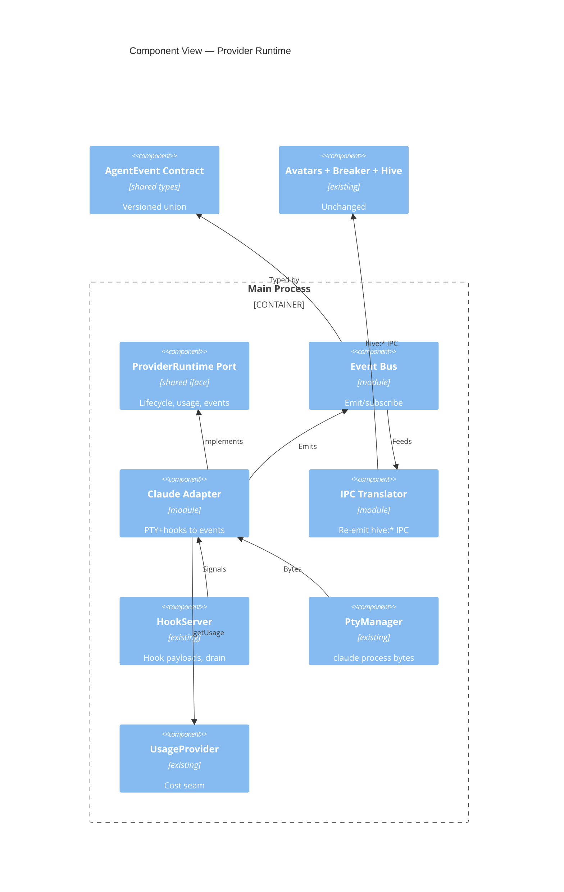

# Implementation Plan: Provider Runtime and Event Bus

**Branch**: `00001-provider-runtime-and-event-bus` | **Date**: 2026-06-07 | **Spec**: [spec.md](spec.md)

## Summary

**Goal**: Introduce a provider-agnostic `ProviderRuntime` port and a normalized, versioned `AgentEvent` contract, proven by wrapping the existing Claude PTY+hooks runtime behind them with zero behavior change.
**Approach**: Add shared port/event types under `/src/shared`; a main-process event bus + Claude adapter map the existing PTY/hook signals to `AgentEvent`s; a parity translator re-emits today's `hive:*` IPC so current consumers stay untouched.
**Key Constraint**: Zero observable regression for Claude agents (avatars, telemetry, budgets, breaker, terminal) — Principle V.

## Technical Context

**Language/Version**: TypeScript 5.6 (Electron 32 main/preload; React 18 renderer)  
**Primary Dependencies**: Electron 32, node-pty 1, zustand 4, Pixi.js 8, xterm.js 5; OpenTelemetry collector (existing)  
**Storage**: N/A — no persistent data (in-process code interfaces only)  
**Testing**: Vitest (to adopt) — unit + integration; `npm run typecheck` is the hard gate  
**Target Platform**: Desktop (macOS/Windows/Linux), local-first  
**Project Type**: single (desktop app)  
**Project Mode**: brownfield  
**Performance Goals**: Avatar reacts to an `AgentEvent` < 250 ms; no added latency vs. current hook path  
**Constraints**: No Claude-plane regression; `token-usage` events cumulative & monotonic; no provider-specific type leaks to consumers; all source under `/src`; typecheck green  
**Scale/Scope**: Single machine, 5–15 agents; one provider (Claude) exercised in this epic  
**Technical Context Source**: Baseline from Technical Context Document (`specs/sad.md`); ADR-0001, ADR-0002

## Instructions Check

*GATE: Must pass before Phase 0 research. Re-check after Phase 1 design.*

| Gate (project-instructions v1.0.0) | Status | Note |
|---|---|---|
| I. Provider-Agnostic Parity | PASS | Port + normalized contract isolate provider specifics (AD-001..003) |
| II. Truthful Cost Governance | PASS (scoped) | `token-usage` mirrors locked `AgentUsageSample`; `usd` passthrough, no recompute here (AD-004) |
| III. Crash-Contained Isolation | PASS (scoped) | Lifecycle stop/kill + `api-error` event modeled; worker isolation/retry deferred to E003/E009 |
| IV. Agent Output Style | PASS | Plan is tabular, required sections only |
| V. Preserve Proven Core & Type Safety | PASS | Parity translator keeps `hive:*` IPC; all under `/src`; typecheck gate |
| Source Code Layout (ENFORCE_SRC_ROOT) | PASS | New code under `src/shared`, `src/main/runtime` |
| Governance (no out-of-scope creep) | PASS | No auto-routing/failover/keychain/extra providers introduced |

No violations → no Complexity Tracking section.

## Architecture



## Architecture Decisions

Feature-local tradeoffs only. Project-wide decisions live in ADR-0001 (port boundary) and ADR-0002 (event bus) — referenced, not duplicated.

| ID | Decision | Options Considered | Chosen | Rationale |
|----|----------|--------------------|--------|-----------|
| AD-001 | Where port + event types live | `src/shared` / `src/main` only | `src/shared` | Renderer also consumes events; one definition across processes |
| AD-002 | Parity strategy for existing consumers | Translate events→existing IPC / rewrite consumers now | Translate (IPC translator) | Zero-regression (TR-005); defer consumer rewrite to later epics |
| AD-003 | Event delivery mechanism | In-main typed EventEmitter / new IPC channel | In-main EventEmitter (`port.subscribe`) | Bus is a main-process seam; renderer keeps current IPC |
| AD-004 | token-usage vs cost seam | Replace `UsageProvider` / mirror its fields | Mirror `AgentUsageSample`, keep seam | Don't disturb locked cost contract (Principle II); recompute is ADR-0005 |
| AD-005 | Contract versioning | Version const + additive-only / semver interfaces | Version const + additive-only rule | Simple, testable (TR-006) |
| AD-006 | Claude adapter source signals | Hook payloads + PTY / re-parse terminal | Hook payloads (structured) + PTY for text | Reuse authoritative structured signals; avoid fragile parsing |

## Data Model Summary

N/A — no persistent data. Introduces in-process TypeScript interfaces (`ProviderRuntime`, `AgentEvent`), not stored entities.

## API Surface Summary

N/A — no network API surface. The deliverable is an internal module interface; documented in [contracts/provider-runtime-contract.md](contracts/provider-runtime-contract.md).

## Testing Strategy

| Tier | Tool | Scope | Mock Boundary | Install |
|------|------|-------|---------------|---------|
| Unit | Vitest | Port conformance; `AgentEvent` shape; cumulative-monotonic usage; additive-version rule | Mock hook payloads / PTY bytes | `npm i -D vitest` |
| Integration | Vitest | Claude adapter over recorded hook+PTY fixtures; parity check vs. baseline (avatars/telemetry/budget/breaker/terminal); stop→drain autonomy | Recorded hook/PTY fixtures; in-memory bus | configured (with Vitest) |
| Security | — | N/A — no new external dependency or secret in this epic (credentials are E004); not a required QC category | — | N/A |
| Coverage | — | N/A — no numeric coverage target (Testing & Quality Policy) | — | N/A |

Linting (required QC category) and performance are repo-level gates: adopt ESLint or Biome (TODO from project-instructions) and assert the <250 ms avatar-reaction budget in the parity/integration check.

## Error Handling Strategy

| Error Category | Pattern | Response | Retry |
|----------------|---------|----------|-------|
| Unmapped/malformed hook signal | fail-safe | Log + best-effort normalized event; never break a consumer | no |
| Claude process exit / mid-turn death | lifecycle event | Emit terminal `stop` event; consumers settle (parity with current ghost/archive) | no |
| Duplicate / out-of-order underlying signal | idempotent | Dedupe where current system dedupes; consistent stream | no |
| Provider API error surfaced by Claude | propagate | Emit `api-error(retryable)` event only | no — retry/backoff is E009 (ADR-0009) |

## Integration Points

| Spec Reference | System/Service | Technical Approach | Contract |
|----------------|----------------|--------------------|----------|
| IP-001 | Native worker runtime (E003) | Consumes `ProviderRuntime` port + `AgentEvent` types from `src/shared` | [contract](contracts/provider-runtime-contract.md) |
| IP-002 | Native provider adapters (E006) | Implement the `ProviderRuntime` port | ADR-0001 |
| IP-003 | Avatars / telemetry / breaker | Parity translator re-emits existing `hive:*` IPC; `UsageProvider` seam unchanged | `src/main/hooks.ts`, `usage.ts` |
| IP-004 | Hive autonomy (`drainForStop`) | Claude adapter emits `stop` event preserving `stop_hook_active` guard → drain fires | `src/main/hive.ts` |

## Risk Mitigation

| Risk (from spec) | Likelihood | Impact | Mitigation | Owner |
|-------------------|------------|--------|------------|-------|
| Signal loss during normalization | M | H | Parity integration test asserts pre/post equivalence across all consumers; translator re-emits exact `hive:*` IPC | Claude adapter / translator |
| Under-specified contract forces later breaking change | M | M | `AGENT_EVENT_VERSION` + additive-only rule with an additive-extension contract test (TR-006) | AgentEvent contract |
| Refactor regression in avatars/telemetry/breaker | M | H | Keep consumers reading existing IPC (AD-002); gate on typecheck + critical-path parity tests | Event bus / translator |

## Requirement Coverage Map

| Req ID | Component(s) | File Path(s) | Notes |
|--------|--------------|--------------|-------|
| TR-001 | ProviderRuntime port | `src/shared/providerRuntime.ts` | start/stop/kill/send/getUsage/subscribe/capabilities |
| TR-002 | AgentEvent contract | `src/shared/agentEvent.ts` | Versioned union; all event kinds + fields |
| TR-003 | AgentEvent / Claude adapter | `src/shared/agentEvent.ts`, `src/main/runtime/claudeAdapter.ts` | Cumulative-monotonic `token-usage` from `UsageProvider` totals |
| TR-004 | Claude adapter | `src/main/runtime/claudeAdapter.ts`, `~src/main/hooks.ts`, `~src/main/pty.ts` | Wraps PTY+hooks behind the port |
| TR-005 | IPC translator + parity test | `src/main/runtime/ipcTranslator.ts`, integration tests | Zero behavior change for consumers |
| TR-006 | AgentEvent versioning | `src/shared/agentEvent.ts`, unit test | Additive-only evolution |
| TR-007 | Port boundary | `src/shared/providerRuntime.ts`, boundary test | No provider-specific types downstream |
| TR-008 | Claude adapter ↔ hive | `src/main/runtime/claudeAdapter.ts`, `~src/main/hooks.ts` | `stop` event triggers `drainForStop` with guard |

## Project Structure

### Source Code

```text
+ src/shared/agentEvent.ts            # versioned AgentEvent union + AGENT_EVENT_VERSION
+ src/shared/providerRuntime.ts       # ProviderRuntime port + CapabilityDescriptor/AgentInput
+ src/main/runtime/eventBus.ts        # typed emit/subscribe bus
+ src/main/runtime/claudeAdapter.ts   # maps PTY+hook signals -> AgentEvents
+ src/main/runtime/ipcTranslator.ts   # re-emits existing hive:* IPC (parity)
+ src/main/runtime/__tests__/         # Vitest unit + integration (incl. parity fixtures)
~ src/main/hooks.ts                   # route payloads through the adapter/bus; keep IPC behavior
~ src/main/pty.ts                     # surface text-delta to the adapter
~ src/main/index.ts                   # instantiate runtime/bus/Claude adapter; wire hooks/pty/usage/breaker
+ vitest.config.ts                    # test runner config (new)
```

**Patterns to reuse**: `HookServer.handle` payload→signal mapping; `UsageProvider`/`AgentUsageSample` cumulative seam; zustand store IPC channel names (`hive:*`).
**Tests to extend**: none exist — introduce Vitest under `src/main/runtime/__tests__/`.
**Naming conventions**: camelCase modules under `src/main`; shared cross-process types under `src/shared`; existing IPC channels prefixed `hive:`.

## Implementation Hints

- **[HINT-001]** Order: land `src/shared/agentEvent.ts` + `providerRuntime.ts` first — every other file depends on these types.
- **[HINT-002]** Gotcha: `token-usage` events MUST be cumulative-monotonic — derive from the existing cumulative `UsageProvider` totals, never per-turn deltas (the breaker diffs consecutive samples).
- **[HINT-003]** Constraint: the IPC translator must emit the EXACT existing `hive:*` messages so the renderer/avatars need no change (parity); do not rewrite consumers in this epic.
- **[HINT-004]** Compatibility: `usage.ts` is the locked cost source of truth — `token-usage` mirrors its fields and never recomputes `usd` here (ADR-0005 owns recompute).
- **[HINT-005]** Gotcha: preserve the Stop-hook autonomy — the Claude adapter must still trigger `drainForStop` at end-of-turn via the `stop` event with the `stop_hook_active` guard intact.
