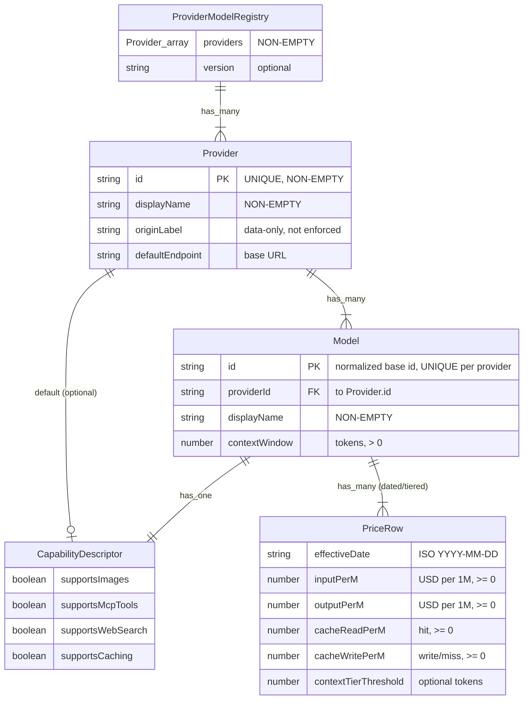

# Data Model — Provider and Model Registry (E002)

> Feature: E002 Provider and Model Registry | Date: 2026-06-08 | Purpose: in-memory / config data model for the canonical provider+model+price+capability registry under `/src`

**Framing**: This is a **TypeScript in-memory / seed-config data model**, not a database. The registry is a code/data module under `/src` (e.g. `src/main/registry/`) that supersedes the family-string price table in `src/main/pricing.ts`. No SQL, DDL, migrations, or persistence layer. Entities below are TypeScript-shaped structures (interfaces + seed literals); "PK"/"FK" denote in-memory key/foreign-key relationships used by the lookup functions, not database keys.

## Entity Table

| Entity | Attributes (name: type, constraints) | Relationships | Notes / State |
|--------|--------------------------------------|---------------|---------------|
| **ProviderModelRegistry** | `providers: Provider[]` (NON-EMPTY); `version?: string`; `lookupPrice(key): PriceRow` (throws on unknown id); `lookupModel(providerId, modelId): Model \| undefined`; `lookupCapabilities(providerId, modelId): CapabilityDescriptor` | has_many: Provider (composition) | Top-level extensible catalog; the single config artifact every later epic (E004–E009) reads. Adding a provider/model is a data edit, no consumer-code change (TR-001, SC-001). Stateless. |
| **Provider** | `id: string` PK, UNIQUE, NON-EMPTY (e.g. `"anthropic"`); `displayName: string` NON-EMPTY; `originLabel: string` (region/jurisdiction, **data-only — not enforced/surfaced**, MVP); `defaultEndpoint: string` (base URL); `models: Model[]` NON-EMPTY; `capabilities?: CapabilityDescriptor` (provider-level default, overridable per Model) | has_many: Model; has_one (optional default): CapabilityDescriptor | A model vendor. `originLabel` captured only (residency deferred per PRD). `defaultEndpoint` is the API base/origin URL (TR-001). |
| **Model** | `id: string` PK within Provider, UNIQUE, NON-EMPTY (normalized base id, suffix-stripped); `providerId: string` FK→Provider.id; `displayName: string` NON-EMPTY; `contextWindow: number` (tokens, > 0); `capabilities: CapabilityDescriptor` (own, or inherited from Provider then overridden); `priceRows: PriceRow[]` NON-EMPTY | belongs_to: Provider; has_one: CapabilityDescriptor; has_many: PriceRow | A model offered by a provider (TR-001). `id` is the normalized form: a variant suffix like `[1m]` is stripped via the reused `normalizeModel` before lookup (Edge Cases, IP-001). |
| **PriceRow** | `effectiveDate: string` (ISO `YYYY-MM-DD`, NON-EMPTY); `inputPerM: number` (USD per 1M tokens, ≥ 0); `outputPerM: number` (≥ 0); `cacheReadPerM: number` (hit, ≥ 0); `cacheWritePerM: number` (write/miss, ≥ 0); `contextTierThreshold?: number` (tokens; row applies when request context size > threshold; absent = base/default tier) | belongs_to: Model | Dated + optionally tiered pricing. Unit is per-million tokens to match existing `ModelPrice` / `estimateCostUsd` (TR-002, TR-003, SC-006). Cache columns model the hit/miss split (DeepSeek). Multiple rows per model: select by effective date, then by tier (Minimax M3). |
| **CapabilityDescriptor** *(from E001)* | `supportsImages: boolean`; `supportsMcpTools: boolean`; `supportsWebSearch: boolean`; `supportsCaching: boolean` | belongs_to (1:1): Model (or Provider default) | MUST conform exactly to the existing shape at `src/shared/providerRuntime.ts` (TR-005, IP-002). Do not add/rename fields. One per Model; a Provider-level default may be defined and overridden per Model. |
| **PriceLookupKey** *(derived input, not stored)* | `providerId: string`; `modelId: string`; `contextSize: number` (request token count, for tier selection); `at?: Date \| string` (effective date, default = now) | — | The composite key for `lookupPrice`. Resolution: provider+model → date filter → tier filter → exactly one PriceRow, or **fail loud** (TR-004). |
| **TokenSplit** *(reused from `pricing.ts`)* | `inputTokens: number`; `outputTokens: number`; `cacheReadTokens: number`; `cacheWriteTokens: number` | — | Cost input. Maps from `AgentUsageSample` (`input`/`output`/`cacheRead`/`cacheCreation`) per IP-003. Cost = split × selected PriceRow / 1M (TR-007). |

## Validation, Lookup & Derivation Rules

| # | Rule | Source |
|---|------|--------|
| VR-1 | **Fail-loud on unknown id.** `lookupPrice` / `lookupModel` for an `(providerId, modelId)` not in the registry MUST surface a clear warning/error (throw or typed error result) and MUST NOT return another model's price. Removes `pricing.ts`'s `DEFAULT_PRICE = SONNET`. | TR-004, SC-003 |
| VR-2 | **Normalize before lookup.** Strip the variant suffix (e.g. `claude-opus-4-8[1m]` → `claude-opus-4-8`) via the reused `normalizeModel` regex before matching `Model.id`. | Edge Cases, IP-001 |
| VR-3 | **Date selection.** Among a model's `priceRows`, select the row whose `effectiveDate` is the latest that is ≤ the request date (`at`, default now). | TR-002, Edge Cases |
| VR-4 | **Tier selection.** After date filtering, select the row whose `contextTierThreshold` matches the request `contextSize`: pick the highest threshold strictly below `contextSize`; if none, use the base row (no threshold). Resolution MUST be deterministic (exactly one row). | TR-003, SC-002 |
| VR-5 | **Cache-split pricing.** `cacheReadPerM` (hit) and `cacheWritePerM` (write/miss) are independent columns; cost applies each to its own token bucket (DeepSeek hit/miss). | Research, TR-002 |
| VR-6 | **Cost computation (single derivation).** `cost = inputTokens·inputPerM + outputTokens·outputPerM + cacheReadTokens·cacheReadPerM + cacheWriteTokens·cacheWritePerM`, each `/ 1_000_000`. Mirrors `estimateCostUsd`; computed once from the selected row. | TR-007, SC-005 |
| VR-7 | **Best-effort degradation, never wrong default.** If a usage field needed for pricing (e.g. cache-token split) is absent, degrade to a documented best-effort estimate and **surface the gap** — never substitute a wrong-vendor price. | TR-008, SC-007 |
| VR-8 | **No Claude cost regression.** Seeded Claude rows MUST equal the current `pricing.ts` per-M values so computed Claude cost is unchanged. | TR-007, SC-006 |
| VR-9 | **Capability shape lock.** Each `CapabilityDescriptor` MUST have exactly the four E001 boolean fields; unsupported features declared `false` (DeepSeek/Minimax lack images/MCP/web-search/caching uniformly). | TR-005, SC-004 |
| VR-10 | **Structural constraints.** `Provider.id` unique in registry; `Model.id` unique within its Provider; `providers`, `models`, `priceRows` non-empty for seeded entries; `contextWindow > 0`; all `*PerM ≥ 0`; `effectiveDate` valid ISO date. | TR-001, TR-006 |

## Seed-Data Outline (3 validated providers)

> Per the spec Risk and Compliance "Remediations": provider-specific seed prices/tiers — **especially Minimax M3** — are marked **"confirm at build time"** (build-time spike) before GA. Claude rows are authoritative (must match `pricing.ts`).

| Provider (`id`) | originLabel | Models (`id` — base) | contextWindow | Capabilities (img / mcp / web / cache) | PriceRow(s) — per 1M tokens (input / output / cacheRead / cacheWrite) |
|-----------------|-------------|----------------------|---------------|----------------------------------------|------------------------------------------------------------------------|
| **anthropic** (Claude) | US | `claude-opus-4-*` (Opus 4.x) | ~200K | T / T / T / **true** | **15 / 75 / 1.5 / 18.75** — must match `pricing.ts` OPUS (SC-006, locked) |
| | | `claude-sonnet-4-*` (Sonnet 4.x) | ~200K (1M tier capable) | T / T / T / **true** | **3 / 15 / 0.3 / 3.75** — must match `pricing.ts` SONNET (locked) |
| | | `claude-haiku-4-*` (Haiku 4.x) | ~200K | T / T / T / **true** | **0.8 / 4 / 0.08 / 1.0** — must match `pricing.ts` HAIKU (locked) |
| **deepseek** | CN (origin-label data only) | DeepSeek V4-class (current) | ~1M-class | **false / false / false / false** | cache **hit/miss split** populates `cacheReadPerM` (hit) vs `cacheWritePerM` (miss); input/output per fact-sheet — **confirm at build time** |
| **minimax** | CN (origin-label data only) | Minimax **M3** | ~1M-class | **false / false / false / false** | **two tiered rows**: base (≤ ~512K) and long-context (`contextTierThreshold ≈ 512_000`, higher rate) — **confirm at build time** |

Seed notes:
- T = inherits the E001 shape; Claude capabilities populated per Claude plane (images, MCP tools, web search, prompt caching = `true`; confirm per-model).
- DeepSeek & Minimax declare all four capabilities `false` (Research: they lack uniform support for image/MCP/web-search/caching over their endpoints).
- `originLabel` values are descriptive data only — never enforced or surfaced in MVP (TR/Scope: residency deferred).
- Minimax M3's `contextTierThreshold` and all DeepSeek/Minimax per-token figures are provisional pending the build-time confirmation spike.

## Relationship Cardinality Summary

- `ProviderModelRegistry` **1 — N** `Provider` (composition; registry owns providers)
- `Provider` **1 — N** `Model`
- `Model` **1 — 1** `CapabilityDescriptor` (own, or inherited from a `Provider` default then overridden)
- `Model` **1 — N** `PriceRow` (dated and/or tiered)
- `PriceLookupKey` + `TokenSplit` are transient inputs to the lookup/cost functions, not persisted entities.

ER Diagram (visual reference)

