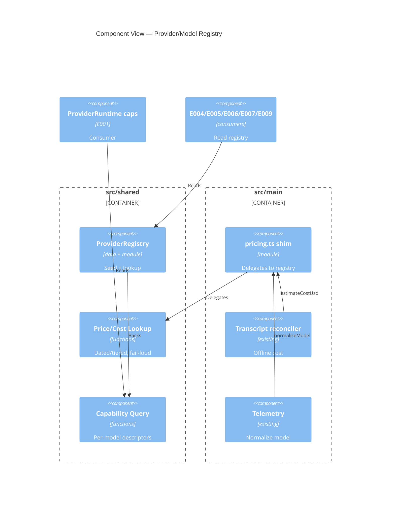

# Implementation Plan: Provider and Model Registry

**Branch**: `00002-provider-and-model-registry` | **Date**: 2026-06-08 | **Spec**: [spec.md](spec.md)

## Summary

**Goal**: An extensible, data-driven provider/model registry — metadata, dated/tiered prices, and capability descriptors — with a fail-loud price lookup that supersedes `src/main/pricing.ts` while preserving Claude cost.
**Approach**: A registry module in `src/shared` (seed data + pure lookup/cost functions) consumed by main and renderer; `pricing.ts` becomes a thin shim delegating to it, so `transcript.ts`/`telemetry.ts` imports are unchanged and Claude values stay identical.
**Key Constraint**: No regression to existing Claude cost (SC-006); unknown model id fails loud, never defaults to Sonnet.

## Technical Context

**Language/Version**: TypeScript 5.6 (Electron 32 main + React 18 renderer share `src/shared`)  
**Primary Dependencies**: none new — pure TS data + functions; reuses `ModelPrice`/`TokenSplit`/`normalizeModel` shapes from `pricing.ts` and `CapabilityDescriptor` from `src/shared/providerRuntime.ts` (E001)  
**Storage**: N/A — in-memory/config data module (no DB, no persistence)  
**Testing**: Vitest (installed); `npm run typecheck` + `npm run lint` gates  
**Target Platform**: Desktop (macOS/Windows/Linux), local-first  
**Project Type**: single (desktop app)  
**Project Mode**: brownfield  
**Performance Goals**: lookup is O(1)/O(rows) in-memory — negligible; no live-path latency change  
**Constraints**: Claude price rows must equal current values; dated + tiered + cache-split rows; fail-loud unknown id; origin label is data-only (no residency enforcement); all source under `/src`; typecheck + lint green  
**Scale/Scope**: 3 providers seeded (Claude, DeepSeek, Minimax M3), extensible  
**Technical Context Source**: Baseline from `specs/sad.md`; ADR-0005, ADR-0008

## Instructions Check

*GATE: Must pass before Phase 0 research. Re-check after Phase 1 design.*

| Gate (project-instructions v1.0.0) | Status | Note |
|---|---|---|
| I. Provider-Agnostic Parity | PASS | Registry is the provider-agnostic config every consumer reads (AD-001) |
| II. Truthful Cost Governance | PASS | Dated/tiered rows + fail-loud unknown id + cost = tokens × selected row (AD-003) |
| III. Crash-Contained Isolation | N/A | Out of E002 scope |
| IV. Agent Output Style | PASS | Plan is tabular, required sections only |
| V. Preserve Proven Core & Type Safety | PASS | Claude values preserved via the pricing.ts shim (AD-002); all under `/src`; typecheck/lint gated |
| Source Code Layout (ENFORCE_SRC_ROOT) | PASS | New code under `src/shared` |
| Governance (out-of-scope guard) | PASS | No residency enforcement/auto-routing/failover/keychain/extra providers |

No violations → no Complexity Tracking section.

## Architecture



## Architecture Decisions

Feature-local tradeoffs only. Project-wide decisions live in ADR-0005 (registry + true-cost) and ADR-0008 (capability descriptor) — referenced, not duplicated.

| ID | Decision | Options Considered | Chosen | Rationale |
|----|----------|--------------------|--------|-----------|
| AD-001 | Registry location | `src/shared` / `src/main` | `src/shared` | Renderer (E005) reads metadata/caps; functions are pure, no main deps |
| AD-002 | pricing.ts migration | Compat shim re-exporting registry / delete + update all imports | Compat shim | Preserves `transcript.ts`/`telemetry.ts` imports + Claude values (SC-006, no regression) |
| AD-003 | Fail-loud mechanism | Throw / log loud warning + best-effort sentinel | Warn + best-effort | The offline reconciler must not crash; never a wrong-vendor default |
| AD-004 | Price units | Per-million tokens / per-token | Per-million | Matches existing `ModelPrice`/`estimateCostUsd` so Claude cost is bit-identical |
| AD-005 | Capability placement | Per-model / per-provider only | Per-model (provider default optional) | Models within a provider can differ; conforms to E001 shape |
| AD-006 | Row selection | latest-effective-date then context-tier match | date-filter then tier-match | Deterministic dated + tiered selection |

## Data Model Summary

| Entity | Key Fields | Relationships | Notes |
|--------|------------|---------------|-------|
| ProviderModelRegistry | providers[] | 1—N Provider | Canonical config; exposes lookup* |
| Provider | id, displayName, originLabel, defaultEndpoint | 1—N Model | originLabel data-only (not enforced) |
| Model | id, providerId, displayName, contextWindow, capabilities, priceRows[] | →1 Provider, 1—1 Capability, 1—N PriceRow | id normalized (no `[1m]`) |
| PriceRow | effectiveDate, input/output/cacheRead/cacheWrite perM, contextTierThreshold? | →1 Model | dated + tiered + cache-split |
| CapabilityDescriptor | supportsImages/McpTools/WebSearch/Caching | →1 Model | E001 shape (src/shared/providerRuntime.ts) |

**Detail**: [data-model.md](data-model.md) · **Interface**: [contracts/registry-interface.md](contracts/registry-interface.md)

## API Surface Summary

N/A — no network API. Internal query interface (`listProviders` / `lookupModel` / `lookupCapabilities` / `lookupPrice` / `computeCost`) documented in [contracts/registry-interface.md](contracts/registry-interface.md).

## Testing Strategy

| Tier | Tool | Scope | Mock Boundary | Install |
|------|------|-------|---------------|---------|
| Unit | Vitest | Lookup (dated/tiered selection); fail-loud unknown id; cache-split + tier cost; capability query; **Claude no-regression vs current OPUS/SONNET/HAIKU values** | none — pure functions on seed data | configured |
| Integration | Vitest | pricing.ts shim → registry: `estimateCostUsd`/`normalizeModel` keep their contract for `transcript.ts`/`telemetry.ts` | in-memory token splits | configured |
| Security | — | N/A — no new dependency or secret | — | N/A |
| Coverage | — | N/A — no numeric target (policy) | — | N/A |

Lint (required) + performance are repo gates: `npm run lint` (ESLint, configured) must stay clean; no perf-sensitive path here (in-memory lookup).

## Error Handling Strategy

| Error Category | Pattern | Response | Retry |
|----------------|---------|----------|-------|
| Unknown / unseeded model id | fail-loud | Loud warning + best-effort/sentinel; never a wrong-vendor price | no |
| Missing usage field (e.g. cache split) | best-effort | Compute with available fields; mark `bestEffort` + surface the gap | no |
| No price row matches date/context | fallback + warn | Select nearest available row, warn; never silently wrong | no |

## Integration Points

| Spec Reference | System/Service | Technical Approach | Contract |
|----------------|----------------|--------------------|----------|
| IP-001 | `src/main/pricing.ts` | Re-implement `priceFor`/`estimateCostUsd` as a shim over the registry; keep `normalizeModel` | [contract](contracts/registry-interface.md) |
| IP-002 | `CapabilityDescriptor` (E001) | Registry populates the shape from `src/shared/providerRuntime.ts`; `capabilities()` + consumers query it | ADR-0008 |
| IP-003 | usage/cost (E001, `usage.ts`) | `TokenSplit`/`AgentUsageSample` cache-split fields map to registry cache pricing | `src/main/usage.ts` |
| IP-004 | E004/E005/E006/E007/E009 | Read provider/model metadata, prices, capabilities from the registry | data-model.md |

## Risk Mitigation

| Risk (from spec) | Likelihood | Impact | Mitigation | Owner |
|-------------------|------------|--------|------------|-------|
| Pricing drift / dated-row maintenance | H | M | Dated rows in one data file; unknown id fails loud; easy to update | ProviderRegistry seed |
| Provider usage-field gaps (cache split) | M | M | `computeCost` returns `bestEffort` + surfaced gap (TR-008/SC-007) | computeCost |
| Unconfirmed seed prices/tiers (Minimax M3) | M | M | Seed values flagged "confirm at build time"; spike per ADR-0005 | seed data |

## Requirement Coverage Map

| Req ID | Component(s) | File Path(s) | Notes |
|--------|--------------|--------------|-------|
| TR-001 | ProviderRegistry | `src/shared/providerRegistry.ts` | providers/models metadata + extensible |
| TR-002 | PriceRow / seed | `src/shared/providerRegistry.ts` | dated rows, input/output/cache-split |
| TR-003 | lookupPrice (tier) | `src/shared/providerRegistry.ts` | context-length-tier selection |
| TR-004 | lookupPrice (fail-loud) | `src/shared/providerRegistry.ts` | unknown id → warn + sentinel |
| TR-005 | lookupCapabilities | `src/shared/providerRegistry.ts` | E001 CapabilityDescriptor |
| TR-006 | seed data | `src/shared/providerRegistry.ts` | Claude/DeepSeek/Minimax seeded |
| TR-007 | computeCost + shim | `src/shared/providerRegistry.ts`, `~src/main/pricing.ts` | tokens × row; Claude preserved |
| TR-008 | computeCost (best-effort) | `src/shared/providerRegistry.ts` | missing field → best-effort + surfaced |

## Project Structure

### Source Code

```text
+ src/shared/providerRegistry.ts            # registry types + seed data + lookup/computeCost (fail-loud)
+ src/shared/__tests__/providerRegistry.test.ts  # Vitest: lookup/dated/tiered/fail-loud/caps/cost/no-regression
~ src/main/pricing.ts                        # thin shim: priceFor/estimateCostUsd delegate to registry; re-export normalizeModel
~ tsconfig.web.json                          # add the test exclude (registry lives in src/shared, which web typechecks)
```

**Patterns to reuse**: `ModelPrice`/`TokenSplit`/`normalizeModel` shapes and the `estimateCostUsd(model, tokens)` contract from `pricing.ts`; the E001 `CapabilityDescriptor` + `EMPTY_CAPABILITY_DESCRIPTOR` from `src/shared/providerRuntime.ts`.
**Tests to extend**: none for registry (new); Vitest suite under `src/shared/__tests__/`.
**Naming conventions**: camelCase modules; shared cross-process types/data under `src/shared`.

## Implementation Hints

- **[HINT-001]** Order: land `src/shared/providerRegistry.ts` (types + seed + lookup) first — the `pricing.ts` shim and tests depend on it.
- **[HINT-002]** Constraint: Claude price rows MUST equal the current values (OPUS 15/75/1.5/18.75; SONNET 3/15/0.3/3.75; HAIKU 0.8/4/0.08/1.0 per M) — add a regression test asserting `estimateCostUsd` is unchanged for Claude models (SC-006).
- **[HINT-003]** Gotcha: fail-loud must NOT crash the offline transcript reconciler — log a loud warning + best-effort (never the Sonnet default); the reconciler keeps running.
- **[HINT-004]** Compatibility: keep `normalizeModel` and `estimateCostUsd` exported from `pricing.ts` (delegating to the registry) so `transcript.ts`/`telemetry.ts` imports don't break.
- **[HINT-005]** Gotcha: the registry is in `src/shared`, which BOTH tsconfigs typecheck — add the `**/__tests__/**` + `**/*.test.ts` exclude to `tsconfig.web.json` (already in `tsconfig.node.json`) so the registry test isn't pulled into the web typecheck.
