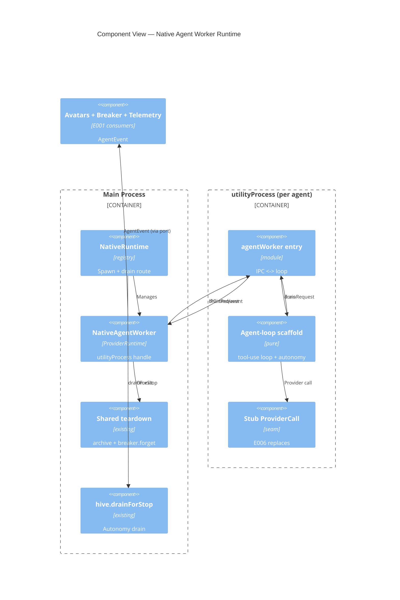

# Implementation Plan: Native Agent Worker Runtime

**Branch**: `00003-native-agent-worker-runtime` | **Date**: 2026-06-08 | **Spec**: [spec.md](spec.md)

## Summary

**Goal**: Run each non-Claude agent in its own Electron `utilityProcess`, fronted by the E001 `ProviderRuntime` port, driving a provider-agnostic agent loop that emits `AgentEvent`s and reproduces the `drainForStop` autonomy — crash-contained and validated with a stub provider.
**Approach**: Split a **pure, Node-testable agent-loop scaffold** (no electron) from a thin `utilityProcess` transport; the worker requests the inbox drain from main over IPC (main keeps the single-committer hive); worker exit reuses the existing `teardownPty` archive lifecycle.
**Key Constraint**: A worker crash/hang/OOM must not crash the main process; the autonomy loop must be guaranteed to terminate; the Claude PTY runtime is untouched.

## Technical Context

**Language/Version**: TypeScript 5.6 (Electron 32 main + `utilityProcess` worker; both Node)  
**Primary Dependencies**: Electron `utilityProcess` (ADR-0003); E001 `ProviderRuntime`/`AgentEvent` (`src/shared/`); hive `drainForStop` (`src/main/hive.ts`); no new npm deps  
**Storage**: N/A — runtime objects, no persistence  
**Testing**: Vitest for the pure loop/autonomy/seam + a faked transport; `utilityProcess` lifecycle verified by running the app (Electron-only API)  
**Target Platform**: Desktop (macOS/Windows/Linux), local-first  
**Project Type**: single (desktop app)  
**Project Mode**: brownfield  
**Performance Goals**: worker spawn + first event responsive; no main/UI-loop blocking; 5–15 concurrent workers stable  
**Constraints**: crash containment; bounded per-worker memory (`execArgv`) + event-queue backpressure + floor concurrency cap; autonomy bounded by a `stop_hook_active`-equivalent guard + hop/turn caps; Claude PTY runtime unchanged; all under `/src`; typecheck/lint/test green  
**Scale/Scope**: ~5–15 concurrent native workers; one provider stub (real adapters E006)  
**Technical Context Source**: Baseline from `specs/sad.md`; ADR-0003, ADR-0004

## Instructions Check

*GATE: Must pass before Phase 0 research. Re-check after Phase 1 design.*

| Gate (project-instructions v1.0.0) | Status | Note |
|---|---|---|
| I. Provider-Agnostic Parity | PASS | Worker fronted by E001 port; emits normalized AgentEvents only (AD-002/AD-003) |
| III. Crash-Contained Isolation | PASS | utilityProcess per agent; exit → shared teardown (AD-004); bounded mem/queue/concurrency (AD-006); loop guard + caps |
| V. Preserve Proven Core & Type Safety | PASS | Claude PTY untouched; worker is additive; all under `/src`; typecheck/lint/test gated |
| II. Truthful Cost Governance | N/A | Cost recompute deferred E007; usage passthrough only |
| IV. Agent Output Style | N/A | — |
| Source Code Layout (ENFORCE_SRC_ROOT) | PASS | New code under `src/main/runtime/**` + `src/shared/**` |
| Governance (out-of-scope guard) | PASS | No real adapters/assignment/credentials/cost/rendering/switch; retry policy left to E009 |

No violations → no Complexity Tracking section.

## Architecture



## Architecture Decisions

Feature-local tradeoffs only. Project-wide decisions live in ADR-0003 (utilityProcess isolation) and ADR-0004 (native autonomy) — referenced, not duplicated.

| ID | Decision | Options Considered | Chosen | Rationale |
|----|----------|--------------------|--------|-----------|
| AD-001 | Worker build entry | Second electron-vite main input (`agentWorker.ts` → `out/main/agentWorker.js`) / runtime eval | Second build input, fork by built path | Standard electron-vite multi-entry; dev+prod consistent |
| AD-002 | Loop vs transport | Pure loop (no electron) + thin utilityProcess transport / loop directly in worker | Separated | Loop is Node/vitest-testable + reusable; electron confined to transport |
| AD-003 | ProviderCall seam location | `src/shared/providerCall.ts` / `src/main` | `src/shared` | Cross-process typed contract E006 adapters implement |
| AD-004 | Worker exit teardown | Reuse existing `teardownPty` archive/`breaker.forget` path / separate native teardown | Reuse shared lifecycle | Native + PTY agents tear down identically (no divergence) |
| AD-005 | Autonomy drain transport | Worker requests drain from main over IPC / worker calls hive directly | Worker→main IPC `drainRequest` | Worker is a separate process; main keeps the single-committer hive |
| AD-006 | Resource limits | `execArgv --max-old-space-size` + main concurrency cap + bounded IPC queue / unbounded | Bounded all three | Crash/backpressure containment (Principle III) |

## Data Model Summary

N/A — no persistent data. Runtime objects (`NativeAgentWorker`, agent-loop, IPC messages) only.

## API Surface Summary

N/A — no network API. Internal interfaces (ProviderCall seam, worker IPC protocol, agent-loop deps, NativeAgentWorker/NativeRuntime) documented in [contracts/native-worker-interface.md](contracts/native-worker-interface.md).

## Testing Strategy

| Tier | Tool | Scope | Mock Boundary | Install |
|------|------|-------|---------------|---------|
| Unit | Vitest | Agent-loop scaffold with a stub `ProviderCall`: ordered AgentEvents (SC-003), cumulative-monotonic usage + contract (SC-007); autonomy continue/idle (SC-004); loop terminates via guard + caps (SC-005) | stub ProviderCall + fake `requestDrain`/`emit` | configured |
| Integration | Vitest | `NativeAgentWorker` ProviderRuntime conformance over a **faked transport** (SC-002) — start/send/stop/kill/getUsage/subscribe/capabilities without electron | fake worker transport | configured |
| Security | — | N/A — no new dependency or secret (credentials are E004) | — | N/A |
| Coverage | — | N/A — no numeric target | — | N/A |

`utilityProcess` is an Electron-only API, so **SC-001** (real spawn + crash teardown) and **SC-006** (5 concurrent workers, isolation) require the running app and are verified by an Electron integration/manual smoke (`npm run dev`), not vitest — recorded in the plan, not silently skipped. Lint (required) stays clean; no perf-sensitive path beyond the responsiveness target.

## Error Handling Strategy

| Error Category | Pattern | Response | Retry |
|----------------|---------|----------|-------|
| Worker crash / hang / OOM | isolate + teardown | `utilityProcess` exit → shared archive/`breaker.forget`; main + peers unaffected | no |
| Autonomy loop hits cap | bounded stop | Emit terminal `stop`; no infinite loop | no |
| Provider-call error (stub/E006) | surface | Emit `api-error(retryable)`; per-turn wall-clock budget bounds a hang | no — retry is E009 |
| IPC event flood | backpressure | Bounded worker→main queue; events not dropped silently | no |

## Integration Points

| Spec Reference | System/Service | Technical Approach | Contract |
|----------------|----------------|--------------------|----------|
| IP-001 | E001 `ProviderRuntime`/`AgentEvent` | `NativeAgentWorker` implements the port; loop emits `AgentEvent`s over IPC | `src/shared/providerRuntime.ts`, `agentEvent.ts` |
| IP-002 | `src/main/pty.ts` lifecycle | Worker exit reuses the `teardownPty` archive/`breaker.forget` path (AD-004) | `src/main/index.ts` `teardownPty` |
| IP-003 | `src/main/hive.ts` `drainForStop` | Worker `drainRequest` → main calls `drainForStop` → `drainResult` (AD-005); guard mirrors `hooks.ts` | `hive.ts:407`, `hooks.ts:153` |
| IP-004 | E006 / E007–E010 | E006 implements the `ProviderCall` seam; downstream consume AgentEvents/usage/lifecycle | [contract](contracts/native-worker-interface.md) |

## Risk Mitigation

| Risk (from spec) | Likelihood | Impact | Mitigation | Owner |
|-------------------|------------|--------|------------|-------|
| Reproducing the Claude-only plane off-CLI | M | H | Front with E001 port; reuse `drainForStop`; validate loop/autonomy with a stub + vitest; lifecycle via app smoke | NativeRuntime |
| Runaway autonomy loop | M | H | `stopActive` guard (drain-created turn doesn't re-drain) + `maxTurns`/`maxHops` caps + a test that loops without them | agent-loop |
| Worker crash destabilizing harness | L-M | H | `utilityProcess` isolation + exit teardown + per-turn wall-clock budget | NativeAgentWorker |

## Requirement Coverage Map

| Req ID | Component(s) | File Path(s) | Notes |
|--------|--------------|--------------|-------|
| TR-001 | NativeAgentWorker, shared teardown | `src/main/runtime/nativeAgentWorker.ts`, `~src/main/index.ts` | utilityProcess spawn/kill/exit → archive |
| TR-002 | NativeAgentWorker | `src/main/runtime/nativeAgentWorker.ts` | implements E001 ProviderRuntime |
| TR-003 | worker entry + protocol | `src/main/runtime/worker/agentWorker.ts`, `src/shared/workerProtocol.ts` | AgentEvents over IPC |
| TR-004 | agent-loop scaffold | `src/main/runtime/worker/agentLoop.ts` | request→tool_use→execute→tool_result |
| TR-005 | ProviderCall seam + stub | `src/shared/providerCall.ts`, `src/main/runtime/worker/stubProvider.ts` | pluggable; E006 implements |
| TR-006 | autonomy + drain route | `agentLoop.ts`, `src/main/runtime/nativeRuntime.ts` | drainRequest → drainForStop → continue/idle |
| TR-007 | loop guard + caps | `agentLoop.ts` | stopActive guard + maxTurns/maxHops |
| TR-008 | resource limits | `nativeAgentWorker.ts` (execArgv), `nativeRuntime.ts` (concurrency), `agentWorker.ts` (queue) | bounded mem/queue/concurrency |

## Project Structure

### Source Code

```text
+ src/shared/providerCall.ts                  # ProviderCall seam (E006 implements) + ProviderRequest/Turn/UsageDelta
+ src/shared/workerProtocol.ts                # typed WorkerCommand / WorkerMessage IPC messages
+ src/main/runtime/worker/agentLoop.ts        # PURE agent-loop scaffold + autonomy (no electron)
+ src/main/runtime/worker/stubProvider.ts     # deterministic stub ProviderCall (E003 validation)
+ src/main/runtime/worker/agentWorker.ts      # utilityProcess ENTRY: parentPort IPC <-> agentLoop
+ src/main/runtime/nativeAgentWorker.ts       # main-process ProviderRuntime over a utilityProcess
+ src/main/runtime/nativeRuntime.ts           # registry: spawn, drain route, exit teardown, concurrency cap
+ src/main/runtime/__tests__/agentLoop.test.ts        # SC-003/004/005/007 (pure)
+ src/main/runtime/__tests__/nativeAgentWorker.test.ts # SC-002 via faked transport
~ electron.vite.config.ts                     # add the agentWorker entry to the main build inputs (AD-001)
~ src/main/index.ts                           # instantiate NativeRuntime; wire drainForStop + shared teardown + usage
```

**Patterns to reuse**: `ClaudeRuntime`/`ClaudeAdapter`/`AgentEventBus` shapes (E001, `src/main/runtime/`); `PtyManager.setExitHandler` + `teardownPty` archive path; `drainForStop` block/idle from `hooks.ts`; the E001 `ProviderRuntime`/`AgentEvent`/`UsageSnapshot` contracts.
**Tests to extend**: Vitest under `src/main/runtime/__tests__/` (alongside E001's).
**Naming conventions**: camelCase modules under `src/main/runtime`; cross-process types under `src/shared`.

## Implementation Hints

- **[HINT-001]** Order: land `src/shared/providerCall.ts` + `workerProtocol.ts` and the pure `agentLoop.ts` first — everything else (worker entry, NativeAgentWorker, tests) depends on them.
- **[HINT-002]** Constraint: keep `agentLoop.ts` and the stub provider **free of any electron/node-pty import** so vitest runs them in Node (SC-003/004/005/007). Electron lives only in `agentWorker.ts` (worker entry) and `nativeAgentWorker.ts` (transport).
- **[HINT-003]** Gotcha: the worker is a separate process and MUST NOT touch the hive git — end-of-turn sends `drainRequest` over IPC; main runs `drainForStop` and replies (AD-005). Single-committer preserved.
- **[HINT-004]** Gotcha: the autonomy `stopActive`-equivalent guard must prevent a drain-created turn from re-draining; add `maxTurns`/`maxHops` caps and a test that would loop forever without them (SC-005).
- **[HINT-005]** Compatibility: worker exit MUST run the SAME teardown as a PTY exit (archive + `breaker.forget`); generalize/reuse `teardownPty` rather than forking the lifecycle (AD-004). SC-001/SC-006 are validated by `npm run dev` (Electron `utilityProcess`), not vitest.
