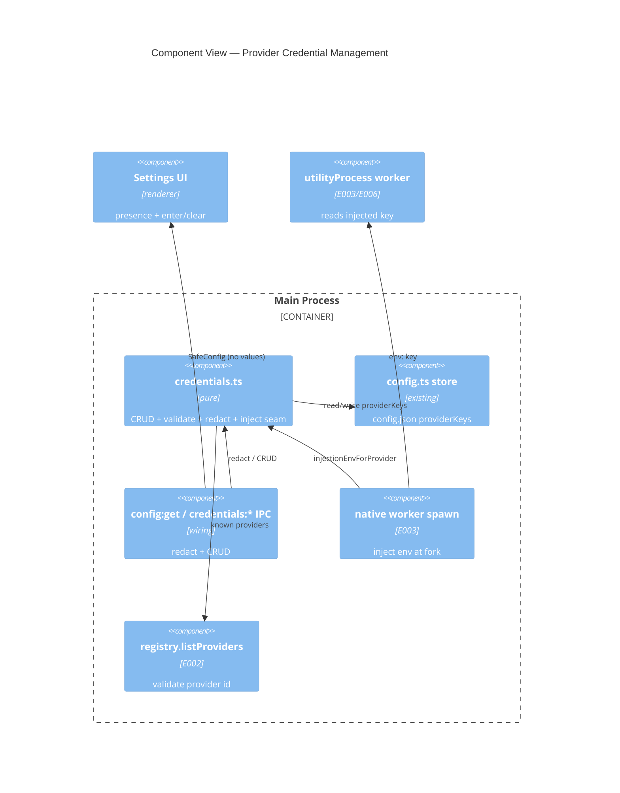

# Implementation Plan: Provider Credential Management

**Branch**: `00004-provider-credential-management` | **Date**: 2026-06-08 | **Spec**: [spec.md](spec.md)

## Summary

**Goal**: Store one provider API key per provider in the harness config (plaintext MVP, ADR-0007) and inject the right key into a native worker at spawn — with the key value never reaching the renderer, the git hive, the transcripts, or telemetry.
**Approach**: A pure, electron-free credential module (CRUD + validation + redaction + injection seam) operating on a passed config; live wiring redacts `providerKeys` at the `config:get` IPC and injects the spawn env at the E003 `utilityProcess` fork; a minimal Settings surface manages keys by presence.
**Key Constraint**: Value-level non-leakage (keys only in `config.json` + the worker's spawn env); the injection seam is the single swap point for future OS-keychain hardening.

## Technical Context

**Language/Version**: TypeScript 5.6 (Electron 32 main + React 18 renderer)  
**Primary Dependencies**: none new — reuses `src/main/config.ts` (HarnessConfig persistence + Slack-secret precedent), E002 `providerRegistry.listProviders`, E003 `electronWorkerTransport` spawn  
**Storage**: `config.json` under the OS app-data dir (`app.getPath('userData')`) — outside any registered repo; plaintext (ADR-0007)  
**Testing**: Vitest for the pure credential logic (CRUD/validation/seam/redaction/non-leakage); the Settings UI is manual  
**Target Platform**: Desktop (macOS/Windows/Linux), local-first  
**Project Type**: single (desktop app)  
**Project Mode**: brownfield  
**Performance Goals**: N/A — trivial in-memory map operations  
**Constraints**: keys never to renderer/hive/transcripts/telemetry; store outside any repo; single injection seam for keychain hardening; all under `/src`; typecheck/lint/test green  
**Scale/Scope**: a handful of providers (DeepSeek, Minimax; Claude excluded)  
**Technical Context Source**: Baseline from `specs/sad.md`; ADR-0007

## Instructions Check

*GATE: Must pass before Phase 0 research. Re-check after Phase 1 design.*

| Gate (project-instructions v1.0.0) | Status | Note |
|---|---|---|
| Governance — secret non-leakage (ADR-0007) | PASS | `redactConfig` strips keys from the renderer path (AD-002); module has no hive/telemetry/transcript import; key only in config.json + worker env |
| I. Provider-Agnostic Parity | PASS | Store keyed by E002 provider id; injection seam provider-agnostic + single swap point (AD-003) |
| V. Preserve Proven Core & Type Safety | PASS | Reuses the config secret store (Slack precedent); pure core via type-only import (electron-free); all under `/src`; gated |
| II/III/IV | N/A | No cost/isolation/output-style surface (missing-key → clean null is incidental III) |
| Source Code Layout (ENFORCE_SRC_ROOT) | PASS | New code under `src/main` + a minimal `src/renderer` Settings addition |
| Governance (out-of-scope guard) | PASS | Keychain hardening deferred (seam reused); assignment→E005, adapters→E006, Claude auth excluded |

No violations → no Complexity Tracking section.

## Architecture



## Architecture Decisions

Feature-local tradeoffs only. The project-wide decision is ADR-0007 (plaintext-config secret management) — referenced, not duplicated.

| ID | Decision | Options Considered | Chosen | Rationale |
|----|----------|--------------------|--------|-----------|
| AD-001 | Store location | `config.json` (HarnessConfig.providerKeys) / separate credentials.json | `config.json` | ADR-0007 "harness config file"; reuses persistence + Slack-secret precedent; outside any repo |
| AD-002 | Renderer exposure | Redact keys (`config:get` → SafeConfig presence) / send full config | Redact | TR-008 — keys never reach the renderer |
| AD-003 | Injection env shape | Generic `NATIVE_PROVIDER_API_KEY` + provider id / provider-specific env names | Generic + id | Keeps the seam provider-agnostic; E006 adapter maps it |
| AD-004 | Testable core | Pure fns on a passed config (type-only HarnessConfig import) / electron-coupled | Pure core | Electron-free → vitest; live wiring stays thin |
| AD-005 | Validation | Reject unknown provider id via E002 `listProviders` / accept any | Reject unknown | TR-002 |
| AD-006 | Injection wiring point | env at `utilityProcess` fork / via the worker `start` IPC | env at fork | Matches ADR-0007 "spawn env"; IPC alternative noted behind the same seam |

## Data Model Summary

| Entity | Key Fields | Relationships | Notes |
|--------|------------|---------------|-------|
| CredentialRecord | providerId, apiKey | one per E002 provider | stored as `HarnessConfig.providerKeys[providerId] = apiKey` in config.json; redacted from the renderer |

**Detail**: trivial single record — see [contracts/credential-interface.md](contracts/credential-interface.md).

## API Surface Summary

N/A — no network API. Internal CRUD + injection seam + redaction (`setKeyInConfig`/`getKeyFromConfig`/`clearKeyInConfig`/`keyPresence`/`injectionEnvForProvider`/`redactConfig`) + IPC channels (`config:get` redacted, `credentials:set`/`clear`/`presence`) documented in [contracts/credential-interface.md](contracts/credential-interface.md).

## Testing Strategy

| Tier | Tool | Scope | Mock Boundary | Install |
|------|------|-------|---------------|---------|
| Unit | Vitest | Pure credentials.ts: set/get/clear persistence (over a config object); reject unknown provider id; `injectionEnvForProvider` (key → env, no key → null); `keyPresence` values-absent; `redactConfig` strips `providerKeys` | plain config object + fake provider list | configured |
| Integration | Vitest | **Non-leakage (SC-004)**: a set key's value is absent from `redactConfig` output; `credentials.ts` imports no hive/telemetry/transcript module (source-scan boundary test, like E001's boundary test) | source scan + config object | configured |
| Security | — | N/A — no new external dependency or scanner; plaintext-at-rest accepted (ADR-0007), non-leakage is the asserted property above | — | N/A |
| Coverage | — | N/A — no numeric target | — | N/A |

The Settings-UI key entry/clear is manual (renderer). SC-005 (store outside any repo) is verified by the path assertion (`app.getPath('userData')`), SC-007 (worker-scoped) by the redaction + the env-only injection.

## Error Handling Strategy

| Error Category | Pattern | Response | Retry |
|----------------|---------|----------|-------|
| Unknown provider id on set | reject | `credentials:set` returns an error; store unchanged (TR-002) | no |
| Missing key at spawn | clean null | `injectionEnvForProvider` returns null; no env injected, no crash (TR-007) | no |
| Renderer requests config | redact | `config:get` returns SafeConfig (presence only); never key values (TR-008) | no |

## Integration Points

| Spec Reference | System/Service | Technical Approach | Contract |
|----------------|----------------|--------------------|----------|
| IP-001 | E002 `providerRegistry.listProviders` | Validate provider ids on set; presence keyed by known providers | `src/shared/providerRegistry.ts` |
| IP-002 | `src/main/config.ts` | `providerKeys` field; persist via `readConfig`/`writeConfig` (config.json, userData) | config.ts |
| IP-003 | E003 native worker spawn | `electronWorkerTransport`/`nativeRuntime` inject `injectionEnvForProvider` into the fork env | E003 contracts |
| IP-004 | hive / transcripts / telemetry | Non-leakage boundaries — no key write to `hive.ts`, `~/.claude`, or `telemetry.ts` (already PII-scrubbed); `config:get` redacted | hive.ts, telemetry.ts |

## Risk Mitigation

| Risk (from spec) | Likelihood | Impact | Mitigation | Owner |
|-------------------|------------|--------|------------|-------|
| Plaintext at rest (accepted) | H | M | Accepted MVP (ADR-0007); non-leakage enforced; keychain hardening reuses the seam (AD-006) | credentials.ts |
| Leakage to hive/transcripts/telemetry | L-M | H | `redactConfig` at `config:get`; module imports no hive/telemetry/transcript; SC-004 value-absence + boundary tests | credentials.ts / ipc |
| Key visible in worker env | L | M | Accepted under local trust; IPC-injection alternative behind the same seam (AD-006) | spawn |

## Requirement Coverage Map

| Req ID | Component(s) | File Path(s) | Notes |
|--------|--------------|--------------|-------|
| TR-001 | credentials store | `src/main/credentials.ts`, `~src/main/config.ts` | set/get/clear over `providerKeys`, persisted |
| TR-002 | validation | `src/main/credentials.ts` | reject unknown provider id (E002) |
| TR-003 | injection seam | `src/main/credentials.ts`, `~electronWorkerTransport.ts` | `injectionEnvForProvider`, single injection point |
| TR-004 | non-leakage boundaries | `src/main/credentials.ts`, `~index.ts` (config:get redact) | no hive/transcript/telemetry write |
| TR-005 | store location | `~src/main/config.ts` (userData) | outside any repo |
| TR-006 | swap-point seam | `src/main/credentials.ts` | keychain backend swaps behind it |
| TR-007 | missing-key handling | `src/main/credentials.ts` | null env, no crash |
| TR-008 | worker-scoped + redaction | `src/main/credentials.ts` `redactConfig`, `~index.ts`, `~preload` | key not to renderer/other agents |

## Project Structure

### Source Code

```text
+ src/main/credentials.ts                 # PURE: setKeyInConfig/getKeyFromConfig/clearKeyInConfig/keyPresence/injectionEnvForProvider/redactConfig (+ SafeConfig type)
+ src/main/__tests__/credentials.test.ts  # Vitest: CRUD/validation/seam/redaction/non-leakage (SC-001..004,006)
~ src/main/config.ts                      # add `providerKeys?: Record<string,string>` to HarnessConfig
~ src/main/index.ts                       # config:get → redactConfig(readConfig()); add credentials:set/clear/presence IPC; inject env at native spawn
~ src/main/runtime/electronWorkerTransport.ts # fork env from injectionEnvForProvider (given a providerId)
~ src/preload/index.ts                    # getConfig returns SafeConfig; add credentials.set/clear/presence
~ src/renderer/src/...                     # minimal Settings surface: per-provider key presence + enter/clear
```

**Patterns to reuse**: `HarnessConfig`/`readConfig`/`writeConfig` + the Slack-secret persistence pattern (`config.ts`); E001's source-scan boundary test (for the non-leakage import check); E002 `listProviders`; E003 fork `env`.
**Tests to extend**: Vitest under `src/main/__tests__/`.
**Naming conventions**: camelCase modules under `src/main`; `import type` for `HarnessConfig` to keep `credentials.ts` electron-free.

## Implementation Hints

- **[HINT-001]** Order: land `src/main/credentials.ts` (pure fns + SafeConfig) + its tests first; the IPC redaction, spawn injection, and preload/UI all depend on it.
- **[HINT-002]** Constraint: `credentials.ts` MUST use `import type { HarnessConfig } from './config'` (type-only) so it stays electron-free and vitest-runnable — and MUST NOT import hive/telemetry/transcript modules (the boundary the SC-004 test asserts).
- **[HINT-003]** Gotcha (TR-008): the `config:get` IPC handler currently returns the full `HarnessConfig` (preload `config:get`), which would expose keys. It MUST return `redactConfig(readConfig())`. (Pre-existing Slack secrets share this exposure — out of E004 scope, but do not widen it.)
- **[HINT-004]** Gotcha (SC-004): bind the value-absence test to each named sink — assert the key value is not in the redacted config; assert `credentials.ts` source imports none of `hive`/`telemetry`/`transcript`. Worker env is the only other place the key flows.
- **[HINT-005]** Compatibility: the injected env is generic (`NATIVE_PROVIDER_API_KEY` + `NATIVE_PROVIDER_ID`); the E006 adapter reads it. The provider id per agent comes from E005 assignment — until then the injection is parameterized (no provider id ⇒ no key env).
