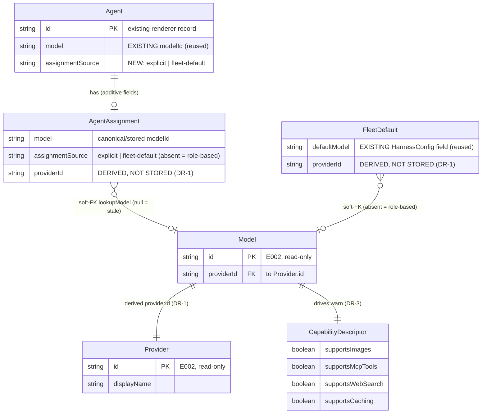

# Data Model — Model and Provider Assignment (E005)

> Feature: E005 Model and Provider Assignment | Date: 2026-06-08 | Purpose: persisted + derived data model for per-agent and fleet-default provider/model selection with capability-aware warnings

**Framing**: This is **NOT a SQL/relational feature**. It is an Electron/TypeScript desktop app, and the entities below are **TypeScript-shaped persisted structures + derivations** — no DB tables, no SQL DDL, no migrations table. Two existing persistence substrates are extended **additively**; one registry is read-only:

| Substrate | Where | Shape | What E005 adds |
|-----------|-------|-------|----------------|
| **Harness config** | `src/main/config.ts` `HarnessConfig`, persisted as JSON in `config.json` under the OS userData dir | `defaultModel?: string` already exists; E004 added `providerKeys?` | **FleetDefault** reuses/extends `defaultModel` |
| **Persisted renderer agent record** | `src/renderer/src/store/store.ts` `Agent`, serialized to `localStorage['cth.agents']` as `PersistedAgent` | `model?: string` already exists | **AgentAssignment** stored additively on this record |
| **Provider/model registry** *(E002, read-only)* | `src/shared/providerRegistry.ts` | `listProviders()`, `lookupModel()`, `lookupModelInfo()`, `lookupCapabilities()`; types `Provider`, `Model`, `CapabilityDescriptor` | nothing — read-only consumer |

"FK" below denotes a **soft foreign key** (a registry lookup by id that may resolve to `null`), never a database constraint. Graceful degradation is a first-class rule, not an error path (see Soft-Dependency Rules).

## Entity Table

| Entity | Attributes (name: type, constraints) | Relationships | State Transitions |
|--------|--------------------------------------|---------------|-------------------|
| **AgentAssignment** | `model?: string` (canonical/stored `modelId`; the EXISTING `Agent.model` field, reused — drives `--model` at spawn) `[1]`; `assignmentSource?: 'explicit' \| 'fleet-default'` (NEW; absent ⇒ role-based fallback, never persisted as `'role-based'`); `providerId` (**DERIVED, NOT STORED** — see DR-1) | soft FK: `model` → **Model** via `lookupModel(model)` (E002); derived `providerId` → **Provider**; reads **CapabilityDescriptor** for the warn (DR-3) | none → explicit → changed (re-assign) → reverted (back to fleet-default/inherited) → stale (model removed from registry). See **State Machine**. |
| **FleetDefault** | `defaultModel?: string` (the EXISTING `HarnessConfig.defaultModel`, reused — house-wide default `modelId`); `providerId` (**DERIVED, NOT STORED** — DR-1); absence ⇒ role-based fallback applies | soft FK: `defaultModel` → **Model** (E002); derived `providerId` → **Provider** | unset → set → changed (**non-retroactive** — does NOT mutate existing agents, DR-4) |
| **CapabilityDescriptor** *(owned by E002; referenced read-only)* | `supportsImages: boolean`; `supportsMcpTools: boolean`; `supportsWebSearch: boolean`; `supportsCaching: boolean` | belongs_to (1:1): **Model**; read by AgentAssignment's warn logic (DR-3) | — (immutable registry data; E005 does not own or mutate it) |

`[1]` One AgentAssignment per agent. **ABSENT** for agents on the role-based fallback (no explicit `model`, no `assignmentSource`). `assignmentSource` and `providerId`-derivation are additive — they never overwrite E004's independently-keyed `providerKeys` (Edge Cases; Risk: shared config/drawer).

## Derivation, Validation & Soft-Dependency Rules

| # | Rule | Source |
|---|------|--------|
| **DR-1** | **Provider is DERIVED, never an independently-editable field.** `providerId = lookupModelInfo(modelId)?.provider.id` (E002). Stored data holds ONLY the `modelId`; provider is computed on read. A model id uniquely determines its provider, so two editable fields would risk drift. | FR-008; Assumptions |
| **DR-2** | **Validation = registry resolution.** A `modelId` is valid iff `lookupModel(modelId)` is non-null. Resolution reuses E002's `normalizeModel` (strips a `[1m]`-style suffix) and `matchSubstrings`. An unresolvable id is **not invalid input** — it is a **STALE** assignment (DR-5). | FR-011; SC-008 |
| **DR-3** | **Capability-gap warning (warn-at-assignment, non-blocking).** At selection, read `lookupCapabilities(modelId)` and name each of the four flags that is `false`. The warning is surfaced but **never blocks** the assignment; assigning a fully-capable model shows no warning. Gap-based only — no per-agent "needed capabilities" field is introduced. | FR-009; SC-007; US4 |
| **DR-4** | **Fleet-default change is NON-RETROACTIVE.** Changing `HarnessConfig.defaultModel` MUST NOT mutate any existing `Agent.model`/`assignmentSource`. Inheritance is resolved at agent-CREATION time and frozen onto the record; only agents created afterward pick up the new default. | FR-006; SC-004; US2 |
| **DR-5** | **Stale model: preserve + flag, NEVER remap.** When a stored `modelId` no longer resolves in the registry, KEEP the stored id verbatim, mark it stale/unavailable (derived UI state — `lookupModel(model) === null` on an agent that HAS a `model`), and prompt re-selection. MUST NOT silently remap to another provider/model (would break provider-agnostic parity + cost attribution). | FR-011; SC-008; Risk |
| **DR-6** | **Missing credential: annotate, do not block.** Selecting a model whose provider has no key in E004's `providerKeys` is allowed; the picker shows a "needs credentials" affordance. Credential PRESENCE is read-only annotation; running a desk without a key is a downstream (E006) concern. Key material is never read/stored/logged here. | FR-010; Edge Cases |
| **DR-7** | **Empty/unreadable registry: empty-state + fallback.** When `listProviders()` yields no models, the picker shows an empty-state pointing to setup and agent creation falls back to existing default behavior (FleetDefault → role-based). | FR-012; SC-008 |
| **DR-8** | **Creation precedence (unchanged, registry-aware).** The model an agent is created with resolves as: **explicit AgentAssignment → FleetDefault → role-based fallback** (`modelForRole`, `src/main/config.ts`). E005 preserves this existing precedence; it does not reorder it. | FR-008; US1.4 |
| **DR-9** | **Additive, independently-keyed persistence.** `assignmentSource` (renderer record) and `defaultModel` (config) are added without removing existing fields and coexist with E004's `providerKeys`. Survives restart via the existing `cth.agents` localStorage and `config.json` round-trips. | FR-007; SC-002, SC-005; Risk |
| **DR-10** | **GOD parity.** The GOD agent assigns through the SAME mechanism (writes the same `model` + `assignmentSource` on the agent record), subject to identical persistence + warning behavior — no separate programmatic path. | FR-013 |
| **DR-11** | **Stale FleetDefault: fall through, never crash/remap.** A *present-but-unresolvable* `defaultModel` (config has a value, but `lookupModel(defaultModel) === null`) is treated like an absent default for creation: precedence falls through to the role-based fallback (DR-8), exactly as `absence ⇒ role-based`. The stored `defaultModel` is preserved verbatim (never auto-remapped, DR-5) and surfaced as stale for re-selection in Settings. A new agent created while the default is stale gets the role-based fallback, not a remapped vendor. | FR-012; DR-2; DR-7; DR-8; SC-008 |

## State Machine — AgentAssignment

> >4 states with conditional branches (registry change is external), so broken out per the data-model convention.

| From | Event | To | Persisted effect |
|------|-------|----|------------------|
| (absent / role-based) | operator or GOD picks a model at creation | **explicit** | set `model`, `assignmentSource = 'explicit'` |
| (absent / role-based) | created while a FleetDefault is set, no pick | **fleet-default** | set `model` = resolved default, `assignmentSource = 'fleet-default'` (frozen at creation, DR-4) |
| explicit / fleet-default | operator/GOD re-assigns to a different model | **explicit (changed)** | overwrite `model`, `assignmentSource = 'explicit'` |
| explicit | operator chooses "revert to fleet default" | **fleet-default (reverted)** | re-resolve current default onto `model`, `assignmentSource = 'fleet-default'` |
| explicit / fleet-default | the assigned model is removed from the registry (external) | **stale** | `model` UNCHANGED (preserved); staleness is DERIVED (`lookupModel(model) === null`), prompting re-selection — never auto-remapped (DR-5) |
| stale | operator/GOD re-selects a resolvable model | **explicit** | overwrite `model`, `assignmentSource = 'explicit'` |

No-explicit-assignment (role-based fallback) is the absence of state, not a stored `'role-based'` value (DR-8).

## State — FleetDefault

`unset` → `set` (operator sets provider/model) → `changed` (operator sets a different model; **non-retroactive**, DR-4) → `stale` (the set `defaultModel` no longer resolves in the registry; external). Persists across restart via `config.json` (DR-9). Absence ⇒ role-based fallback; a `stale` (present-but-unresolvable) default falls through to the same role-based fallback at creation and is preserved+flagged for re-selection, never remapped (DR-11).

## Relationship Cardinality Summary

- **Agent** (existing record) **1 — 0..1** `AgentAssignment` (the assignment IS additive fields on the agent record; absent ⇒ role-based fallback).
- `AgentAssignment.model` **soft-FK → 1** `Model` (E002 `lookupModel`; may resolve to `null` ⇒ stale, DR-5).
- `FleetDefault.defaultModel` **soft-FK → 0..1** `Model` (absent ⇒ role-based fallback).
- `Model` **1 — 1** `Provider` (the derived `providerId`, DR-1) and **1 — 1** `CapabilityDescriptor` (drives the warn, DR-3).
- `CapabilityDescriptor`, `Provider`, `Model` are **read-only** E002 entities — referenced, never owned or mutated by E005.

ER Diagram (visual reference)

