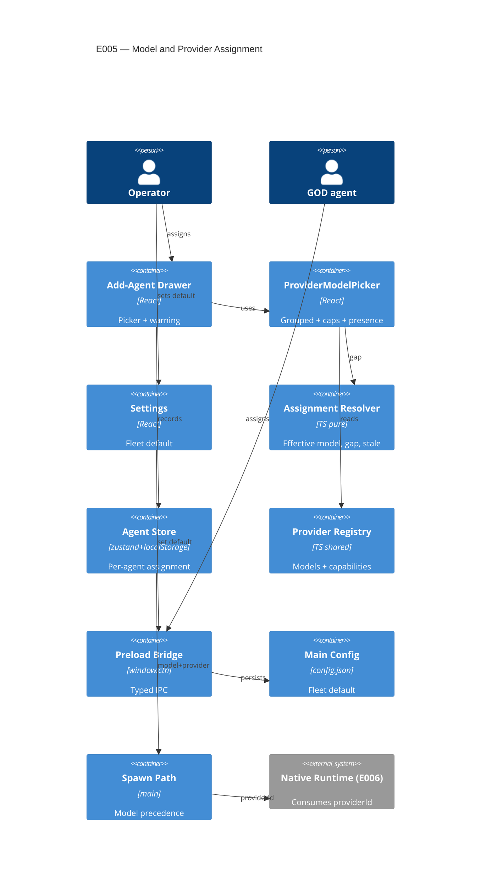

# Implementation Plan: Model and Provider Assignment

**Branch**: `00005-model-and-provider-assignment` | **Date**: 2026-06-08 | **Spec**: [spec.md](spec.md)

## Summary

**Goal**: Let the operator (and GOD agent) assign a provider+model per desk and as a fleet default, with a non-blocking capability-gap warning, persisted across restart.
**Approach**: Extend the existing config + persisted agent record additively; store the canonical `modelId` and derive the provider from the E002 registry; surface a provider-grouped picker + fleet-default setting + gap warning; keep resolution/gap/stale logic in one electron-free module and feed the result into the existing model-precedence spawn path.
**Key Constraint**: Read-only consumer of the E002 registry; shares the Add-Agent drawer + config schema with E004 (additive, independently-keyed); never silently remap a stale assignment.

## Technical Context

**Language/Version**: TypeScript 5.6 (Node 20 / Electron 32 main+preload; React 18 renderer)
**Primary Dependencies**: Electron 32, React 18, zustand 4; E002 `src/shared/providerRegistry.ts`; E001 ProviderRuntime port; E004 config/credentials
**Storage**: JSON `config.json` (userData) for FleetDefault (reuses `defaultModel`); persisted renderer store (localStorage `LS_AGENTS` / `PersistedAgent`) for per-agent AgentAssignment. No new SQL.
**Testing**: Vitest (forks pool); ESLint flat config; `npm run typecheck` (node + web) hard gate
**Target Platform**: Electron desktop (Windows/macOS/Linux)
**Project Type**: single
**Project Mode**: brownfield
**Performance Goals**: N/A — UI selection + O(1) registry map lookups
**Constraints**: persist across restart; additive coexistence with E004 `providerKeys`; provider derived from `modelId` (no dual-edit); warn non-blocking; never remap stale
**Scale/Scope**: ~5–15 agents per floor

## Instructions Check

*GATE: Must pass before Phase 0 research. Re-check after Phase 1 design.*

| Gate | Verdict | Note |
|------|---------|------|
| ENFORCE_SRC_ROOT (all source under `/src`) | PASS | New/modified files in `src/shared`, `src/main`, `src/preload`, `src/renderer` only |
| I. Provider-Agnostic Parity | PASS | Model is a per-desk setting; provider derived behind the registry; adding a provider needs no downstream change |
| II. Truthful Cost Governance | PASS | Read-only registry consumer; unknown/stale `modelId` fails loud (flagged, never remapped to another vendor); no self-reported pricing |
| III. Crash-Contained Isolation | N/A | Assignment-record + UI only; no process/worker/retry/breaker change |
| IV. Agent Output Style | PASS | Artifact-form plan; concise |
| V. Preserve Core & Type Safety | PASS | Additive (no field removal); typecheck node+web stays green; assignments observable on floor |
| Governance out-of-scope guard | PASS | No automatic cost-aware routing / failover; within ADR-0008 scope |
| Secrets never to hive/transcripts/telemetry (ADR-0007) | PASS | Reads credential *presence* only; no key values touched |

**Policy Auditor verdict**: PASS (2026-06-08) — all gates above confirmed; AD-001..006 correctly reference global ADR-0001/0005/0007/0008, no new ADR warranted.

## Architecture



## Architecture Decisions

Feature-local tradeoffs only. Implements accepted ADR-0001 (port), ADR-0005 (registry), ADR-0007 (credentials), ADR-0008 (capability/degradation) — referenced, not duplicated. No new project-wide ADR required.

| ID | Decision | Options Considered | Chosen | Rationale |
|----|----------|--------------------|--------|-----------|
| AD-001 | How to store provider vs model | store both / store model+derive / store provider+model independently | Store `modelId`; derive `providerId` via `lookupModelInfo` | Registry is single source of truth (ADR-0005); no drift |
| AD-002 | Persistence substrate | new unified store / reuse existing | Reuse `config.json` (fleet default) + `PersistedAgent` localStorage (per-agent) | Survives restart via proven round-trips; minimal new surface; additive with E004 |
| AD-003 | Warn-at-assignment trigger | gap-based / per-agent declared-needs / inferred-from-role | Gap-based (name the chosen model's unsupported caps) | Realizes ADR-0008 assignment-time half without a new needs entity; non-blocking |
| AD-004 | How the assignment reaches the agent | new parallel native path now / reuse precedence + record provider | Reuse existing `--model` precedence; record provider for E006 | Keeps E005 to assignment; E006 drives the `nativeRuntime.spawn(agentId, providerId?)` seam |
| AD-005 | Fleet-default inheritance | live-inherit / snapshot-at-creation | Snapshot effective model + `source` onto the agent at creation; explicit revert re-inherits | FR-006 non-retroactivity; no surprise live mutation; provenance via `assignmentSource` |
| AD-006 | Stale/missing model handling | drop / remap to default / preserve+flag | Preserve `modelId`, flag stale, prompt re-selection | Parity + truthful cost (Principle II); research edge-case guidance |

## Data Model Summary

| Entity | Key Fields | Relationships | Notes |
|--------|------------|---------------|-------|
| AgentAssignment | reuses `model` (stored `modelId`); + `assignmentSource?: 'explicit'\|'fleet-default'`; `providerId` DERIVED | `modelId` → Model (soft FK); Model → Provider | On `PersistedAgent` (localStorage), additive; absent ⇒ role-based fallback; unresolvable ⇒ stale (preserved+flagged) |
| FleetDefault | `modelId` (provider derived) | → Model (soft FK) | In `config.json` (reuses `defaultModel`); absence ⇒ role-based fallback; change non-retroactive |
| CapabilityDescriptor | 4 flags (images, MCP, web search, caching) | Model → descriptor | Owned by E002 (`src/shared/providerRuntime.ts`); read-only; drives gap warning |

**Detail**: [data-model.md](data-model.md)

## API Surface Summary

N/A — no external API surface. New internal IPC (fleet-default set via existing `config:update`; an assignment seam for the GOD agent) is listed in Integration Points and the Requirement Coverage Map.

## Testing Strategy

| Tier | Tool | Scope | Mock Boundary | Install |
|------|------|-------|---------------|---------|
| Unit | Vitest (forks) | `src/shared/assignment.ts` — effective-model resolution, precedence (explicit→default→role), capability-gap computation, stale detection, provenance | Inject registry lookups; electron-free (no IPC) | configured |
| Integration | Vitest | Fleet-default config round-trip (set→persist→reload) via pure serialization; preload bridge shape typecheck | Electron IPC behind thin wrappers (type-only import) | configured |
| Security | — | N/A — reads credential presence only; no key values, no new secret path | — | configured |
| Coverage | — | N/A — no numeric coverage target (project policy) | — | N/A |

**Persistence round-trip homing (SC-002 / SC-005 / FR-007 / DR-9)**: the *fleet-default* `config.json` round-trip (set→persist→reload) is asserted at the Integration tier via pure serialization (above). The *per-agent* `cth.agents` localStorage round-trip — the "100% of explicit assignments survive restart" criterion (SC-002) — is verified at the app-smoke/manual tier (the renderer-localStorage substrate is exercised on real restart, consistent with the proven E001–E004 persisted-store convention), while the additive assignment *shape* it serializes (`model` + `assignmentSource`, with `providerId` never persisted) is asserted in the unit tier on `src/shared/assignment.ts`. No persistence claim is left without a home tier.

UI behaviors (picker render, drawer flow, Settings fleet-default control) are verified by app-smoke (manual), recorded transparently — consistent with E001–E004.

## Error Handling Strategy

| Error Category | Pattern | Response | Retry |
|----------------|---------|----------|-------|
| Validation (unknown `modelId` at set) | fail-soft | Reject set with clear message; assignment unchanged | no |
| Capability gap | warn (non-blocking) | Inline warning naming each unsupported capability; Save stays enabled | no |
| Missing credential (assigned provider has no key) | warn / annotate | "Needs credentials" affordance in picker; selection allowed | no |
| Stale assignment (model removed post-assignment) | preserve + flag | Stale badge; prompt re-selection; never remap | no |
| Empty/unreadable registry | fallback | Empty-state in picker; agent creation falls back to existing role-based default | no |

## Integration Points

| Spec Reference | System/Service | Technical Approach | Contract |
|----------------|----------------|--------------------|----------|
| E002 dependency | Provider/model registry | Read options + capabilities | `listProviders` / `lookupModelInfo` / `lookupCapabilities` (`src/shared/providerRegistry.ts`) |
| E004 dependency | Config + credential presence | Annotate picker via presence; additive config fields | renderer `cth.credentials.presence()`; main `keyPresence` / `redactConfig` (`src/main/credentials.ts`), `HarnessConfig` (`src/main/config.ts`) |
| E001 dependency | ProviderRuntime port | Provider derived + recorded for runtime | `providerRuntime.ts` |
| Downstream E006 | Native runtime | Recorded `providerId` feeds spawn seam | `nativeRuntime.spawn(agentId, providerId?)` (`src/main/runtime/nativeRuntime.ts`) |
| Spawn precedence | Main spawn path | Assignment supplies `--model`; fleet default is the fallback | `pty:spawn` handler (`src/main/index.ts`), `modelForRole` (`src/main/config.ts`) |

## Risk Mitigation

| Risk (from spec) | Likelihood | Impact | Mitigation | Owner |
|-------------------|------------|--------|------------|-------|
| Shared Add-Agent drawer / config schema with E004 | M | M | Additive, independently-keyed fields (no widening of `providerKeys`/presence); E004 already complete; typecheck guards shape | AddAgentModal / config |
| "Needed capability" not knowable at assignment time | M | L | Gap-based warning names the chosen model's gaps; no need-prediction | assignment.ts / picker |
| Stale assignment after a registry change | L | M | Resolver treats registry as soft dependency: preserve id, flag stale, prompt re-selection; never remap | assignment.ts |

## Requirement Coverage Map

| Req ID | Component(s) | File Path(s) | Notes |
|--------|--------------|--------------|-------|
| FR-001 | ProviderModelPicker, registry | `+src/renderer/src/components/ProviderModelPicker.tsx`, `src/shared/providerRegistry.ts` | Provider-grouped, capability tags |
| FR-002 | Add-Agent drawer, store | `~src/renderer/src/components/AddAgentModal.tsx`, `~src/renderer/src/store/store.ts` | Record `model` + `assignmentSource='explicit'` |
| FR-003 | Edit-assignment surface, store | `~src/renderer/src/components/AddAgentModal.tsx` (reuse), `~src/renderer/src/store/store.ts` | `updateAgent` re-assign per desk |
| FR-004 | Resolver, store, picker | `+src/shared/assignment.ts`, `~src/renderer/src/store/store.ts` | Revert-to-default; provenance badge |
| FR-005 | Settings, config, bridge | `~src/renderer/src/components/SettingsModal.tsx`, `~src/main/config.ts`, `~src/preload/index.ts` | Set/change fleet default (`defaultModel`) |
| FR-006 | Resolver, drawer, config | `+src/shared/assignment.ts`, `~src/renderer/src/components/AddAgentModal.tsx` | Snapshot at creation; non-retroactive |
| FR-007 | Store, config | `~src/renderer/src/store/store.ts`, `~src/main/config.ts` | localStorage + `config.json` round-trips |
| FR-008 | Spawn path, resolver | `~src/main/index.ts`, `+src/shared/assignment.ts` | Precedence explicit→default→role; record provider |
| FR-009 | Resolver, picker | `+src/shared/assignment.ts`, `+src/renderer/src/components/ProviderModelPicker.tsx` | `computeCapabilityGap`; non-blocking warning |
| FR-010 | Picker, credentials bridge | `+src/renderer/src/components/ProviderModelPicker.tsx`, `~src/preload/index.ts` | `cth.credentials.presence()` annotation |
| FR-011 | Resolver, store | `+src/shared/assignment.ts`, `~src/renderer/src/store/store.ts` | Stale detection; preserve+flag |
| FR-012 | Picker, drawer | `+src/renderer/src/components/ProviderModelPicker.tsx`, `~src/renderer/src/components/AddAgentModal.tsx` | Empty-state + fallback |
| FR-013 | Assignment seam, main | `~src/main/index.ts`, `+src/shared/assignment.ts` | GOD programmatic assign via same path |
| FR-014 | Settings (fleet-default surface) | `~src/renderer/src/components/SettingsModal.tsx` | Scope message: default change applies to new agents only (non-retroactive, FR-006) |

## Project Structure

### Source Code

```text
src/
  shared/
  + assignment.ts                       # pure: resolveEffectiveModel, precedence, computeCapabilityGap, stale detection, provenance
    providerRegistry.ts                 # read-only consumer (listProviders/lookupModelInfo/lookupCapabilities)
  + __tests__/assignment.test.ts        # vitest (node) for the pure resolver
  main/
  ~ config.ts                           # FleetDefault clarified on defaultModel (+ optional accessor)
  ~ index.ts                            # GOD assignment seam; spawn precedence records providerId
  preload/
  ~ index.ts                            # fleet-default get/set passthrough (config); presence already exposed
  renderer/src/
    components/
  ~ AddAgentModal.tsx                   # integrate picker, snapshot default, warning, empty-state
  + ProviderModelPicker.tsx             # provider-grouped picker: caps tags, presence annotation, gap warning, empty-state
  ~ SettingsModal.tsx                   # fleet-default provider/model setting
    store/
  ~ store.ts                            # Agent/PersistedAgent: + assignmentSource; updateAgent re-assign
```

**Patterns to reuse**: E004 `SettingsModal` section pattern + `redactConfig`/`presence`; `AddAgentModal` `pickModel`/`buildSpawnCommand`; `providerRegistry` lookups; the E001–E004 electron-free-pure-module + vitest convention.
**Tests to extend**: add `src/shared/__tests__/assignment.test.ts` mirroring `src/shared/__tests__/providerRegistry.test.ts`.
**Naming conventions**: camelCase functions, PascalCase components/types, IPC `domain:action`, `cth.*` bridge methods.

## Implementation Hints

- **[HINT-001]** Constraint: store `modelId` only; derive `providerId` via `lookupModelInfo` at read time — never persist provider as an editable second field (AD-001 / data-model DR-1).
- **[HINT-002]** Order: fleet-default inheritance is snapshot-at-creation onto the agent record; "revert to default" re-inherits. Changing the default MUST NOT mutate existing agents (AD-005 / FR-006).
- **[HINT-003]** Gotcha: keep resolution/gap/stale logic in electron-free `src/shared/assignment.ts` so vitest runs it in Node (mirror E001–E004); UI/IPC stay thin wrappers.
- **[HINT-004]** Compatibility: assignment fields are additive on `PersistedAgent` + `config.json`. Do NOT widen or alter E004 `providerKeys`/presence — coexist independently-keyed (shared Add-Agent drawer risk).
- **[HINT-005]** Gotcha: treat the registry as a soft dependency — unresolved `modelId` ⇒ stale (preserve+flag+prompt); empty registry ⇒ empty-state + existing role-based fallback; never remap to another provider (Principle II).
