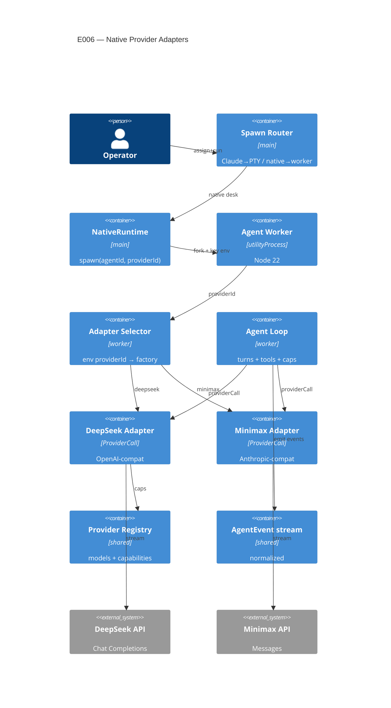

# Implementation Plan: Native Provider Adapters

**Branch**: `00006-native-provider-adapters` | **Date**: 2026-06-09 | **Spec**: [spec.md](spec.md)

## Summary

**Goal**: Two native adapters (DeepSeek, Minimax M3) that run full agentic tool-use loops behind the existing `ProviderRuntime` port inside the E003 worker, so an assigned desk runs on its provider as a full hive peer with graceful runtime degradation.
**Approach**: Implement each adapter as the `ProviderCall` seam (stream → normalized turn + events), selected at the worker from the injected provider id; extend the seam additively with a streaming-emit callback to realize ADR-0002's delta events; normalize the three provider divergences in-adapter; route native-assigned desks to `nativeRuntime.spawn(agentId, providerId)`; reuse ADR-0009 reliability and ADR-0008 degradation.
**Key Constraint**: Adapters keep all provider specifics behind the boundary (no SDK/wire types leak, FR-007); key read from env only, never emitted (FR-013); usage cumulative-monotonic and passed through (recompute is E002/E007).

## Technical Context

**Language/Version**: TypeScript 5.6 (Node 22 in the Electron utilityProcess worker; main process Electron 32; CI Node 20)
**Primary Dependencies**: E001 port (`src/shared/providerRuntime.ts`), AgentEvent (`src/shared/agentEvent.ts`), `ProviderCall` seam (`src/shared/providerCall.ts`), E002 registry (`src/shared/providerRegistry.ts`), E004 credential env (`NATIVE_PROVIDER_API_KEY`/`NATIVE_PROVIDER_ID`), E005 assignment (`providerIdForAgent`). Node global `fetch` + hand-rolled SSE parsing (no vendor SDK).
**Storage**: N/A — no new persistence; usage passes through to existing telemetry.
**Testing**: Vitest (forks) over recorded/mocked provider SSE fixtures; `npm run typecheck` (node + web) hard gate; ESLint.
**Target Platform**: Electron desktop; native adapters run in the per-agent utilityProcess worker (Node 22).
**Project Type**: single
**Project Mode**: brownfield
**Performance Goals**: perceptible token streaming parity with Claude desks; no per-turn overhead beyond the provider round-trip.
**Constraints**: adapter stream→turn/event translation kept electron-free + fetch-injected for vitest; no provider SDK/wire types past the adapter (FR-007); key from env only, never emitted (FR-013); cumulative-monotonic usage (ADR-0002); reliability per ADR-0009; degradation per ADR-0008; single-committer main stays the only writer of shared runtime state (registry capability fixes are static source edits, not worker writes).
**Scale/Scope**: 2 adapters, 3 models (`deepseek-v4-flash`, `deepseek-v4-pro`, `minimax-m3`); 5–15 concurrent native desks bounded by the worker concurrency cap.

## Instructions Check

*GATE: Must pass before Phase 0 research. Re-check after Phase 1 design.*

| Gate | Verdict | Note |
|------|---------|------|
| ENFORCE_SRC_ROOT (all source under `/src`) | PASS | New code in `src/main/runtime/worker/adapters/` + `src/shared`; tests co-located |
| I. Provider-Agnostic Parity | PASS | Adapters behind the port emit the normalized stream; no provider-specific code downstream; adding a provider = adding an adapter (ADR-0001) |
| II. Truthful Cost Governance | PASS | Usage passed through cumulative-monotonic; recompute deferred to E002/E007; no self-reported pricing |
| III. Crash-Contained Isolation & Resilience | PASS | Adapters run in the E003 per-agent worker; ADR-0009 retry/backoff; malformed JSON never crashes the desk; registry fixes are source edits not runtime writes |
| IV. Agent Output Style | PASS | Artifact-form plan |
| V. Preserve Core & Type Safety | PASS | Additive seam extension; no SDK types past adapter; typecheck node+web stays the hard gate; Claude path untouched |
| Degrade gracefully (ADR-0008 runtime half) | PASS | No-op-with-one-notice per capability per session, enforced in-adapter |
| Secrets never to events/telemetry/hive (ADR-0007) | PASS | Key from env only; FR-013 |

**Policy Auditor verdict**: PASS (2026-06-09) — all gates confirmed against source; AD-001..AD-007 reference global ADR-0001/0002/0008/0009/0010 (no new ADR warranted); AD-007 static-source-edit satisfies the single-committer note.

## Architecture



## Architecture Decisions

Feature-local tradeoffs. Implements accepted ADR-0001 (port), ADR-0002 (event bus + streaming deltas + in-adapter normalization), ADR-0008 (capability degradation), ADR-0009 (reliability), ADR-0010 (rendering) — referenced, not duplicated. No new project-wide ADR required (the streaming-emit + normalization decisions are already in ADR-0002).

| ID | Decision | Options Considered | Chosen | Rationale |
|----|----------|--------------------|--------|-----------|
| AD-001 | How adapters emit streaming deltas | aggregate-per-turn only / replace ProviderCall with async-iterator / extend ProviderCall additively with an `emit` callback | Additive: `ProviderCall(req, emit?) → ProviderTurn`; adapter emits text/thinking/tool deltas while streaming, returns the aggregate turn for tool-exec + usage | Realizes ADR-0002 canonical deltas; additive (stub/Claude unaffected); no downstream change (Principle V) |
| AD-002 | Where adapter selection happens | dispatch in main before fork / dispatch in worker from injected env | In the worker, on `process.env.NATIVE_PROVIDER_ID` → factory, replacing `makeStubProvider()` | Key + id already injected into the worker env (E004); main stays provider-agnostic; selection co-located with key read |
| AD-003 | Provider HTTP client | vendor SDKs (`openai`, `@anthropic-ai/sdk`) / hand-rolled `fetch` + SSE parser | Hand-rolled Node `fetch` + a small shared SSE line parser, per adapter | Lean (no heavy deps in the worker bundle); full control over divergence normalization + usage; nothing to contain for FR-007 (no SDK types) |
| AD-004 | Usage normalization | per-chunk passthrough / accumulate in-adapter | Accumulate to a cumulative-monotonic counter in-adapter (DeepSeek: `include_usage` final chunk summed across rounds; Minimax: latest `message_delta.usage` added; absent fields = 0, never decrease) | ADR-0002 monotonic `token-usage`; correct Minimax context-tier (FR-006) |
| AD-005 | Capability-degradation enforcement | in shared consumers / in the adapter at the invocation seam | In-adapter, gated on the registry descriptor; one `notification` per capability per session; strip the unsupported field, continue | ADR-0008 runtime half; FR-010; keeps consumers provider-agnostic |
| AD-006 | Reliability policy | per-adapter ad hoc / reuse ADR-0009 | Reuse ADR-0009: retryable allowlist (429/5xx/timeouts, honor Retry-After) + full-jitter backoff (3–5, capped); exhausted/non-retryable → `api-error` feeding the breaker; per-turn wall-clock budget; runaway bounded by existing max-turn/max-hop caps | ADR-0009 accepted; FR-012; no false breaker trips |
| AD-007 | Registry capability-flag correction | worker writes registry at runtime / static source edit | Correct any wrong flag by editing the static registry data module (`providerRegistry.ts`) in source; read-only at runtime | Registry is static code, not runtime shared state — no single-committer violation (Principle III); FR-014 |

## Data Model Summary

N/A — no persistent data. The feature's "entities" are existing code contracts (ProviderRuntime, AgentEvent, ProviderModelRegistry) and new code modules (the two adapters); usage is passed through to existing telemetry, not stored.

## API Surface Summary

N/A — no external API surface is exposed. The adapters CALL external provider HTTP APIs (EXTERNAL-SERVICE); the internal plug-in contract is the `ProviderCall` seam (extended per AD-001), documented in Architecture + Implementation Hints, not an OpenAPI/GraphQL surface.

## Testing Strategy

| Tier | Tool | Scope | Mock Boundary | Install |
|------|------|-------|---------------|---------|
| Unit | Vitest (forks) | Per-adapter stream→turn/event translation over recorded SSE fixtures. **Happy-path**: DeepSeek index-keyed tool assembly + reasoning routing + single-final usage; Minimax block/partial-JSON assembly + thinking + cumulative usage; multi-round tool loop. **Usage/tier**: cumulative-monotonic usage across rounds; Minimax context-length-tier scenario as a distinct fixture pair — one prompt below and one above the registry-defined tier boundary (derived from the E002 price-row threshold, not a magic number), asserting the correct tier is reflected. **Negative/edge**: capability no-op + single-notice **and** notice-not-repeated across turns; malformed/partial-JSON handling (no tool executes, error tool result fed back); stream-interrupted-mid-tool-call (incomplete block discarded, retryable error surfaced); empty/refused turn ends cleanly; retry classification (retryable allowlist vs terminal, independent of backoff timing). | Inject `fetch`/stream (electron-free adapter core); no live network | configured |
| Integration | Vitest | Adapter selection (`NATIVE_PROVIDER_ID` → factory) + `runAgentLoop` driving a mock adapter through a multi-round tool loop emitting the normalized stream | Mock adapter + mock `executeTool`; no electron | configured |
| Security | — | N/A by tooling — assert by test that no adapter path writes the key into the full FR-013 surface set (emitted events, usage, telemetry, transcripts, the hive, and logs) via a string-absence check; key reaches the adapter only through the injected env seam (E004), so a leak from any other path is detectable | — | configured |
| Coverage | — | N/A — no numeric coverage target (project policy) | — | N/A |

Live DeepSeek/Minimax calls require real keys (none in CI) → manual app-smoke per the plan; the loop/assembly/usage/degradation logic is fully fixture-tested in Node. **Manual app-smoke scope** (what a human confirms against the real providers, all other logic being fixture-tested): (1) a DeepSeek desk and a Minimax desk each complete a real multi-step tool-use task end-to-end (SC-001/SC-003); (2) reasoning/thinking surfaces correctly and is not replayed (SC-002); (3) per-agent telemetry/usage accrues cumulative-monotonically against real provider reports and the desk behaves as a full hive peer alongside a Claude desk (SC-005/SC-006); (4) assigning a desk to a native provider actually launches it on that provider with its assigned model (SC-007); (5) spot-check that the API key never appears in any operator-visible surface during a real run (FR-013). No P1 adapter logic is verified only here.

## Error Handling Strategy

| Error Category | Pattern | Response | Retry |
|----------------|---------|----------|-------|
| Malformed/partial tool-call JSON | fail-soft, self-correct | `tool-end success:false` + error tool result fed back; `api-error`; never execute the partial call | no |
| Stream interrupted mid-tool-call | discard + surface | drop the incomplete block (never execute); retryable `api-error` | yes (retryable) |
| Transient provider error (429/5xx/timeout) | retry (ADR-0009) | silent retry with Retry-After + full-jitter backoff, bounded attempts | yes |
| Non-retryable (400/401/403, context overflow) | fail-fast | end the turn cleanly; `api-error` (retryable:false) → breaker | no |
| Unsupported capability | degrade (ADR-0008) | skip path, one `notification` per capability/session, continue | no |
| Runaway loop | bound | stop at max-turn/max-hop + per-turn wall-clock budget; terminal `stop` | no |
| Missing key at launch | guard | surface "needs credentials"; do not start a broken loop | no |

## Integration Points

| Spec Reference | System/Service | Technical Approach | Contract |
|----------------|----------------|--------------------|----------|
| FR-001/004, EXTERNAL-SERVICE | DeepSeek + Minimax HTTP APIs | `fetch` + SSE streaming in-adapter; endpoints from registry rows | OpenAI Chat Completions / Anthropic Messages (in-adapter) |
| FR-001/004/007 | `ProviderCall` seam (E001/E003) | Each adapter implements `ProviderCall` (extended w/ emit, AD-001) replacing `makeStubProvider()` | `src/shared/providerCall.ts`, `src/main/runtime/worker/agentWorker.ts` |
| FR-007 | AgentEvent bus (E001/ADR-0002) | Adapters emit normalized deltas via the loop emit; no SDK types past boundary | `src/shared/agentEvent.ts` |
| FR-008 | Assignment→spawn (E005) | Spawn router sends native-assigned desks to `nativeRuntime.spawn(agentId, providerId)` using `providerIdForAgent` | `src/main/index.ts`, `src/main/runtime/nativeRuntime.ts` |
| FR-008/013 | Credential env (E004) | Adapter reads `NATIVE_PROVIDER_API_KEY`/`NATIVE_PROVIDER_ID` from `process.env` | `src/main/credentials.ts` |
| FR-009 | Hive tools / autonomy | Native worker `executeTool` exposes the hive tools; `requestDrain` autonomy already wired (E003) — verify/extend so memory/mailbox/tasks work for native desks | `src/main/runtime/worker/agentWorker.ts`, agentLoop deps |
| FR-010/014 | Registry capability descriptor (E002) | Adapter gates optional paths on `lookupCapabilities`; correct wrong flags in source | `src/shared/providerRegistry.ts` |

## Risk Mitigation

| Risk (from spec) | Likelihood | Impact | Mitigation | Owner |
|-------------------|------------|--------|------------|-------|
| Provider API divergence / drift | M | H | Normalize in-adapter; parse-on-complete-only; monotonic usage; fixture tests pin assembly/usage/stop per provider | adapters |
| No live API keys in CI | H | M | Fixture/mocked SSE unit + integration tests for all logic; live behavior by manual smoke; document the manual gate | testing |
| Non-streaming seam limits avatar parity | M | M | Extend `ProviderCall` additively with an emit callback (AD-001); fall back to per-turn events if not extended | seam (AD-001) |

## Requirement Coverage Map

| Req ID | Component(s) | File Path(s) | Notes |
|--------|--------------|--------------|-------|
| FR-001 | DeepSeek adapter | `+src/main/runtime/worker/adapters/deepseekAdapter.ts` | OpenAI-compat loop behind ProviderCall |
| FR-002 | DeepSeek tool assembly | `+.../adapters/deepseekAdapter.ts` | index-keyed delta accumulation; parse-on-complete; multi-call |
| FR-003 | DeepSeek reasoning routing | `+.../adapters/deepseekAdapter.ts` | reasoning_content→thinking; not replayed |
| FR-004 | Minimax adapter | `+src/main/runtime/worker/adapters/minimaxAdapter.ts` | Anthropic-compat loop behind ProviderCall |
| FR-005 | Minimax block assembly | `+.../adapters/minimaxAdapter.ts` | partial_json at block stop; thinking; stop_reason tool_use |
| FR-006 | Usage normalization | `+.../adapters/deepseekAdapter.ts`, `+.../adapters/minimaxAdapter.ts`, `~src/shared/providerCall.ts` | cumulative-monotonic; Minimax context tier |
| FR-007 | Event emission | `~src/main/runtime/worker/agentLoop.ts`, `~src/shared/providerCall.ts` | emit normalized deltas; no SDK types past boundary |
| FR-008 | Spawn routing + selection | `~src/main/index.ts`, `~src/main/runtime/nativeRuntime.ts`, `+.../adapters/selectAdapter.ts`, `~.../worker/agentWorker.ts` | native desk → nativeRuntime.spawn(providerId); env→factory |
| FR-009 | Hive-peer participation | `~src/main/runtime/worker/agentWorker.ts`, `~src/main/runtime/worker/agentLoop.ts` | executeTool→hive tools; autonomy/drain; stream drives avatars/telemetry/breaker |
| FR-010 | Capability degradation | `+.../adapters/capabilityGate.ts` (or in-adapter) | no-op + one notice/session; reads descriptor |
| FR-011 | Tool-JSON safety | `+.../adapters/*Adapter.ts`, `~.../worker/agentLoop.ts` | never exec partial; error tool result |
| FR-012 | Reliability | `+.../adapters/reliability.ts` (or in-adapter), `~.../worker/agentLoop.ts` | ADR-0009 retry/backoff/classify; per-turn budget |
| FR-013 | Key non-leak | `+.../adapters/*Adapter.ts` | key from env only; never emitted (test-asserted) |
| FR-014 | Registry capability fix | `~src/shared/providerRegistry.ts` | source edit if a flag misrepresents support |

## Project Structure

### Source Code

```text
src/
  main/runtime/worker/
  + adapters/
  +   deepseekAdapter.ts        # OpenAI-compat: request build, SSE parse, index-keyed tool assembly, reasoning routing, usage
  +   minimaxAdapter.ts         # Anthropic-compat: block assembly, partial_json, thinking, usage + context tier
  +   sseParser.ts              # shared SSE line/event parser (electron-free, fetch-injected)
  +   selectAdapter.ts          # NATIVE_PROVIDER_ID → adapter factory (replaces makeStubProvider)
  +   capabilityGate.ts         # degradation no-op + one-notice-per-session (reads descriptor)
  +   reliability.ts            # ADR-0009 retry/backoff/classify wrapper
  ~ agentWorker.ts              # inject selectAdapter(env) instead of makeStubProvider()
  ~ agentLoop.ts                # pass scoped emit into providerCall; stream deltas; reliability + capability plumbing
  + __tests__/deepseekAdapter.test.ts   # fixture-stream tests
  + __tests__/minimaxAdapter.test.ts
  + __tests__/selectAdapter.test.ts
  + __tests__/degradation.test.ts
  shared/
  ~ providerCall.ts             # extend ProviderCall: optional emit callback + richer turn (stopReason/thinking) — additive
  ~ providerRegistry.ts         # correct DeepSeek/Minimax capability flags if a seed misrepresents support
  main/
  ~ index.ts                    # spawn router: native-assigned desk → nativeRuntime.spawn(agentId, providerId)
  ~ runtime/nativeRuntime.ts    # ensure providerId flows to the worker (already parameterized E004/E005)
```

**Patterns to reuse**: the E003 worker + `runAgentLoop` + `makeStubProvider` shape; the E001 AgentEvent emit contract; E002 `lookupCapabilities`; E004 env constants; E005 `providerIdForAgent`; the E001–E005 electron-free-core + vitest convention.
**Tests to extend**: add adapter fixture suites under `src/main/runtime/worker/__tests__/` mirroring `nativeAgentWorker.test.ts` / `agentLoop.test.ts`.
**Naming conventions**: camelCase functions, PascalCase types, adapter factory `makeDeepseekAdapter()/makeMinimaxAdapter()` returning `ProviderCall`.

## Implementation Hints

- **[HINT-001]** Constraint: keep each adapter's stream→turn/event core electron-free and `fetch`-injected so vitest runs it in Node over recorded SSE fixtures (mirror E001–E005); the worker entry is the only place that reads `process.env`.
- **[HINT-002]** Gotcha: parse tool arguments ONLY when the call is complete (DeepSeek `finish_reason:'tool_calls'`; Minimax `content_block_stop`). Never execute a tool from partial/un-parsed JSON (FR-011). Key the accumulator on the delta/block `index`, not array position.
- **[HINT-003]** Constraint: usage is cumulative-monotonic — DeepSeek emit once at the final chunk (`include_usage`) summed across rounds; Minimax take the latest `message_delta.usage` cumulatively; treat absent cache fields as 0, never a decrease (AD-004 / ADR-0002).
- **[HINT-004]** Order: degradation gates read the registry descriptor BEFORE invoking an optional path; emit exactly one `notification` per capability per session (dedupe), strip the field, continue — never throw (AD-005 / ADR-0008).
- **[HINT-005]** Gotcha: `ProviderCall` extension is ADDITIVE (optional `emit`) — the stub and Claude paths must keep compiling/behaving unchanged; reliability wraps the provider call per ADR-0009 and only exhausted/non-retryable errors feed the breaker (do not false-trip on a transient 429).
