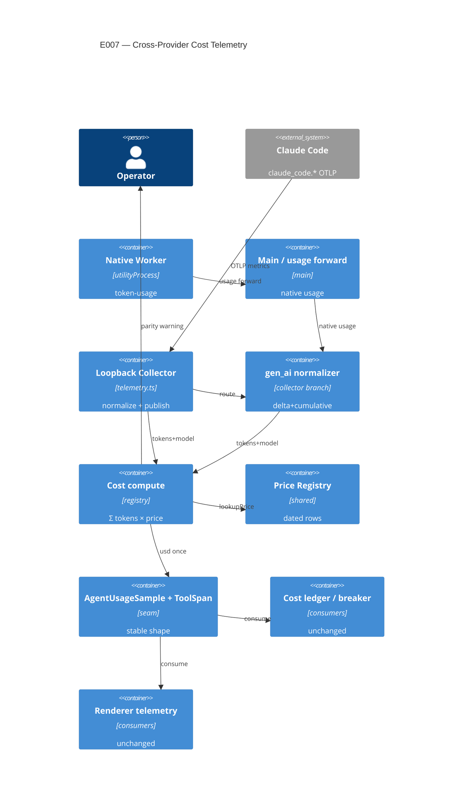

# Implementation Plan: Cross-Provider Cost Telemetry

**Branch**: `00007-cross-provider-cost-telemetry` | **Date**: 2026-06-09 | **Spec**: [spec.md](spec.md)

## Summary

**Goal**: Compute per-agent/fleet cost provider-accurately once at the usage seam from the price registry (never self-reported), and route native-agent telemetry through the loopback collector so a DeepSeek/Minimax desk reaches the same `AgentUsageSample` + `ToolSpan` seam as a Claude desk.
**Approach**: At the live seam (the OTLP collector in `telemetry.ts`), compute USD = Σ(tokens × E002 registry row) on publish — replacing the `claude_code.cost.usage` sum as the cost source — for both Claude and a new `gen_ai.*` normalization branch fed by native usage; fail loud on an unknown model; thread the context size for the Minimax tier; scrub secrets; keep `AgentUsageSample`/`ToolSpan` shapes stable.
**Key Constraint**: Compute-once at the single seam, never recomputed downstream (FR-002); registry is the only cost source — never a provider's self-reported USD (FR-005); the locked `AgentUsageSample`/`ToolSpan` shapes are unchanged so every consumer (ledger, breaker, renderer, waterfall) is untouched (FR-014).

## Technical Context

**Language/Version**: TypeScript 5.6 (Node 20/22 — Electron 32 main; native worker utilityProcess)
**Primary Dependencies**: the locked usage seam (`src/main/usage.ts` `UsageProvider`/`AgentUsageSample`), the loopback OTLP collector (`src/main/telemetry.ts`, `ToolSpan`), E002 registry (`src/shared/providerRegistry.ts` `lookupPrice`/`computeCost`/`PriceRow`, `src/main/pricing.ts` shim), E001 `token-usage` event, E003/E006 native worker usage forward (`nativeAgentWorker.ts`)
**Storage**: N/A — no new persistence; the existing cost ledger (`cost-ledger.jsonl`) consumes the unchanged `AgentUsageSample`
**Testing**: Vitest (forks) — golden-vector cost vectors + collector-normalization fixtures; `npm run typecheck` (node + web) hard gate; ESLint
**Target Platform**: Electron desktop (main-process collector + utilityProcess worker)
**Project Type**: single
**Project Mode**: brownfield
**Performance Goals**: cost compute is O(1) per publish (a few multiplies); no hot path beyond the existing per-batch collector ingest
**Constraints**: compute-once at the seam (FR-002); registry-only cost source (FR-005); fail-loud on unknown id (FR-006); `AgentUsageSample`/`ToolSpan` shapes locked (FR-014); pinned GenAI semconv (FR-009); secrets never in telemetry (FR-013); single-writer cumulative-monotonic accumulation in main
**Scale/Scope**: 3 providers, 3 models; 5–15 concurrent desks; per-agent cumulative counters

## Instructions Check

*GATE: Must pass before Phase 0 research. Re-check after Phase 1 design.*

| Gate | Verdict | Note |
|------|---------|------|
| ENFORCE_SRC_ROOT (all source under `/src`) | PASS | Changes in `src/main/telemetry.ts`, `src/main/usage.ts`, `src/main/pricing.ts`/`src/shared/providerRegistry.ts`, native-usage forward; tests co-located |
| II. Truthful Cost Governance | PASS | USD computed once at the seam from the registry (FR-001/002); self-reported `cost.usage` rejected (FR-005); unknown id fails loud (FR-006); only a missing field degrades, never the price (FR-007); ≤5% golden-vector gate (FR-012) |
| I. Provider-Agnostic Parity | PASS | Native `gen_ai.*` + Claude `claude_code.*` normalize into the same `AgentUsageSample`/`ToolSpan`; no provider-specific downstream code (FR-010/011) |
| III. Crash-Contained Isolation | N/A | No worker/breaker logic change; single-writer cumulative accumulation in main is consistent with single-committer |
| IV. Agent Output Style | PASS | Artifact-form plan |
| V. Preserve Core & Type Safety | PASS | `AgentUsageSample`/`ToolSpan` shapes locked (FR-014); additive; `npm run typecheck` (node + web) stays the hard gate; consumers untouched |
| Secrets never to telemetry (ADR-0007) | PASS | Least-attribute emission; collector reads only known attrs; no key in spans/metrics (FR-013) |
| Governance out-of-scope guard | PASS | No auto cost-routing; CAP-017 breaker/budget logic, CAP-019 switch parity, E002 registry data excluded |

**Policy Auditor verdict**: PASS (2026-06-09) — all gates confirmed against source (cost.usage source at `telemetry.ts:298`, single-writer main accumulators, locked sample/span shapes, fail-loud pricing); AD-001..006 reference ADR-0005/0006/0007, no new ADR warranted.

## Architecture



## Architecture Decisions

Feature-local tradeoffs. Implements accepted ADR-0005 (registry + single-seam true-cost recompute, fail-loud), ADR-0006 (OTel GenAI emission + collector normalization, pinned semconv, delta-vs-cumulative), ADR-0007 (secrets) — referenced, not duplicated. No new project-wide ADR required.

| ID | Decision | Options Considered | Chosen | Rationale |
|----|----------|--------------------|--------|-----------|
| AD-001 | Cost SOURCE at the live seam | keep `claude_code.cost.usage` sum / compute from the registry at the seam | Compute USD = Σ(tokens × registry row) at the collector publish, for all providers; `cost.usage` retained only as a diagnostic cross-check | ADR-0005 single-seam true-cost; self-reported rejected (FR-005); matches the transcript-fallback path which already uses the registry |
| AD-002 | Native telemetry normalization path | worker emits OTLP directly to the loopback collector / main feeds the collector a `gen_ai.*` branch from the forwarded native usage | Collector gains a `gen_ai.*` normalization branch; native usage (already forwarded worker→main) is fed into it (single-writer in main) | Single-writer cumulative accumulation (research); one normalizer; no OTLP exporter per worker; testable; satisfies ADR-0006 |
| AD-003 | Unknown-model vs missing-field | reuse `computeCost {usd,bestEffort}` (conflates) / distinguish at the seam | Distinguish unknown-model (→ loud telemetry-parity warning; sample `usd = null`, no price billed) from a missing usage field (→ best-effort zero for that field). `AgentUsageSample.usd` widens to `number \| null`; consumers exclude `null` from billed totals (never 0) | FR-006 vs FR-007 require different handling; `bestEffort` alone conflates them; `usd=null` (not 0) keeps "no default price" honest without a new field (FR-014) |
| AD-004 | Minimax context tier selection | ignore tier / thread request context size | Thread the request context size — the call's input/prompt token count (the context length) — into `computeCost` opts; the tier is selected from that single metric, then the WHOLE call (input+output+cache) is repriced at the selected dated row | ADR-0005 / FR-004; Minimax's tier is the context length (prompt size), and crossing the threshold reprices the whole call. Note: research §3's "total tokens" refers to the whole-call amount that is *repriced*, not the metric that *selects* the tier — the selector is the input/prompt context length |
| AD-005 | Semconv pin + secret scrubbing | unpinned / pinned + least-attribute | Pin `OTEL_SEMCONV_STABILITY_OPT_IN`; emit only token counts + required ids (content-capture off); collector reads a known-attr allowlist | ADR-0006 (experimental semconv) + ADR-0007 (no secrets in telemetry); FR-009/013 |
| AD-006 | ≤5% accuracy validation | live-bill only / CI golden vectors + out-of-band reconcile | CI golden vectors (known tokens × dated rows → expected USD; DeepSeek cache split, Minimax tier, Claude) runnable without keys; registry rows vs real bills reconciled out-of-band | ADR-0005 / CAP-016; live bills not reproducible in CI (FR-012) |

## Data Model Summary

N/A — no persistent data. The "entities" are existing code contracts: `AgentUsageSample` and `ToolSpan` (shapes locked, FR-014) and the E002 `PriceRow` (referenced). Cost is computed into the existing sample; the existing `cost-ledger.jsonl` is unchanged.

## API Surface Summary

N/A — no external API surface. The internal seam is the existing `UsageProvider`/`AgentUsageSample` + the collector's OTLP ingest (extended with a `gen_ai.*` branch), documented in Architecture + Integration Points; not an OpenAPI/GraphQL surface.

## Testing Strategy

| Tier | Tool | Scope | Mock Boundary | Install |
|------|------|-------|---------------|---------|
| Unit | Vitest (forks) | Golden-vector cost compute (DeepSeek cache split, Minimax context tier whole-call, Claude) → expected USD within ≤5%; unknown-id → parity warning + no price; missing-field → zero-not-price | Pure `computeCost`/seam compute; registry rows as fixtures | configured |
| Integration | Vitest | Collector normalization: feed `claude_code.*` delta + `gen_ai.*` native metric bodies → assert one cumulative-monotonic `AgentUsageSample` (no double-count/decrease) + `ToolSpan`; secret-scrub (key absent from any emitted metric/attribute) | Call collector ingest with fabricated OTLP bodies; no live network/keys | configured |
| Security | — | Asserted by the integration secret-scrub test (FR-013); no separate tool | — | configured |
| Coverage | — | N/A — no numeric coverage target (project policy) | — | N/A |

Live ≤5% reconciliation against a real provider bill is out-of-band manual (no keys in CI); the compute + normalization are fully golden-vector/fixture-tested. The renderer cost/telemetry surfaces are unchanged consumers (app-smoke).

## Error Handling Strategy

| Error Category | Pattern | Response | Retry |
|----------------|---------|----------|-------|
| Unknown/unpriced model id | fail-loud | Telemetry-parity warning (operator-visible); no default/substituted price; sample flagged | no |
| Missing usage field (known model) | best-effort | Treat the absent field as zero for the computation only; price never substituted | no |
| Decreasing cumulative value arrives | clamp-monotonic | The per-agent counter holds at its prior cumulative max (the decrease is not applied); never lowers the counter, preserving the never-decreases invariant (FR-010/SC-006) | no |
| Malformed metric (structurally invalid OTLP) | ignore | Drop; accumulate nothing. Criterion: body fails to parse / missing or non-numeric data point — distinct internal reason `malformed` (FR-009 edge case) | no |
| Semconv version drift (off-version but well-formed OTLP) | ignore | Drop; accumulate nothing. Criterion: well-formed OTLP whose instrument/attribute schema does not match the pinned semconv (unknown/renamed name or attrs) — distinct internal reason `drift`; emission stays on the pinned version, shape not mis-mapped | no |
| Secret would appear in an attribute | scrub | Least-attribute emission; collector reads only the known-attr allowlist | no |

## Integration Points

| Spec Reference | System/Service | Technical Approach | Contract |
|----------------|----------------|--------------------|----------|
| FR-001/003/004, ADR-0005 | E002 price registry | Compute USD via `computeCost`/`lookupPrice` at the seam; thread context-size opts for the tier | `src/shared/providerRegistry.ts`, `src/main/pricing.ts` |
| FR-001/002/005/010, US1 | Usage seam (live `UsageProvider`) | Compute USD from the registry at the collector publish, replacing `cost.usage` as the source | `src/main/telemetry.ts`, `src/main/usage.ts` |
| FR-008/010/011, ADR-0006 | Loopback collector | Add a `gen_ai.*` normalization branch fed by native usage; same cumulative accumulation as `claude_code.*` | `src/main/telemetry.ts` ingest |
| FR-008/010 | Native worker usage forward | The forwarded native `token-usage` (E006) drives the `gen_ai.*` branch (single-writer in main) | `src/main/runtime/nativeAgentWorker.ts`, `nativeRuntime.ts` |
| FR-013, ADR-0007 | Secret scrubbing | Least-attribute emission + known-attr allowlist at ingest | `src/main/telemetry.ts` |
| FR-014 | Consumers (unchanged) | Ledger, breaker, renderer, waterfall read `AgentUsageSample`/`ToolSpan` as-is | `hive.ts`, `breaker.ts`, `useTelemetry.ts` |

## Risk Mitigation

| Risk (from spec) | Likelihood | Impact | Mitigation | Owner |
|-------------------|------------|--------|------------|-------|
| ≤5% accuracy hard to validate / cache-field ambiguity | M | H | Golden-vector reconciliation against dated rows + a build-time spike confirming each provider's usage fields; out-of-band manual bill reconcile | cost compute |
| Delta-vs-cumulative double-count or drop | M | H | Single-writer cumulative accumulation in main; idempotent joins; idle-eviction tuned above the longest idle gap; monotonic-never-decrease assertion | collector |
| Experimental GenAI semconv drift | M | M | Pin the version, record it; ignore unrecognized incoming shapes rather than mis-map | collector / config |

## Requirement Coverage Map

| Req ID | Component(s) | File Path(s) | Notes |
|--------|--------------|--------------|-------|
| FR-001 | Seam cost compute | `~src/main/telemetry.ts`, `src/shared/providerRegistry.ts` | Σ tokens × registry at publish, all providers |
| FR-002 | Compute-once | `~src/main/telemetry.ts` | USD set once at the seam; consumers read as-is |
| FR-003 | Registry-only pricing | `~src/main/telemetry.ts`, `~src/main/pricing.ts` | No family-string/Anthropic default for non-Claude |
| FR-004 | Cache split + tier | `~src/main/telemetry.ts`, `src/shared/providerRegistry.ts` | DeepSeek split; Minimax whole-call tier via opts |
| FR-005 | No self-reported USD | `~src/main/telemetry.ts` | `cost.usage` not the source (diagnostic only) |
| FR-006 | Unknown-id parity warning | `~src/main/telemetry.ts`, `~src/main/pricing.ts` | Loud warning; no default price; warning payload bounded to the model id only (no prompt/tokens/headers) |
| FR-007 | Missing-field best-effort | `~src/main/telemetry.ts`, `src/shared/providerRegistry.ts` | Field→0, never the price |
| FR-008 | Native OTel/gen_ai emission | `~src/main/telemetry.ts`, `~src/main/runtime/nativeAgentWorker.ts` | gen_ai branch fed by native usage; closed span/metric set (invoke_agent/chat/execute_tool + token.usage histogram) |
| FR-015 | Mandatory join-attribute set | `~src/main/telemetry.ts` | agent.id join key + provider.name/request.model mandatory; response.model recommended; missing-mandatory → dropped |
| FR-016 | execute_tool → ToolSpan mapping | `~src/main/telemetry.ts` | Fixed field mapping (tool/success/duration/decision/error); failed tool → success=false + error |
| FR-009 | Semconv pin | `~electron.vite.config.ts`/env, `~src/main/telemetry.ts` | `OTEL_SEMCONV_STABILITY_OPT_IN` recorded |
| FR-010 | Delta-vs-cumulative normalize | `~src/main/telemetry.ts` | One cumulative-monotonic sample, no double-count |
| FR-011 | Telemetry parity | `~src/main/telemetry.ts` | Native desk → AgentUsageSample + ToolSpan |
| FR-012 | ≤5% accuracy | `+src/main/__tests__/costVectors.test.ts` | Golden vectors |
| FR-013 | Secret scrub | `~src/main/telemetry.ts` | Least-attribute + allowlist; non-leak covers the diagnostic/parity-warning/best-effort/clamp/drop channels too (assert secret absent on every path — see telemetryNormalize.test.ts secret-scrub) |
| FR-014 | Shape stability | `src/main/usage.ts`, `src/main/telemetry.ts` | No field-shape change to sample/span |

## Project Structure

### Source Code

```text
src/
  main/
  ~ telemetry.ts                # compute USD from registry at publish (replace cost.usage source); + gen_ai.* normalization branch; parity warning; context-tier opts; secret allowlist
  ~ usage.ts                    # ensure the live seam's USD is registry-computed (align with the fallback); no AgentUsageSample shape change
  ~ pricing.ts                  # distinguish unknown-model (parity warning) vs missing-field (best-effort); context-tier opts passthrough
  ~ runtime/nativeAgentWorker.ts # forward native usage into the collector gen_ai branch (single-writer in main)
  + __tests__/costVectors.test.ts        # golden-vector cost (cache split, Minimax tier, Claude) within ≤5%; unknown→warning; missing-field→0
  + __tests__/telemetryNormalize.test.ts # claude_code.* delta + gen_ai.* → one cumulative-monotonic AgentUsageSample + ToolSpan; no double-count; secret-scrub
  shared/
    providerRegistry.ts         # computeCost/lookupPrice/PriceRow (E002, consumed; minor: surface unknown distinctly + context-tier opts if needed)
electron.vite.config.ts         # pin OTEL_SEMCONV_STABILITY_OPT_IN (or main-process env)
```

**Patterns to reuse**: the existing collector ingest/accumulation + `publishUsage` path; `computeCost`/`lookupPrice` (E002); `normalizeModel`; the E001–E006 electron-light-logic + vitest convention; the transcript-fallback's existing registry use as the template for the live path.
**Tests to extend**: add `src/main/__tests__/` suites feeding fabricated OTLP metric bodies + token×price vectors (telemetry.ts ingest is callable without the live HTTP server).
**Naming conventions**: camelCase functions, PascalCase types; keep `AgentUsageSample`/`ToolSpan` field names unchanged.

## Implementation Hints

- **[HINT-001]** Constraint: compute USD ONCE at the collector publish from cumulative token counts × the registry row; do NOT also sum `claude_code.cost.usage` into `usd` (keep it only as an optional diagnostic) — the registry is the single source (AD-001/FR-005).
- **[HINT-002]** Gotcha: distinguish unknown-model (loud parity warning, bill nothing) from a missing usage FIELD (zero that field only) — `computeCost`'s `bestEffort` conflates them, so check `lookupPrice` unknown separately at the seam (AD-003/FR-006/007).
- **[HINT-003]** Order: select the Minimax tier from the call's input/prompt context length (the single selecting metric, per AD-004) BEFORE pricing any class, then reprice the WHOLE call (input+output+cache) at the selected tier row (thread context-size into `computeCost` opts) (AD-004/FR-004).
- **[HINT-004]** Gotcha: keep the per-agent counter cumulative-monotonic across BOTH `claude_code.*` deltas and native per-call usage — single-writer accumulation in main, idempotent joins, never decrease/double-count (FR-010); test by interleaving both sources.
- **[HINT-005]** Constraint: do NOT change the `AgentUsageSample`/`ToolSpan` field shapes (FR-014) — every consumer (ledger, breaker, renderer, waterfall) must keep reading them unchanged; emit least-attribute telemetry with no key/secret (FR-013).
