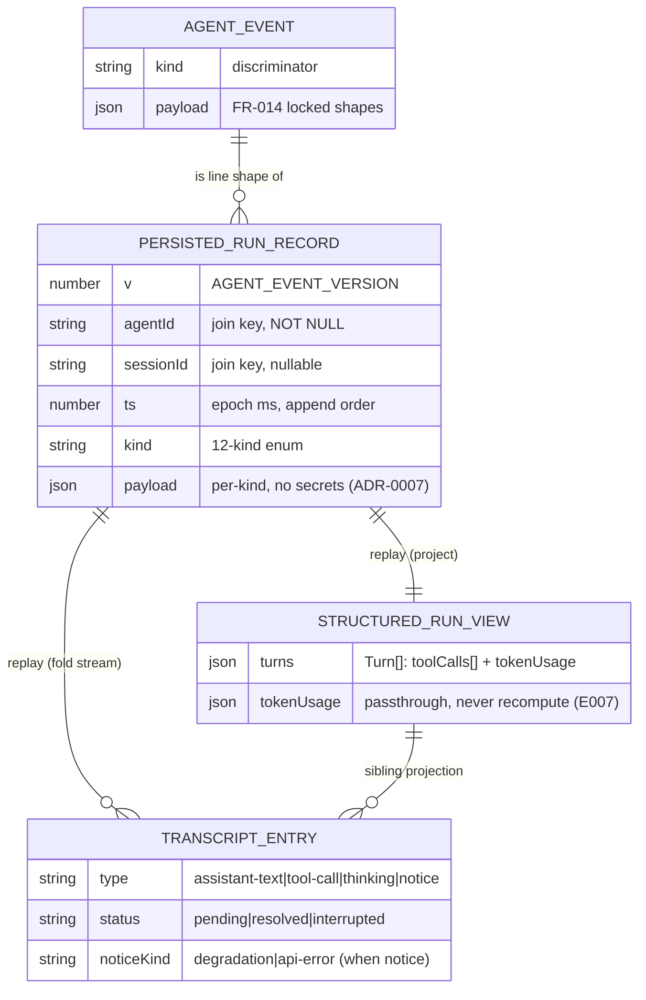

# Data Model: Native Agent Panel Rendering (E008)

> Feature `00008-native-agent-panel-rendering` | 2026-06-09 | Document/JSONL schema for the persisted native run record and the renderer-side view-models derived from it.

## Nature of the Data

This feature has NO relational/SQL schema. There are three data shapes:

1. **Persisted run record** — a DURABLE, APPEND-ONLY JSONL event log, one file per agent/session, each line one `AgentEvent` envelope. Mirrors the existing `cost-ledger.jsonl` / `log.jsonl` append-only pattern in `src/main/hive.ts` (`appendCostLedger`, `appendLog`): single-writer in the Electron main process, append-on-event, naturally ordered by `ts`, durable immediately.
2. **Transcript entry** — a renderer-side VIEW-MODEL, derived (never stored as its own substrate) by folding the event stream.
3. **Structured run view** — a renderer-side VIEW-MODEL, the turns -> tool-calls -> token-usage projection of the same event stream.

**Substrate decision (ADR-0007 alignment).** Append-only JSONL per agent/session is the chosen substrate. SQLite was considered and rejected: heavier than needed for an ordered, append-only, replay-only stream with no query/index/random-access requirement; the JSONL log is replayed top-to-bottom on open, never queried. No new fields are added to `AgentEvent` (FR-014). The persisted record carries ONLY `AgentEvent` fields and MUST NOT contain secrets/API keys/auth headers/credentials (ADR-0007).

## Entity Table

| Entity | Attributes (name: type, constraints) | Relationships | State Transitions |
|--------|--------------------------------------|---------------|-------------------|
| **Persisted run record** (native-events log; one JSONL file `<hiveHome>/agents/<agentId>/native-events.jsonl`) | Each line = one `AgentEvent` envelope: `v: number` (AGENT_EVENT_VERSION), `agentId: string` NOT NULL, `sessionId: string \| null`, `ts: number` (epoch millis, append order), `kind: enum` (12 kinds below) + per-kind payload. File = ordered append-only stream. CONSTRAINT: append-only (never rewritten/edited in place); single-writer (main process); NO secrets/credentials/auth headers (ADR-0007); no fields beyond `AgentEvent` (FR-014). | join key `agentId` (+ `sessionId`) -> replayed into Transcript entries and Structured run view (1 record : N entries, 1 : 1 structured view) | per-FILE: absent -> appending (events arrive) -> resumable (closed/reopened or app restart) -> replayed (rebuilt on open). Missing/partial/truncated file: degrade gracefully — render what parsed, no error (FR-016). |
| **AgentEvent** (existing, `src/shared/agentEvent.ts`, E001; consumed not modified) | Versioned discriminated union over `kind`. Per-kind payload in "AgentEvent Kinds" below. | the persisted record's line shape; the input the view-models fold over | not stateful itself; ordered by `ts` |
| **Transcript entry** (view-model, derived, NOT persisted) | `type: enum` (`assistant-text` \| `tool-call` \| `thinking` \| `notice`); `content/text?: string`; `toolName?: string`; `toolInput?: unknown` (truncated for display when large); `result?: unknown` (truncated when large); `success?: boolean`; `durationMs?: number`; `status: enum` (`pending` \| `resolved` \| `interrupted`); `noticeKind?: enum` (`degradation` \| `api-error`, retryable flag carried for api-error). | derived from 1..N `AgentEvent`s by folding the persisted/live stream | per `tool-call`: `pending` (on `tool-start`) -> `resolved` (on matching `tool-end` by `toolCallId`) -> `interrupted` (stream ends/aborts with no `tool-end`). assistant-text: streaming (coalescing `text-delta`) -> settled (turn-end). thinking: grouped from `thinking-start`/`thinking-delta`. |
| **Structured run view** (view-model, derived, NOT persisted) | `turns: Turn[]`. `Turn = { toolCalls: ToolCall[]; tokenUsage: TokenUsage }`. `ToolCall = { name: string; input: unknown; result/output?: unknown; durationMs?: number; success?: boolean; status: pending\|resolved\|interrupted }`. `TokenUsage = { input, output, cacheRead, cacheCreation: number; usd: number \| null; model: string \| null }` per turn AND per run. CONSTRAINT: token usage is DISPLAY PASSTHROUGH — never recompute cost (cost authority = usage seam / E007, FR-012). | derived from the same event stream as Transcript entry; backs the structured tab for native AND Claude desks | turn boundaries from `turn-start`/`turn-end`; toolCalls mirror the Transcript `tool-call` lifecycle; tokenUsage from the latest cumulative `token-usage` sample (per-turn = sample at turn close, per-run = latest overall). |

## AgentEvent Kinds (per-kind payload — the persisted line schema)

Authoritative shapes locked by FR-014 (source: `src/shared/agentEvent.ts`). Common envelope on EVERY line: `{ v: number; agentId: string; sessionId: string \| null; ts: number; kind: <kind> }`.

| `kind` | Payload (beyond envelope) | Notes for rendering |
|--------|---------------------------|---------------------|
| `turn-start` | `{}` | opens a turn (Structured run view turn boundary) |
| `turn-end` | `{}` | closes a turn; settles in-progress assistant text |
| `thinking-start` | `{ text?: string }` | begins a thinking block (labeled/collapsible; FR-003) |
| `thinking-delta` | `{ text?: string }` | appended to current thinking block |
| `text-delta` | `{ text: string }` | coalesced into the current `assistant-text` entry (incremental; FR-002) |
| `tool-start` | `{ toolName: string; toolInput: unknown; toolCallId: string }` | creates a `pending` tool-call entry keyed by `toolCallId` |
| `tool-end` | `{ toolCallId: string; success: boolean; durationMs: number; error?: string }` | resolves the matching `pending` entry in place to `resolved` |
| `token-usage` | `{ input: number; output: number; cacheRead: number; cacheCreation: number; model: string \| null; usd: number \| null }` | CUMULATIVE & MONOTONIC per session; passthrough only; `usd` may be `null` (unpriced model) — never read as 0, never recompute |
| `api-error` | `{ retryable: boolean; message: string }` | inline `notice` entry (`noticeKind = api-error`); retryable vs terminal; does NOT abort transcript (FR-008) |
| `stop` | `{ reason: string; stopActive: boolean }` | run/turn termination signal |
| `needs-input` | `{ message: string }` | inline `notice` (operator-input prompt) |
| `notification` | `{ message: string }` | inline `notice`; degradation notices surface here (`noticeKind = degradation`, FR-007) |

## Key Constraints & Invariants

| ID | Constraint |
|----|-----------|
| C1 — append-only (FR-043) | Persisted record is never edited/rewritten/compacted/truncated in place; events are only appended. Single-writer = Electron main (sole writer; no renderer/worker writes). |
| C2 — secret-free (ADR-0007, FR-041) | Persisted lines carry ONLY `AgentEvent` fields (text, tool name/input/result, thinking, token counts, notices). NEVER auth headers, API keys, or credentials — at any nesting depth, including INSIDE payload fields (`toolInput`/`result`/`text`/`thinking`/`message`), not only top-level. |
| C3 — no schema drift (FR-014, FR-045) | No new fields added to `AgentEvent`. The persisted line schema IS the `AgentEvent` envelope + payload above; all 12 kinds handled; a line whose `v` differs is folded best-effort, not rejected. |
| C4 — ordered by `ts` (FR-039, FR-043) | Lines are naturally append-ordered; replay reconstructs the transcript in arrival order even when events interleave (e.g. final `token-usage` after streamed text) — arrival order is reproduced, never reordered. |
| C5 — graceful degradation (FR-016, FR-042) | Each mode has a distinct non-erroring outcome: missing → empty state; partial (no terminal `stop`) → parsed events + open entries marked interrupted; corrupt line → skipped; truncated tail → skipped. Replay always continues; never fatal. |
| C6 — interrupted resolution (FR-011, FR-044) | Pairing keys strictly on `toolCallId` (never name/ordinal). A `tool-start` with no matching `tool-end` at end-of-stream/abort resolves to `status = interrupted` — never left `pending`. An ORPHAN `tool-end` (no preceding `tool-start`) is dropped/standalone, never corrupts an unrelated entry. An unfinished turn likewise terminates. |
| C7 — cumulative-monotonic tokens (FR-012, FR-036) | `token-usage` is a cumulative running total per session and never decreases; a later sample REPLACES the prior value (it is NOT summed/incremented — "set-not-sum"). Velocity = diff of consecutive samples. `usd = null` is monotonicity-neutral (unpriced/unknown, never read as 0, never recomputed). If a non-monotonic (decreasing) sample is ever received, the projection clamps to the last-known maximum (keeps the prior higher value) rather than regressing the displayed total. |
| C8 — cost passthrough (FR-012) | The Structured run view DISPLAYS token usage and `usd`; it never computes or recomputes cost. Cost authority remains the usage seam (E007). |
| C9 — view-models are derived (FR-039) | Transcript entry and Structured run view are NOT persisted stores; they are rebuilt by folding the persisted/live `AgentEvent` stream on every open. The persisted `AgentEvent` stream is the single source of truth; replay is deterministic and idempotent (re-opening/restarting reconstructs the same views, never mutates the log). |

## Relationships

- **Persisted run record --(replay on open / app restart)--> Transcript entries** : join key `agentId` (+ `sessionId`). One record yields N transcript entries by folding the stream (coalescing `text-delta`; pairing `tool-start`/`tool-end` by `toolCallId`; grouping `thinking-*`; mapping `api-error`/`notification`/`needs-input` to inline notices).
- **Persisted run record --(replay)--> Structured run view** : same join key; one record yields one structured view (turns -> toolCalls -> tokenUsage). Available for both native and Claude desks.
- **Transcript entry <-> Structured run view** : sibling projections of the same stream; toggling between them (FR-006) preserves run content and scroll position because both derive from the one retained event stream (no eviction; virtualization bounds render cost, FR-010).
- **AgentEvent (E001) --is-the-line-shape-of--> Persisted run record** ; **AgentUsageSample / usage seam (E007) --is-cost-authority-for--> token-usage passthrough** (display only here).

## State Machines

### Tool-call lifecycle (Transcript entry `type = tool-call` and Structured `ToolCall.status`)

```
tool-start(toolCallId)            -> pending
pending + tool-end(toolCallId)    -> resolved   (success/failure + durationMs)
pending + end-of-stream/abort     -> interrupted (FR-011, C6) — no tool-end ever arrives
```

### Persisted-record / replay lifecycle (per file)

```
absent
  -> appending        (events arrive; main process appends each line; durable immediately)
  -> resumable        (panel closed/reopened, or app restart — file persists on disk)
  -> replayed         (on open: read top-to-bottom, fold into view-models)
  -> [partial/truncated/missing] -> degrade gracefully (render what parsed; skip bad lines; no error, FR-016/C5)
```

<details><summary>ER / relationship diagram (visual reference)</summary>



</details>

## Plan Data Model Summary (paste into plan.md)

| Entity | Key Fields | Relationships | Notes |
|--------|-----------|---------------|-------|
| Persisted run record (native-events JSONL) | `agentId`+`sessionId` (join key), `ts` (order), `kind`+payload (= `AgentEvent` line) | replay -> Transcript entries (1:N), Structured run view (1:1) | Append-only JSONL per agent/session, single-writer (main), mirrors `cost-ledger.jsonl`; secret-free (ADR-0007); no AgentEvent schema change (FR-014); missing/partial degrades gracefully (FR-016) |
| AgentEvent (existing, E001) | `kind` discriminator over 12 kinds; envelope `{v,agentId,sessionId,ts,kind}` | is the line shape of the persisted record | Consumed, not modified; `token-usage` cumulative-monotonic; `usd` may be `null` |
| Transcript entry (view-model, derived) | `type`, `status (pending\|resolved\|interrupted)`, `noticeKind` | derived from stream; sibling of Structured run view | Not persisted; folds stream (coalesce text, pair tools by `toolCallId`, group thinking); interrupted rule (FR-011); virtualized (FR-010) |
| Structured run view (view-model, derived) | `turns[]` -> `toolCalls[]` + `tokenUsage` (per turn & run) | derived from same stream; native + Claude desks | Not persisted; token usage display passthrough — never recompute cost (FR-012, E007) |
