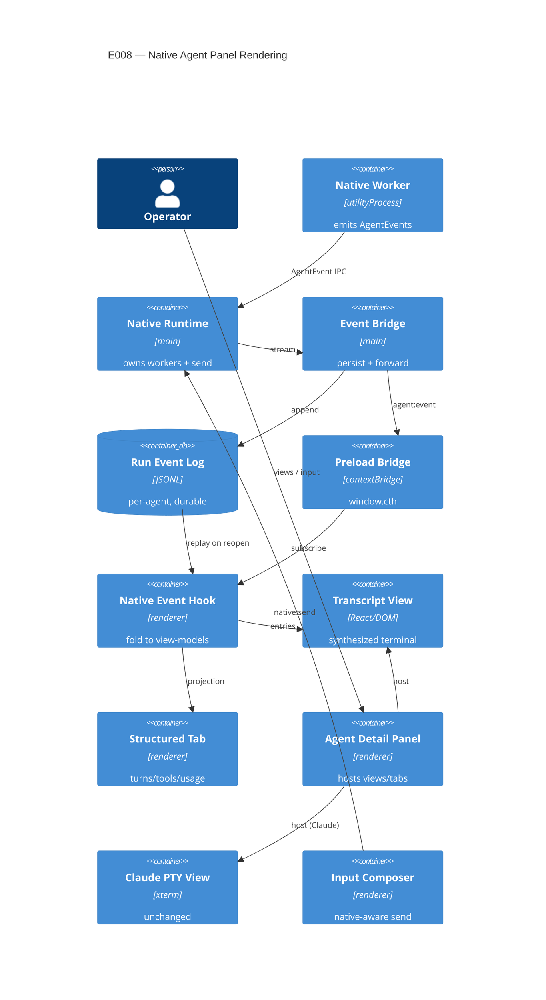

# Implementation Plan: Native Agent Panel Rendering

**Branch**: `00008-native-agent-panel-rendering` | **Date**: 2026-06-09 | **Spec**: [spec.md](spec.md)

## Summary

**Goal**: Render native (DeepSeek/Minimax) agent activity in the per-agent panel as a synthesized terminal transcript + optional structured tab + inline notices, with operator input and durable re-open, while Claude keeps its authentic PTY view.
**Approach**: Bridge the main-process in-process AgentEvent stream to the renderer over a new per-agent IPC channel; fold it into a React/DOM transcript and a structured projection; persist the stream as append-only JSONL per agent for replay-on-reopen; wire renderer→native input via `nativeRuntime.send`.
**Key Constraint**: Locked `AgentEvent`/`AgentUsageSample`/`ToolSpan` shapes (FR-014); Claude PTY path untouched (FR-009); no secrets persisted (ADR-0007); cost never recomputed (FR-012).

## Technical Context

**Language/Version**: TypeScript 5.6 (Electron 32 main/preload; React 18 renderer)
**Primary Dependencies**: Electron 32, electron-vite/Vite 5, React 18, zustand 4 (renderer store), xterm.js 5 (Claude PTY path only — unchanged), the E001 `AgentEvent` contract (`src/shared/agentEvent.ts`), E003 native worker (`nativeAgentWorker.ts`/`nativeRuntime.ts`)
**Storage**: Append-only JSONL per agent at `<hiveHome>/agents/<agentId>/native-events.jsonl` (mirrors `cost-ledger.jsonl`); no SQLite migration
**Testing**: Vitest (forks); `npm run typecheck` (node + web) hard gate; ESLint
**Target Platform**: Electron desktop (main + preload + React renderer)
**Project Type**: single
**Project Mode**: brownfield
**Performance Goals**: streaming render with no flicker/reflow — coalesce `text-delta` to at most one commit per animation frame (~16 ms / ~60 fps), FR-026; virtualized transcript keeps mounted DOM nodes bounded to viewport + overscan (O(visible)) regardless of run length across hundreds–thousands of entries, FR-027; up to 5–15 concurrent native panels stay responsive in aggregate (no input/scroll stall), FR-028; large tool input/output truncated for display past an 8 KB threshold, full payload retained/persisted, FR-029; replay-on-reopen is a single O(events) top-to-bottom fold, FR-030
**Constraints**: locked event/sample/span shapes (FR-014); Claude PTY path unchanged (FR-009); no secrets persisted (FR-016/ADR-0007); token usage passthrough only, no recompute (FR-012); single-writer persistence in main
**Scale/Scope**: 3 providers; 5–15 concurrent desks; per-run event logs of hundreds–thousands of events

## Instructions Check

*GATE: Must pass before Phase 0 research. Re-check after Phase 1 design.*

| Gate | Verdict | Note |
|------|---------|------|
| ENFORCE_SRC_ROOT (all source under `/src`) | PASS | Changes in `src/renderer` (components/hooks), `src/preload`, `src/main` (IPC + persistence); tests co-located |
| I. Provider-Agnostic Parity | PASS | Renderer consumes the normalized `AgentEvent` stream; native/Claude split gated on event source, not vendor; no provider-specific downstream branching (ADR-0002) |
| II. Truthful Cost Governance | PASS | Token usage is display passthrough; renderer never recomputes cost (FR-012); authority stays at the usage seam (E007) |
| III. Crash-Contained Isolation | PASS | Renderer + main persistence only; the JSONL log is single-writer in main (preserves single-committer); no worker change |
| IV. Agent Output Style | PASS | Artifact-form plan |
| V. Preserve Proven Core & Type Safety | PASS | Claude PTY path untouched (FR-009); locked `AgentEvent`/`AgentUsageSample`/`ToolSpan` shapes (FR-014); typecheck hard gate; observable-by-default |
| Secrets never to telemetry/persistence (ADR-0007) | PASS | Persisted JSONL + forwarded IPC carry only `AgentEvent` fields (text/tool/usage/notice) — no keys/headers |
| Governance out-of-scope guard | PASS | No cost-aware routing, failover, data-residency, OS-keychain, or fourth-provider scope |

**Policy Auditor verdict**: PASS (2026-06-09) — no violations, no CRITICAL findings; gates confirmed against source (Claude PTY path untouched, locked shapes, secrets ride `env`-at-spawn not the AgentEvent bus, single-writer JSONL in main, cost passthrough). No standalone ADR warranted — AD-002/AD-003 are feature-local under ADR-0010 / the ADR-0002 normalized bus.

## Architecture



## Architecture Decisions

Feature-local tradeoffs implementing accepted **ADR-0010** (synthesized terminal + structured tab; Claude keeps PTY bytes) — referenced, not duplicated. No new project-wide ADR required.

| ID | Decision | Options Considered | Chosen | Rationale |
|----|----------|--------------------|--------|-----------|
| AD-001 | Synthesized-transcript render substrate | literal xterm w/ synth ANSI / React-DOM component / hybrid | React/DOM transcript component styled as a terminal; xterm reused ONLY for the Claude PTY path | Collapsible thinking, in-place tool resolution, inline notices, and the structured tab need DOM affordances xterm lacks; ADR-0010 "reuse xterm" is met by visual framing + keeping Claude on the xterm pool |
| AD-002 | Native `AgentEvent` → renderer transport | in-process only (status quo) / new IPC channel forwarded by main | New per-agent `agent:event` IPC forwarded by single-committer main from the in-process AgentEvent bus; renderer subscribes via a new preload method + hook | Renderer has no native-event subscription today; reuse the existing `telemetry:event` forward pattern; main stays the single source |
| AD-003 | Persistence substrate for the run event log | append-only JSONL per agent / SQLite table | Append-only JSONL per agent at `<hiveHome>/agents/<agentId>/native-events.jsonl`, single-writer in main | Ordered, resumable, replayable; mirrors `cost-ledger.jsonl`/transcript patterns; no migration; SQLite rejected (no query/index need); secret-free per ADR-0007 |
| AD-004 | Operator input/steer to native agents | none (status quo) / new `native:send` IPC reusing the send seam | Add `native:send` IPC → `nativeRuntime.runtimeFor(agentId).send(AgentInput)`; composer becomes native-aware (writePty for Claude, native:send for native); reuse existing `control:*` steer/halt | Native worker `send()` exists but isn't reachable from the renderer; add the missing bridge, reuse the input-queue UX |
| AD-005 | Structured-tab availability + source | native-only / native + Claude, both from the AgentEvent stream | Both native and Claude desks get the opt-in structured tab, derived from the normalized AgentEvent stream; each desk's default view unchanged | Claude already emits AgentEvents (claudeAdapter/translator), so its structured tab needs no PTY change; one projection over the normalized stream (FR-005) |

## Data Model Summary

| Entity | Key Fields | Relationships | Notes |
|--------|-----------|---------------|-------|
| Persisted run record (native-events JSONL) | `agentId`+`sessionId` (join), `ts` (order), `kind`+payload (= one `AgentEvent` line) | replay → transcript entries (1:N) + structured view (1:1) | Append-only JSONL per agent; single-writer (main); secret-free (ADR-0007); no AgentEvent schema change (FR-014); missing/partial degrades gracefully (FR-016) |
| AgentEvent (existing, E001) | `kind` over 12 kinds; envelope `{v,agentId,sessionId,ts,kind}` | line shape of the persisted record | Consumed, not modified; `token-usage` cumulative-monotonic; `usd: number \| null` |
| Transcript entry (view-model, derived) | `type` (assistant-text\|tool-call\|thinking\|notice), `status` (pending\|resolved\|interrupted), `noticeKind` | folded from stream; sibling of structured view | Not persisted; coalesce text-delta, pair tools by `toolCallId`, group thinking; interrupted rule (FR-011); virtualized (FR-010) |
| Structured run view (view-model, derived) | `turns[]` → `toolCalls[]` + `tokenUsage` (per turn & run) | derived from same stream; native + Claude | Not persisted; token usage display passthrough — never recompute (FR-012) |

**Detail**: [data-model.md](data-model.md)

## API Surface Summary

N/A — no external API surface. Internal IPC only (`agent:event` forward, `native:send`, `loadNativeEvents`) — documented in Integration Points and Architecture.

## Testing Strategy

| Tier | Tool | Scope | Mock Boundary | Install |
|------|------|-------|---------------|---------|
| Unit | Vitest (forks) | Event→view-model fold (text coalesce, tool pairing by `toolCallId`, interrupted-state, cumulative-monotonic token projection, empty/thinking-only turns); JSONL persist↔replay round-trip | Pure functions over fabricated `AgentEvent[]`; temp fs path | configured |
| Integration | Vitest | Main event-bridge: AgentEvent in → persisted JSONL + forwarded IPC payload; replay-on-reopen rebuilds identical view-models; `native:send` routes to `runtime.send` | Call bridge with fabricated events; temp fs; stub `nativeRuntime` | configured |
| Security | — (asserted by a Vitest case) | Persisted JSONL + forwarded IPC carry no secret/API-key at ANY nesting depth, including inside `toolInput`/`result`/`text`/`thinking`/notice `message` payload fields (FR-016/FR-041/ADR-0007) — named assertion `nativeEventBridge.test.ts › "persisted JSONL and forwarded IPC are secret-free (deep)"` (SC-025) | Reuse secret-non-leak assertion style from `keyNonLeak.test.ts`; recurse into payloads, not just top-level | configured |
| Coverage | — | N/A — no numeric coverage target (project policy) | — | N/A |

Live panel behavior (streaming render, virtualization, tab toggle, inline notices, operator input, no Claude PTY regression) is verified by a MANUAL app-smoke (renderer-runtime, consistent with E006) — captured as a task, not a CI gate.

## Error Handling Strategy

| Error Category | Pattern | Response | Retry |
|----------------|---------|----------|-------|
| Interrupted/incomplete stream (`tool-start` no `tool-end`) | resolve-to-terminal | Mark entry `status=interrupted`; transcript continues (FR-011) | no |
| `api-error` event | inline-notice | Distinct inline notice (retryable vs terminal); transcript not aborted (FR-008) | no (retry owned by E009/adapter) |
| Capability-degradation signal | inline-notice (dedup) | Inline notice naming what degraded; collapse repeats (FR-007) | no |
| Partial/corrupt persisted log on replay | best-effort | Render parsed lines; skip unparseable; no crash (FR-016) | no |
| Missing native worker on input send | fail-soft | `native:send` returns `{ok:false}`; non-blocking notice (FR-015) | no |
| Long run / many concurrent panels | virtualize | Render only visible entries (viewport + overscan); full run retained, no eviction (FR-010/FR-027); coalesce deltas to ≤1 commit/frame (FR-026) so up to 5–15 panels stay responsive in aggregate (FR-028) | no |
| Very large tool input/output | truncate-for-display | Truncate `toolInput`/`result` past the display threshold (default 8 KB) in transcript + structured tab with a clear indication; full payload stays retained/persisted (FR-029) | no |
| Event arrival outpaces disk append | queue/serialize | Single-writer main append, arrival-ordered, never drop/reorder; renderer forwarding not blocked on disk I/O (FR-030) | no |

## Integration Points

| Spec Reference | System/Service | Technical Approach | Contract |
|----------------|----------------|--------------------|----------|
| FR-001/003/004 | E001 `AgentEvent` stream | Renderer folds the normalized stream into view-models | `src/shared/agentEvent.ts`; `specs/00001-…/contracts/provider-runtime-contract.md` |
| FR-001/008/016 | E003 native worker/runtime | Main bridges `nativeRuntime` AgentEvents → persist + `agent:event` IPC | `src/main/runtime/nativeAgentWorker.ts`, `nativeRuntime.ts`; `specs/00003-…/contracts/native-worker-interface.md` |
| FR-015 | E003 `ProviderRuntime.send` | New `native:send` IPC → `nativeRuntime.runtimeFor(agentId).send(AgentInput)` | `src/main/runtime/nativeRuntime.ts`, `src/preload/index.ts` |
| FR-016 | Hive on-disk store | Append-only JSONL per agent, single-writer main | `src/main/hive.ts` (`cost-ledger.jsonl` pattern) |
| FR-005/012 | E007 usage seam | Display passthrough of `token-usage`; no recompute | `src/main/usage.ts`/`telemetry.ts` (consumed) |
| FR-009 | Claude PTY path | No change; native path is a separate component | `src/renderer/src/components/PtyTerminalView.tsx`, `terminalPool.ts` |

## Risk Mitigation

| Risk (from spec) | Likelihood | Impact | Mitigation | Owner |
|-------------------|------------|--------|------------|-------|
| Two rendering paths regress the Claude terminal view | M | H | Native path is a separate React/DOM component; Claude PTY stays on the xterm pool untouched; gate render path on event source (native vs `ptyId`); add a no-regression app-smoke | renderer |
| Synthesized transcript misleads as authentic | L | M | Label/frame the native view as synthesized; visual parity without claiming raw bytes | renderer |
| Retained full run grows memory; persistence grows storage | M | M | Virtualize render (only visible entries mount, FR-027); batch text-delta updates (≤1 commit/frame, FR-026); per-agent JSONL append is cheap, single-writer, arrival-ordered, never blocks renderer forwarding (FR-030); document growth as an accepted tradeoff within the operating scale (hundreds–thousands of events, 5–15 desks) with a revisit trigger when exceeded (FR-031) | renderer + main |

## Requirement Coverage Map

| Req ID | Component(s) | File Path(s) | Notes |
|--------|--------------|--------------|-------|
| FR-001 | Event hook + transcript | `~useNativeAgentEvents.ts`, `+NativeTranscriptView.tsx` | fold AgentEvents → default transcript |
| FR-002 | Transcript streaming | `+NativeTranscriptView.tsx` | incremental text-delta, in-progress indicator, batched |
| FR-003 | Transcript | `+NativeTranscriptView.tsx` | distinct text/tool/thinking; collapsible thinking |
| FR-004 | Transcript | `+NativeTranscriptView.tsx` / `+foldEvents.ts` | pending tool-start → resolved tool-end (toolCallId), success/duration |
| FR-005 | Structured tab | `+StructuredRunTab.tsx`, `~AgentDetailPanel.tsx` | native + Claude; turns/tool calls/token usage |
| FR-006 | Panel tabs | `~AgentDetailPanel.tsx`, `~SidebarTabs.tsx` | toggle default↔structured; preserve content/scroll |
| FR-007 | Inline notices | `+NativeTranscriptView.tsx`, `+StructuredRunTab.tsx` | degradation notice inline in both views (dedup) |
| FR-008 | Inline notices | same | api-error inline; retryable vs terminal; no abort |
| FR-009 | Claude PTY path | `PtyTerminalView.tsx`, `terminalPool.ts` (unchanged) | native path separate; no PTY change |
| FR-010 | Virtualized transcript | `+NativeTranscriptView.tsx` | render only visible; full run retained, no eviction |
| FR-011 | Fold/interrupted-state | `+foldEvents.ts` | tool-start w/o tool-end → interrupted; unfinished turn terminal |
| FR-012 | Structured tab usage | `+StructuredRunTab.tsx` | token-usage passthrough; no recompute |
| FR-013 | Fold | `+foldEvents.ts` | empty/no-op/thinking-only turns coherent |
| FR-014 | Shape stability | (no edits to `agentEvent.ts`/`usage.ts`) | view-models only; no field changes |
| FR-015 | Native input bridge | `~src/main/index.ts`, `~src/preload/index.ts`, `~MessageQueueComposer.tsx`, `~nativeRuntime.ts` | route operator input/steer → `runtime.send` |
| FR-016 | Event bridge + persistence | `+src/main/runtime/nativeEventBridge.ts`, `~hive.ts`, `~nativeRuntime.ts` | append JSONL per agent; replay on reopen/restart; graceful partial |
| FR-017 | Transcript + fold | `+NativeTranscriptView.tsx`, `+foldEvents.ts` | per-category label/glyph + indent/container; thinking default-collapsed, operator-expandable |
| FR-018 | Transcript streaming | `+NativeTranscriptView.tsx` | in-progress indicator before first token, clears at turn settle; no re-mount/whole-list flash on delta |
| FR-019 | Inline notices | `+NativeTranscriptView.tsx`, `+StructuredRunTab.tsx` | notice states what degraded / what still works; non-modal; last-entry notice renders complete |
| FR-020 | Inline notices | `+NativeTranscriptView.tsx`, `+StructuredRunTab.tsx` | persistent inline (not toasts); dismissibility consistent across both views |
| FR-021 | Native input parity | `~MessageQueueComposer.tsx`, `~src/preload/index.ts`, `~src/main/index.ts` | always-available submit + send ack; same transcript; unambiguous prompt-vs-steer routing |
| FR-022 | Native input feedback | `~MessageQueueComposer.tsx`, `+useNativeAgentEvents.ts` | distinct not-delivered feedback when native worker missing (non-blocking notice) |
| FR-023 | Panel framing parity | `~AgentDetailPanel.tsx`, `+NativeTranscriptView.tsx` | shared container/chrome, monospace typography, same panel/tab placement |
| FR-024 | Transcript scroll | `+NativeTranscriptView.tsx` | stick-to-bottom only when already at bottom; preserve operator scroll otherwise |
| FR-025 | Accessibility | `+NativeTranscriptView.tsx`, `~AgentDetailPanel.tsx`, `+StructuredRunTab.tsx` | keyboard-focusable thinking blocks + structured-tab toggle; notices exposed to assistive tech |
| FR-026 | Transcript streaming | `+NativeTranscriptView.tsx`, `+useNativeAgentEvents.ts` | coalesce text-delta to ≤1 commit/animation frame; batch bursts |
| FR-027 | Virtualized transcript | `+NativeTranscriptView.tsx` | mounted DOM nodes bounded to viewport + overscan; O(visible) at hundreds–thousands of entries |
| FR-028 | Virtualized transcript (aggregate) | `+NativeTranscriptView.tsx`, `~AgentDetailPanel.tsx` | up to 5–15 panels streaming stay responsive in aggregate (no input/scroll stall) |
| FR-029 | Truncation (display) | `+foldEvents.ts`, `+NativeTranscriptView.tsx`, `+StructuredRunTab.tsx` | truncate toolInput/result past display threshold (default 8 KB); full payload retained/persisted |
| FR-030 | Event bridge + persistence | `+src/main/runtime/nativeEventBridge.ts`, `~hive.ts` | per-event single-writer append, arrival-ordered queue, no renderer stall on disk; replay = single O(events) fold |
| FR-031 | Risk tradeoff | (plan §Risk Mitigation, spec §Risks) | accepted memory/storage growth within operating scale; revisit trigger beyond it |
| FR-032 | Fold | `+foldEvents.ts`, `+NativeTranscriptView.tsx` | empty/no-op/thinking-only turn produces no degenerate mounting/reflowing entry (render-cost form of FR-013) |
| FR-033 | Fold/interrupted-state | `+foldEvents.ts` | end-of-stream interrupt flips only still-pending entries tracked in fold; no full-run re-scan (O(open), not O(run)) |
| FR-034 | Panel tabs | `~AgentDetailPanel.tsx`, `+StructuredRunTab.tsx`, `+NativeTranscriptView.tsx` | toggle reuses already-folded view-models; no full re-fold/re-render of run on switch |
| FR-035 | Scope guard (PTY) | `PtyTerminalView.tsx`, `terminalPool.ts` (unchanged) | streaming/virtualization perf reqs (FR-026–028) scoped to synthesized transcript + structured projection; PTY path unchanged (FR-009) |
| FR-036 | Fold/token projection | `+foldEvents.ts`, `+StructuredRunTab.tsx` | cumulative set-not-sum; never decrease (clamp); `usd:null`=unpriced; sample-less turn = "no usage reported" (testable form of FR-012) |
| FR-037 | Event bridge + persistence | `+src/main/runtime/nativeEventBridge.ts`, `~hive.ts` | "durable" = per-event append-and-commit before forward; mirrors `cost-ledger.jsonl` |
| FR-038 | Event bridge + persistence | `+src/main/runtime/nativeEventBridge.ts`, `~hive.ts` | persistence keyed by `agentId`, segmented by `sessionId`; one file per agent; new session appends to same file |
| FR-039 | Fold + replay | `+foldEvents.ts`, `+useNativeAgentEvents.ts`, `+nativeEventBridge.ts` | deterministic + idempotent replay reconstructs same views as live; read-only over append-only log; preserves arrival order |
| FR-040 | Persistence lifecycle | `+nativeEventBridge.ts`, `~hive.ts` (plan §Risk Mitigation) | on-disk append-only, retained for run life; no rotation/pruning within scale; revisit trigger beyond (FR-031) |
| FR-041 | Secret-free (deep) | `+nativeEventBridge.ts`, `main/__tests__/nativeEventBridge.test.ts` | secrets absent at any nesting depth incl. payload fields; named deep assertion |
| FR-042 | Replay degradation modes | `+foldEvents.ts`, `+useNativeAgentEvents.ts`, `+nativeEventBridge.ts` | missing/partial/corrupt/truncated each a distinct non-erroring outcome (FR-016/C5) |
| FR-043 | Persistence single-writer | `+nativeEventBridge.ts`, `~hive.ts` | main is sole writer; append-only; arrival-order preserved; torn-read tolerated (trailing line = truncated) |
| FR-044 | Fold/tool pairing | `+foldEvents.ts` | pair strictly by `toolCallId`; orphan `tool-end` dropped/standalone; unfinished turn terminal (FR-011/FR-033) |
| FR-045 | Shape stability + replay | `+foldEvents.ts`, `+nativeEventBridge.ts` (no edits to `agentEvent.ts`) | persisted line = AgentEvent envelope+payload only; all 12 kinds handled; `v`-mismatch folded best-effort |

## Project Structure

### Source Code

```text
src/
  main/
  ~ index.ts                          # register native:send IPC; wire the event bridge on native spawn
  ~ runtime/nativeRuntime.ts          # forward AgentEvent → bridge; expose send routing
  + runtime/nativeEventBridge.ts      # subscribe runtime events → persist JSONL + forward agent:event; replay-on-request
  ~ hive.ts                           # per-agent native-events.jsonl path helper (reuse the ledger pattern)
  preload/
  ~ index.ts                          # window.cth: onAgentEvent(agentId,cb)/agent:event, nativeSend(agentId,input), loadNativeEvents(agentId)
  renderer/src/
    components/
    ~ AgentDetailPanel.tsx            # native render path + structured-tab wiring (Claude path untouched)
    ~ SidebarTabs.tsx                 # add the structured tab entry
    + NativeTranscriptView.tsx        # synthesized terminal transcript (React/DOM, virtualized)
    + StructuredRunTab.tsx            # turns / tool calls / token usage (native + Claude)
    + foldEvents.ts                   # PURE: AgentEvent[] → transcript entries + structured view (Node-testable)
    ~ MessageQueueComposer.tsx        # native-aware send (native:send vs writePty)
    hooks/
    + useNativeAgentEvents.ts         # subscribe agent:event + backfill via loadNativeEvents; delegate to foldEvents
  main/__tests__/
    + nativeEventBridge.test.ts       # persist/forward/replay round-trip + secret-free
  renderer/src/components/__tests__/
    + foldEvents.test.ts              # event→view-model fold (pure): coalesce/pairing/interrupted/monotonic
```

**Patterns to reuse**: `cost-ledger.jsonl` append in `hive.ts` for the event log; the `telemetry:event` IPC-forward pattern for `agent:event`; `terminalPool`/`PtyTerminalView` left untouched for Claude; `ToolWaterfall`/`useTelemetry` as the token/tool display reference; zustand `updateAgent` for panel state.
**Tests to extend**: `src/main/__tests__/` (Node-light Vitest); reuse the secret-non-leak assertion style from `keyNonLeak.test.ts`/`telemetryNormalize.test.ts`.
**Naming conventions**: PascalCase components, camelCase hooks/functions; keep `AgentEvent`/`AgentUsageSample`/`ToolSpan` field names unchanged.

## Implementation Hints

- **[HINT-001]** Order: Land the AgentEvent→renderer IPC bridge + persistence (FR-016/FR-001) FIRST — the transcript, structured tab, and input wiring all depend on the renderer actually receiving native events (none exists today).
- **[HINT-002]** Constraint: Render the synthesized transcript in a NEW React/DOM component; do NOT route native events through the xterm `terminalPool` — the Claude PTY path (`pty:data:${ptyId}`, `terminalPool`) MUST stay untouched (FR-009/Principle V).
- **[HINT-003]** Gotcha: Fold rules — coalesce `text-delta`, pair `tool-start`/`tool-end` by `toolCallId` (unpaired → `status=interrupted`, FR-011), `token-usage` is cumulative-monotonic SET-not-SUM (never decrease; `usd` may be `null`), keep thinking distinct from text (FR-003/013).
- **[HINT-004]** Constraint: Persisted JSONL + forwarded IPC carry ONLY `AgentEvent` fields — never an API key/auth header (ADR-0007); assert via a secret-free test; never recompute cost (FR-012, `usd` passthrough).
- **[HINT-005]** Performance: Virtualize the transcript (render only visible entries) and batch high-frequency `text-delta` updates; the full run is retained with no eviction (FR-010) — memory grows with run length by design.
