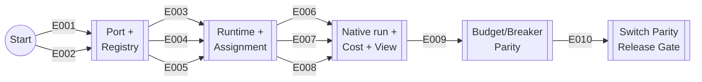

# Project Implementation Plan

**Product**: Munder Difflin — native multi-provider release · **Created**: 2026-06-07 · **Status**: Draft
**Total Epics**: 10 (P1: 10 · P2: 0 · P3: 0) · **Waves**: 5

> Scope note: This plan covers the native multi-provider release (assign + run + full parity for Claude, DeepSeek, and Minimax M3). The existing v0.2.2 product capabilities (real terminals, hive, GOD orchestration, memory, observability, budgets, breaker, kanban, scheduling, GitHub/CI, persistence) are an already-delivered baseline and are not re-decomposed here — see Coverage Validation.

## Epic Checklist

### Wave 1 — Foundation

> No dependencies. The provider boundary and the registry every later epic reads. Both parallel-safe.

- [ ] E001 [P1] [TECHNICAL] [P] {SAD:ADR-0001,ADR-0002}{PRD:CAP-015} Provider runtime and event bus — port + normalized AgentEvent; Claude adapter wraps PTY+hooks
- [ ] E002 [P1] [TECHNICAL] [P] {SAD:ADR-0005,ADR-0008}{PRD:CAP-012} Provider and model registry — models, dated/tiered prices, capability descriptors

### Wave 2 — Runtime, credentials, assignment

> Depends on Wave 1. E003 is isolated (worker/main). E004 and E005 both edit the Add-Agent drawer + config schema — coordinate, not parallel to each other.

- [ ] E003 [P1] [TECHNICAL] [P] {SAD:ADR-0003,ADR-0004}{PRD:CAP-015} Native agent worker runtime — utilityProcess isolation, SDK loop, Stop-equivalent autonomy
- [ ] E004 [P1] [TECHNICAL] {SAD:ADR-0007}{PRD:CAP-014} Provider credential management — plaintext-config store, inject-at-spawn
- [ ] E005 [P1] [PRODUCT] {PRD:CAP-013,CAP-018}{SAD:ADR-0008} Model and provider assignment — per-agent + fleet default; warn-at-assignment

### Wave 3 — Native agents, cost, view

> Depends on Waves 1–2. Separate modules (adapters / usage seam / renderer) — parallel-safe; coordinate on shared registry rows.

- [ ] E006 [P1] [PRODUCT] [P] {PRD:CAP-013,CAP-015}{SAD:ADR-0001} Native provider adapters — DeepSeek + Minimax M3 agentic loops
- [ ] E007 [P1] [PRODUCT] [P] {PRD:CAP-016}{SAD:ADR-0005,ADR-0006} Cross-provider cost telemetry — true-cost recompute + OTel GenAI normalization
- [ ] E008 [P1] [PRODUCT] [P] {PRD:CAP-015,CAP-018}{SAD:ADR-0010} Native agent panel rendering — synthesized terminal + structured tab

### Wave 4 — Governance parity

> Depends on provider-accurate cost (E007) and the native worker (E003).

- [ ] E009 [P1] [PRODUCT] {PRD:CAP-017}{SAD:ADR-0009} Budget and breaker parity — true-cost budgets/breaker + retry/backoff policy

### Wave 5 — Release gate

> Depends on assignment, runtime, telemetry, and governance parity. The zero-regression switch gate.

- [ ] E010 [P1] [PRODUCT] {PRD:CAP-019} Live model provider switch — hot-swap desk model preserving all state

## Dependency Diagram

Nodes are milestones; arrows are epics (activity-on-arrow).

## Execution Wave Summary

| Wave | Epics | All Parallel? | Notes |
|------|-------|---------------|-------|
| 1 | E001, E002 | Yes | Independent foundation: boundary + registry |
| 2 | E003, E004, E005 | Partial | E003 parallel; E004↔E005 share Add-Agent UI/config |
| 3 | E006, E007, E008 | Yes | Separate modules; coordinate on registry rows |
| 4 | E009 | n/a | Single epic |
| 5 | E010 | n/a | Single epic; release gate |

## Parallel Execution Guidance

**Independent epics** (run concurrently): (E001, E002); E003 alongside the E004→E005 pair; (E006, E007, E008).

**Integration risks**:
- E004 and E005 both modify the Add-Agent drawer and the harness config schema — sequence them or coordinate the shared edits.
- E006 adds provider rows to the registry while E007 reads price rows and E005 reads capability descriptors — freeze the registry schema (owned by E002) before Wave 3.
- E007 owns the provider-accurate `AgentUsageSample`; E009 and E010 consume it — keep the sample shape stable across waves.

**Shared resource conflicts**:
- Add-Agent UI / harness config — E004, E005.
- Provider/model registry data — E002 (owner); E006 (adds rows); E004, E005, E007, E009 (readers).
- `AgentUsageSample` usage seam — E007 (owner); E009, E010 (consumers).

## Epic Details

### E001 — Provider runtime and event bus

- **Category**: TECHNICAL · **Priority**: P1 · **Source**: {SAD:ADR-0001,ADR-0002}{PRD:CAP-015}
- **Scope**: Introduce the `ProviderRuntime` port and the normalized internal `AgentEvent` contract that all adapters emit and all downstream consumers read. Refactor the existing Claude PTY+hooks path to sit behind the port as the Claude adapter, with no behavior change. This is the keystone that keeps avatars, telemetry, the breaker, and the hive provider-agnostic.
- **Actors**: Operator (indirect), all agents
- **Key entities**: ProviderRuntime, AgentEvent
- **Depends on**: none
- **Dependency contracts**: none
- **Depended on by**: E003, E006, E007, E008
- **Produces (shared)**: `ProviderRuntime` port; versioned `AgentEvent` contract; Claude adapter
- **Constraints**: No regression to the existing Claude plane; token-usage events must be cumulative and monotonic; all source under `/src`
- **Acceptance criteria**:
  - [ ] A `ProviderRuntime` port defines start/stop/kill/send/getUsage, event subscription, and a capability descriptor
  - [ ] A versioned `AgentEvent` contract covers turn-start/end, thinking, text-delta, tool-start/end, token-usage (cumulative), api-error, stop, needs-input
  - [ ] The existing Claude PTY+hooks path runs behind the port as the Claude adapter with avatars/telemetry/breaker unchanged
- **Specify input**:
  - **Description**: Establish the provider-agnostic runtime boundary and event contract; prove it by wrapping the current Claude runtime with zero behavior change.
  - **Actors**: agents, Operator
  - **Key entities**: ProviderRuntime, AgentEvent
  - **Depends on artifacts**: specs/adrs/0001, specs/adrs/0002
  - **Constraints**: no Claude-plane regression; cumulative-monotonic usage
- **Pipeline hints**: skip_clarify

### E002 — Provider and model registry

- **Category**: TECHNICAL · **Priority**: P1 · **Source**: {SAD:ADR-0005,ADR-0008}{PRD:CAP-012}
- **Scope**: Build the extensible registry describing providers and models (context windows, endpoints, origin label) plus dated, tiered price rows and per-provider capability descriptors. Provide a price-lookup that fails loud on an unknown model id rather than defaulting to a wrong price. This is the canonical configuration artifact every later epic reads.
- **Actors**: Operator
- **Key entities**: ProviderModelRegistry, PriceRow, CapabilityDescriptor
- **Depends on**: none
- **Dependency contracts**: none
- **Depended on by**: E004, E005, E006, E007, E009
- **Produces (shared)**: registry data + module; dated/tiered price rows + fail-loud lookup; capability descriptors
- **Constraints**: Prices must be dated and maintainable; support DeepSeek cache-split and Minimax context-length tiers; unknown id → loud warning
- **Acceptance criteria**:
  - [ ] The registry describes providers/models with context windows, endpoints, and origin label, and is extensible
  - [ ] Dated/tiered price rows back a lookup that fails loud on an unknown model id
  - [ ] Per-provider capability descriptors (image/MCP/web-search/caching) are declared and queryable
- **Specify input**:
  - **Description**: A maintainable provider/model + pricing + capability registry with safe lookup.
  - **Actors**: Operator
  - **Key entities**: ProviderModelRegistry, PriceRow, CapabilityDescriptor
  - **Depends on artifacts**: specs/adrs/0005, specs/adrs/0008
  - **Constraints**: dated prices; fail-loud unknown id
- **Pipeline hints**: skip_clarify, lightweight

### E003 — Native agent worker runtime

- **Category**: TECHNICAL · **Priority**: P1 · **Source**: {SAD:ADR-0003,ADR-0004}{PRD:CAP-015}
- **Scope**: Run each native (non-Claude) agent in its own Electron `utilityProcess`, with lifecycle and IPC mirroring node-pty isolation. Provide the provider-agnostic SDK agent-loop scaffold (request → tool_use → execute → tool_result) that emits normalized AgentEvents, and reproduce the Stop-hook autonomy as a worker-side end-of-turn callback into the hive drain with an infinite-loop guard.
- **Actors**: agents, GOD agent
- **Key entities**: NativeAgentWorker, AgentEvent
- **Depends on**: E001
- **Dependency contracts**: imports `ProviderRuntime` port + `AgentEvent` contract from E001
- **Depended on by**: E006, E007, E008, E009, E010
- **Produces (shared)**: native agent worker; agent-loop scaffold; `drainForStop` continuation seam; worker IPC
- **Constraints**: Crash containment (worker exit must not crash main); bounded per-worker memory + event-queue backpressure; replicate the stop_hook_active-equivalent guard and hop/turn caps
- **Acceptance criteria**:
  - [ ] Each native agent runs in its own utilityProcess with spawn/kill/exit mirroring the PTY teardown/archive
  - [ ] The agent-loop scaffold drives the tool-use loop and emits normalized AgentEvents over IPC
  - [ ] End-of-turn calls the hive drain and continues on fresh inbox messages, guarded against infinite loops
- **Specify input**:
  - **Description**: Isolated worker runtime + provider-agnostic agent loop + native autonomy continuation.
  - **Actors**: agents, GOD agent
  - **Key entities**: NativeAgentWorker, AgentEvent
  - **Depends on artifacts**: specs/adrs/0003, specs/adrs/0004, E001 outputs
  - **Constraints**: crash containment; loop guard
- **Pipeline hints**: skip_clarify

### E004 — Provider credential management

- **Category**: TECHNICAL · **Priority**: P1 · **Source**: {SAD:ADR-0007}{PRD:CAP-014}
- **Scope**: Store the several providers' API keys in the harness config (plaintext for the MVP) and inject the right key into each agent worker at spawn. Keys must never reach the git hive, transcripts, or OTel output, and the config file must live outside any registered repo and be gitignored.
- **Actors**: Operator
- **Key entities**: CredentialRecord
- **Depends on**: E002
- **Dependency contracts**: reads the provider list from E002 registry
- **Depended on by**: E006
- **Produces (shared)**: credential store; key-injection-at-spawn seam
- **Constraints**: Plaintext at rest is an accepted MVP risk (ADR-0007); keys excluded from hive/transcripts/OTel; config gitignored; migration to OS-keychain must reuse the same injection seam
- **Acceptance criteria**:
  - [ ] Provider API keys are stored in the harness config and never written to the hive, transcripts, or OTel output
  - [ ] Keys are injected into the agent worker at spawn via the credential seam
  - [ ] The config file is located outside any registered repo and is gitignored
- **Specify input**:
  - **Description**: Multi-provider key store (plaintext MVP) with secure non-leakage and spawn-time injection.
  - **Actors**: Operator
  - **Key entities**: CredentialRecord
  - **Depends on artifacts**: specs/adrs/0007, E002 registry
  - **Constraints**: no key leakage to hive/transcripts/OTel
- **Pipeline hints**: skip_clarify, skip_checklist

### E005 — Model and provider assignment

- **Category**: PRODUCT · **Priority**: P1 · **Source**: {PRD:CAP-013,CAP-018}{SAD:ADR-0008}
- **Scope**: Let the operator assign a provider+model to any agent (per desk and as a fleet default) through the agent lifecycle and UI, reading options from the registry. Warn at assignment time when the chosen provider lacks a capability the assigned work needs.
- **Actors**: Operator, GOD agent
- **Key entities**: AgentAssignment, CapabilityDescriptor
- **Depends on**: E001, E002
- **Dependency contracts**: uses the port from E001; reads provider/model rows + capability descriptors from E002
- **Depended on by**: E006, E010
- **Produces (shared)**: AgentAssignment model (per-agent + fleet default); assignment UI; warn-at-assignment
- **Constraints**: Shares the Add-Agent drawer + config schema with E004; assignment must persist across restart
- **Acceptance criteria**:
  - [ ] An operator can assign a provider+model to any agent at add-time and change it per desk
  - [ ] A fleet-default provider/model can be set and applies to new agents
  - [ ] Assigning work needing an unsupported capability raises a clear warning
  - [ ] Assignments persist across restart
- **Specify input**:
  - **Description**: Per-agent and fleet-default provider/model selection with capability-aware warnings.
  - **Actors**: Operator, GOD agent
  - **Key entities**: AgentAssignment, CapabilityDescriptor
  - **Depends on artifacts**: specs/adrs/0008, E001 + E002 outputs
  - **Constraints**: persist across restart; coordinate Add-Agent UI with E004
- **Pipeline hints**: (none)

### E006 — Native provider adapters

- **Category**: PRODUCT · **Priority**: P1 · **Source**: {PRD:CAP-013,CAP-015}{SAD:ADR-0001}
- **Scope**: Implement the DeepSeek adapter (OpenAI-compatible loop, streamed tool-call assembly, reasoning-content handling, cumulative usage) and the Minimax M3 adapter (Anthropic-compatible loop, thinking blocks, context-length-tier usage), both behind the ProviderRuntime port and running in the native worker. A desk assigned to either provider participates in the hive as a full peer and degrades unsupported capabilities gracefully.
- **Actors**: Operator, agents, GOD agent
- **Key entities**: ProviderRuntime, AgentEvent, ProviderModelRegistry
- **Depends on**: E002, E003, E004, E005
- **Dependency contracts**: runs in the E003 worker via the E001 port; reads model/price/capability rows from E002; consumes the key-injection seam from E004; consumes the assignment from E005
- **Depended on by**: (validates E007, E008, E009, E010 with real provider traffic)
- **Produces (shared)**: DeepSeek and Minimax M3 adapters; their registry rows
- **Constraints**: Normalize provider divergences (cumulative-vs-delta usage, reasoning/thinking, streamed tool-call assembly) inside the adapter; unsupported capabilities no-op with a notice
- **Acceptance criteria**:
  - [ ] A desk assigned to DeepSeek runs a full agentic tool-use loop with correct streamed tool-call assembly and reasoning-content handling
  - [ ] A desk assigned to Minimax M3 runs a full agentic tool-use loop with thinking blocks and context-length-tier usage
  - [ ] Both adapters emit the normalized AgentEvent stream and participate in the hive (memory, mailbox, autonomy) as full peers
  - [ ] Unsupported capabilities degrade gracefully at runtime with a notice instead of erroring
- **Specify input**:
  - **Description**: Two native provider adapters (DeepSeek, Minimax M3) running full agentic loops behind the port with graceful degradation.
  - **Actors**: Operator, agents, GOD agent
  - **Key entities**: ProviderRuntime, AgentEvent
  - **Depends on artifacts**: specs/adrs/0001, E002/E003/E004/E005 outputs
  - **Constraints**: provider divergences normalized in-adapter; graceful degradation
- **Pipeline hints**: (none)

### E007 — Cross-provider cost telemetry

- **Category**: PRODUCT · **Priority**: P1 · **Source**: {PRD:CAP-016}{SAD:ADR-0005,ADR-0006}
- **Scope**: Compute provider-accurate cost once at the usage seam from token counts × the price registry for every provider, and have native adapters emit OpenTelemetry GenAI spans/metrics to the loopback collector, normalized into the existing `AgentUsageSample` and `ToolSpan` shapes. Replace the family-string pricing default so a non-Claude model is never mispriced.
- **Actors**: Operator
- **Key entities**: AgentUsageSample, ToolSpan, PriceRow
- **Depends on**: E001, E002, E003
- **Dependency contracts**: consumes token-usage AgentEvents from E001; price rows/lookup from E002; native-worker usage emission from E003
- **Depended on by**: E009, E010
- **Produces (shared)**: provider-accurate `AgentUsageSample` seam; OTel GenAI normalization in the collector
- **Constraints**: USD computed once and never recomputed downstream; pin the GenAI semconv version; unknown id → parity warning, not a default price; ≤5% cost-accuracy gate
- **Acceptance criteria**:
  - [ ] Per-agent and fleet cost is computed from tokens × the price registry, once at the usage seam, for every provider
  - [ ] Native adapters emit OTel GenAI spans/metrics normalized into the existing AgentUsageSample + ToolSpan shapes
  - [ ] Non-Claude cost is provider-accurate within the ≤5% gate; an unknown model id surfaces a parity warning rather than a wrong default price
- **Specify input**:
  - **Description**: Provider-accurate true-cost recompute + OTel GenAI telemetry normalization for native agents.
  - **Actors**: Operator
  - **Key entities**: AgentUsageSample, ToolSpan, PriceRow
  - **Depends on artifacts**: specs/adrs/0005, specs/adrs/0006, E001/E002/E003 outputs
  - **Constraints**: compute-once; pinned semconv; ≤5% accuracy
- **Pipeline hints**: (none)

### E008 — Native agent panel rendering

- **Category**: PRODUCT · **Priority**: P1 · **Source**: {PRD:CAP-015,CAP-018}{SAD:ADR-0010}
- **Scope**: Render a native agent in the per-agent panel as a synthesized terminal-style transcript (from text-delta/tool/thinking events) plus an optional structured tab (turns, tool calls, token usage), with inline capability-degradation notices. Claude agents continue to show authentic PTY bytes.
- **Actors**: Operator
- **Key entities**: AgentEvent
- **Depends on**: E001, E003
- **Dependency contracts**: consumes text-delta/tool/thinking AgentEvents from E001; native-worker event production from E003
- **Depended on by**: (none)
- **Produces (shared)**: native per-agent panel renderer (terminal + structured tab)
- **Constraints**: Two rendering paths must not regress the Claude PTY view; degradation notices surfaced inline
- **Acceptance criteria**:
  - [ ] A native agent's activity renders as a synthesized terminal-style transcript in the per-agent panel
  - [ ] An optional structured tab shows turns, tool calls, and token usage
  - [ ] Capability-degradation notices appear inline; Claude agents still show authentic PTY bytes
- **Specify input**:
  - **Description**: Per-agent panel rendering for native agents — synthesized terminal + structured tab.
  - **Actors**: Operator
  - **Key entities**: AgentEvent
  - **Depends on artifacts**: specs/adrs/0010, E001/E003 outputs
  - **Constraints**: no regression to the Claude terminal view
- **Pipeline hints**: (none)

### E009 — Budget and breaker parity

- **Category**: PRODUCT · **Priority**: P1 · **Source**: {PRD:CAP-017}{SAD:ADR-0009}
- **Scope**: Make per-agent budgets and the steer→constrain→stop circuit breaker fire on provider-accurate true cost for native agents, and add the provider-call reliability policy: retry transient errors with Retry-After + jittered backoff, feed only exhausted/non-retryable errors to the error-storm trip, and keep cost overruns a separate trip.
- **Actors**: Operator, GOD agent
- **Key entities**: AgentUsageSample, api-error event
- **Depends on**: E003, E007
- **Dependency contracts**: consumes provider-accurate `AgentUsageSample` from E007; api-error events + worker from E003
- **Depended on by**: E010
- **Produces (shared)**: provider-aware budget/breaker enforcement; retry/backoff reliability layer
- **Constraints**: No false breaker trips from transient rate-limit blips; never retry 400/401; cross-provider failover stays out of scope
- **Acceptance criteria**:
  - [ ] Budgets and the steer→constrain→stop breaker fire on true cost for native agents
  - [ ] Transient retryable errors are retried (Retry-After + jittered backoff) without tripping the error-storm breaker
  - [ ] Exhausted/non-retryable errors feed the error-storm trip; cost overruns remain a separate trip; no false trips
- **Specify input**:
  - **Description**: True-cost budgets/breaker parity for native agents + provider-call reliability policy.
  - **Actors**: Operator, GOD agent
  - **Key entities**: AgentUsageSample, api-error event
  - **Depends on artifacts**: specs/adrs/0009, E003/E007 outputs
  - **Constraints**: no false trips; failover out of scope
- **Pipeline hints**: (none)

### E010 — Live model provider switch

- **Category**: PRODUCT · **Priority**: P1 · **Source**: {PRD:CAP-019}
- **Scope**: Let the operator switch a live desk's provider/model without removing the agent, preserving memory, mailbox, budget, telemetry, breaker state, and avatar with zero regression. This is the headline release gate, demonstrated across all three providers.
- **Actors**: Operator
- **Key entities**: AgentAssignment, NativeAgentWorker, AgentUsageSample
- **Depends on**: E003, E005, E007, E009
- **Dependency contracts**: uses the assignment from E005; worker lifecycle from E003; provider-accurate telemetry from E007; budget/breaker enforcement from E009
- **Depended on by**: (none)
- **Produces (shared)**: live model/provider switch capability
- **Constraints**: Zero regression across memory/mailbox/budget/telemetry/breaker/avatar; demonstrated for Claude, DeepSeek, and Minimax M3
- **Acceptance criteria**:
  - [ ] An operator can switch a live desk's provider/model without removing the agent
  - [ ] The switch preserves memory, mailbox, budget, telemetry, breaker state, and avatar with zero regression
  - [ ] Switch-parity is demonstrated across all three providers
- **Specify input**:
  - **Description**: Hot-swap a live desk's model/provider preserving all agent state; the zero-regression release gate.
  - **Actors**: Operator
  - **Key entities**: AgentAssignment, NativeAgentWorker, AgentUsageSample
  - **Depends on artifacts**: PRD CAP-019, E003/E005/E007/E009 outputs
  - **Constraints**: zero regression; all three providers
- **Pipeline hints**: (none)

## Coverage Validation

### PRD Capability Coverage

| Capability | Epic(s) |
|------------|---------|
| CAP-012 | E002 |
| CAP-013 | E005, E006 |
| CAP-014 | E004 |
| CAP-015 | E001, E003, E006, E008 |
| CAP-016 | E007 |
| CAP-017 | E009 |
| CAP-018 | E005, E006, E008 |
| CAP-019 | E010 |
| CAP-001 … CAP-011 | Excluded — see Uncovered items |

### SAD ADR Coverage

| ADR | Epic(s) |
|-----|---------|
| ADR-0001 | E001, E006 |
| ADR-0002 | E001 |
| ADR-0003 | E003 |
| ADR-0004 | E003 |
| ADR-0005 | E002, E007 |
| ADR-0006 | E007 |
| ADR-0007 | E004 |
| ADR-0008 | E002, E005 |
| ADR-0009 | E009 |
| ADR-0010 | E008 |

### DOD DDR Coverage

No Deployment & Operations Document registered — operational epics not generated.

### Uncovered Items

- **CAP-001 – CAP-011 (existing product baseline)** — intentionally excluded from build epics. These capabilities (real-terminal runtime, hive coordination, GOD orchestration, memory + reflection, office-floor visualization, per-agent control surface, telemetry/observability, budgets + breaker, task/scheduling, GitHub/CI, durable persistence) ship today in v0.2.2. The native multi-provider epics extend them to provider parity rather than rebuilding them. Regression-checking the baseline against the multi-provider plane is part of E010's release gate.
- **Out-of-scope (per PRD, no epic)** — automatic cost-aware model routing, cross-provider failover, full data-residency enforcement, OS-keychain secret hardening, and providers beyond the three validated. Tracked as roadmap/open questions in the PRD/SAD.

## Shared Artifact Surface

### Shared Data Entities

| Entity | Introduced by | Consumed by |
|--------|---------------|-------------|
| ProviderModelRegistry (+ PriceRow, CapabilityDescriptor) | E002 | E004, E005, E006, E007, E009 |
| AgentEvent contract | E001 | E003, E006, E007, E008 |
| AgentAssignment (per-agent + fleet default) | E005 | E006, E010 |
| CredentialRecord | E004 | E006 |
| AgentUsageSample (provider-accurate) | E007 | E009, E010 |

### API / IPC Surfaces

| Surface | Introduced by | Consumed by |
|---------|---------------|-------------|
| ProviderRuntime port | E001 | E003, E006 |
| Worker IPC + drainForStop seam | E003 | E006 |
| Key-injection-at-spawn seam | E004 | E003, E006 |
| OTel GenAI → collector normalization | E007 | E009 |

### Libraries / Modules

| Module | Introduced by | Consumed by |
|--------|---------------|-------------|
| Event bus / AgentEvent types | E001 | E003, E006, E007, E008 |
| Registry / pricing | E002 | E004, E005, E006, E007, E009 |
| Native worker runtime | E003 | E006 |
| Credential store | E004 | E006 |
| Provider adapters | E006 | native runtime |
| Telemetry normalizer | E007 | E009, E010 |

## Wave Transition Protocol

Before starting Wave N+1, verify:

- All Wave N epics have passed their quality gate (typecheck green; acceptance criteria met).
- Shared artifacts that Wave N introduces are produced and stable (registry schema, `AgentEvent` contract, `AgentUsageSample` shape, port signatures).
- Technical context reflects any decision changes (new/changed ADRs propagated into `specs/sad.md`).
- Every dependency contract required by Wave N+1 epics is satisfiable from already-completed epics.
- No open shared-resource conflict remains (Add-Agent UI/config, registry rows, usage seam).
