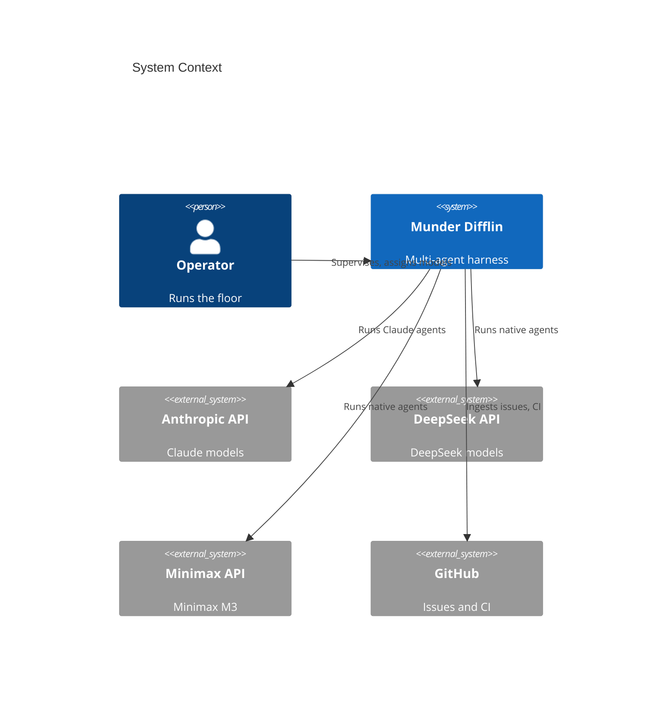
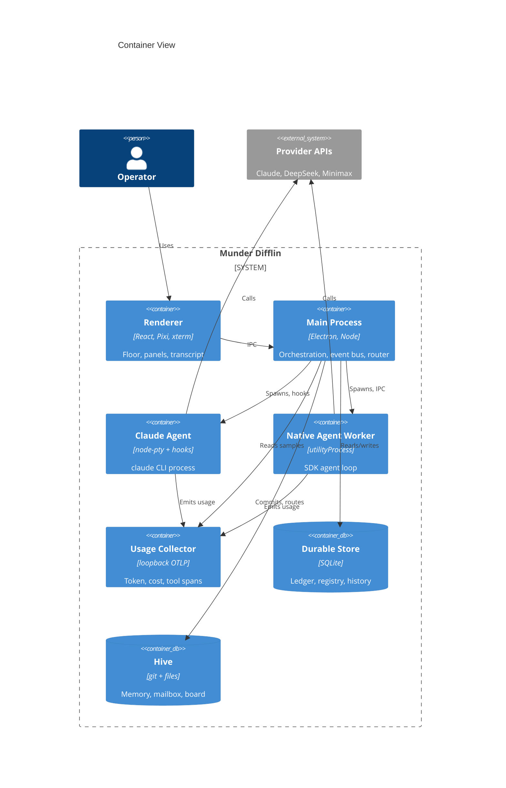
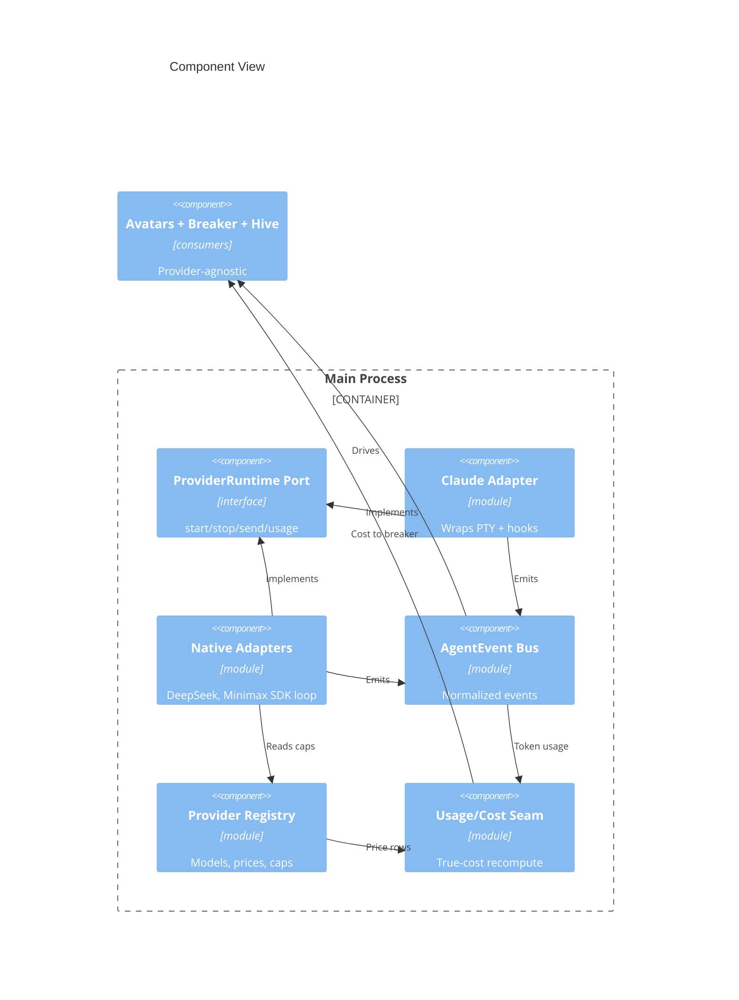
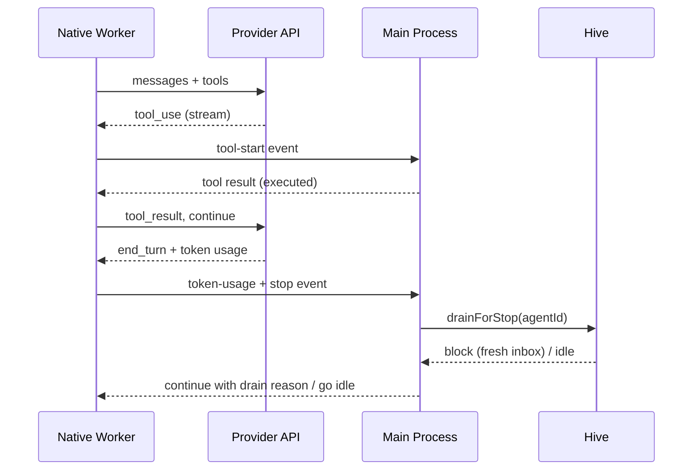
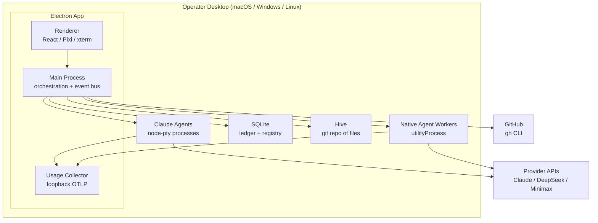

# Software Architecture Document: Munder Difflin

> Date: 2026-06-07 | Status: Draft

## Purpose and Scope

Munder Difflin is a local desktop harness (Electron) that runs and supervises a fleet of autonomous coding agents on one machine, visualized as avatars on a shared 2D office floor and coordinated by a GOD orchestrator agent through an on-disk git "hive." This document is the canonical project-level technical context. It covers the existing two-plane architecture and the architecturally significant extension introduced by the current release: **native multi-provider agent runtimes** so any agent can run on **Claude, DeepSeek, or Minimax M3** with full parity on memory, coordination, autonomy, avatars, telemetry, budgets, and the circuit breaker.

The boundary is the operator's desktop: a single Electron application, the local agent processes it manages, and the external provider APIs and GitHub services it calls. Automatic cost-aware model routing, cross-provider failover, and data-residency enforcement are out of scope for this release (see Risks and the PRD).

## Technical Context

**Language/Version**: TypeScript 5.6 (Node via Electron 32 main/preload; React 18 renderer)  
**Primary Dependencies**: Electron 32, electron-vite/Vite 5, React 18, Pixi.js 8 (office floor), xterm.js 5 (terminal view), node-pty 1 (Claude agent processes), better-sqlite3 11 (durable store + cost ledger), zustand 4 (renderer state); provider SDKs (Anthropic, DeepSeek/OpenAI-compatible, Minimax) for native adapters; OpenTelemetry (loopback OTLP collector) 
**Storage**: SQLite (better-sqlite3) for durable window/history, cost ledger, session ids, provider/model registry; on-disk git "hive" of plain files (per-agent memory, mailboxes, blackboard, task ledger); MemPalace semantic-recall index (optional, degrade-to-noop)  
**Testing**: TypeScript type-checking (`tsc` node + web projects) is the current gate; automated unit/integration test strategy is NEEDS CLARIFICATION (see project-instructions Testing & Quality Policy) 
**Target Platform**: Desktop — macOS (signed), Windows, Linux; local-first, no server tier  
**Project Type**: Single desktop application (Electron main + preload + renderer) 
**Performance Goals**: Avatar reacts to a normalized AgentEvent < 250 ms; token-usage sample reaches the breaker within one heartbeat interval; 5–15 concurrent agents stable  
**Constraints**: Local-first; single-committer git hive; coexist with the existing Claude-Code plane without regression; provider APIs are external, paid, rate-limited, and PRC-hosted for DeepSeek/Minimax (residency = recorded risk); volatile dated provider pricing; bundled pixel-art assets are non-commercial-licensed  
**Scale/Scope**: Single operator, single machine, ~5–15 concurrent agents per floor; three providers validated (Claude, DeepSeek, Minimax M3), registry extensible

## System Scope and Context

The primary actor is the **Operator**, who talks to the GOD agent, assigns each desk a provider/model, sets budgets, and acts on escalations. The system depends on three external **provider APIs** (Anthropic, DeepSeek, Minimax), **GitHub** (issue/CI ingestion via the `gh` CLI), and the **OS keychain** capability (referenced for the deferred secret-hardening path; the MVP stores keys in plaintext config per ADR-0007). All provider APIs sit outside the trust boundary and are reached over the network; the OTLP collector is loopback-only.

### C4 System Context

### C4 Container View

Both agent container types — the Claude PTY process and the native agent worker — feed the **same normalized AgentEvent bus**, which is the keystone of the multi-provider design (ADR-0001, ADR-0002).

### C4 Component View

The new **ProviderRuntime** subsystem inside the main process — the only component view that materially aids understanding. Provider differences live entirely in the adapters; everything downstream consumes the normalized stream.

## Solution Strategy and Architecture Style

- **Architecture Style**: Modular Electron application (main / preload / renderer) built on **two data planes** — a Terminal plane (PTY byte streams) and an Event/hive plane (structured agent state) — extended with a **ports-and-adapters ProviderRuntime boundary** so heterogeneous model providers are interchangeable behind one normalized event contract.
- **Source Code Location**: All project source code resides under `/src` (`src/main`, `src/preload`, `src/renderer`).
- **Why this style fits**: The harness must keep every cross-cutting feature (avatars, telemetry, budgets, breaker, hive autonomy) provider-agnostic while supporting fundamentally different runtimes (a `claude` CLI process vs. a direct-SDK agent loop). A ports-and-adapters boundary that emits one normalized AgentEvent stream isolates provider differences in adapters and leaves downstream consumers unchanged — making "add a provider" an additive operation (ADR-0001, ADR-0002). Per-agent OS-process isolation (node-pty today, `utilityProcess` for native agents — ADR-0003) preserves crash containment and a responsive UI under fleet load.
- **Alternatives considered**: A per-provider Claude-Code-compatible shim (rejected — couples to an external tool's private surface); forking the avatar/telemetry/autonomy plane per provider (rejected — multiplies surface area and guarantees drift); in-process or worker-thread native loops (rejected — no crash containment, blocks the main loop). See ADR-0001 and ADR-0003.

## Key Runtime Flows and Failure Paths

### Primary Flow — native agent agentic loop + autonomy continuation

A native (DeepSeek/Minimax) agent runs its tool-use loop in an isolated worker, emits normalized events the harness consumes, and reproduces the Claude Stop-hook autonomy without Claude Code (ADR-0004).

### Failure Paths

- **Transient provider error (429 / 5xx / timeout)** -> adapter retries with Retry-After + full-jitter backoff (bounded attempts); only exhausted/non-retryable errors surface as `api-error` and feed the breaker error-storm trip; cost overruns remain a separate trip (ADR-0009).
- **Native worker crash or hang** -> `utilityProcess` exit/error is caught in the main process; the agent is torn down and archived exactly like a dead PTY; the floor reflects the loss; no main-process impact (ADR-0003).
- **Unknown / unpriced model id** -> cost recompute fails loud with a telemetry-parity warning rather than defaulting to a wrong vendor price; budgets/breaker are not silently mis-fed (ADR-0005).
- **Unsupported capability requested (image / MCP / web search / caching)** -> pre-assignment warning plus runtime graceful degradation (skip/no-op with a notice); the agent keeps running (ADR-0008).
- **Provider self-reported cost is wrong for non-Anthropic models** -> never trusted; USD is computed once at the usage seam from token counts × the dated price registry (ADR-0005, ADR-0006).
- **Hive `index.lock` contention** -> single-committer main process with retry/backoff and stale-lock cleanup (existing design, unchanged).

## Deployment and Infrastructure View

## Cross-Cutting Concerns

### Security

- **Trust boundary**: provider APIs and GitHub are external; the OTLP collector is loopback-only. The renderer reaches the main process only through the typed `window.cth` contextBridge.
- **Secrets**: the MVP stores provider API keys in plaintext in the harness config file (ADR-0007) — an explicit, accepted residual risk. Keys are injected into agent workers at spawn and MUST NOT be written to the git hive, transcripts, or OTel output; the config file must live outside any registered repo and be gitignored. Hardening to Electron `safeStorage` over the OS keychain is the deferred follow-up (Open Questions).
- **Data handling**: DeepSeek and Minimax are PRC-hosted; code sent to an agent on those providers leaves the machine to those endpoints. This release surfaces the exposure as a risk only — no residency enforcement.

### Reliability

- Per-agent OS-process isolation (PTY and `utilityProcess`) contains crashes; dead agents are archived, not fatal.
- Provider-call resilience via a retryable-status allowlist, Retry-After + full-jitter backoff, and per-turn wall-clock budgets (ADR-0009). Failover across providers is explicitly out of scope.
- The single-committer hive with retry/backoff protects coordination integrity.

### Observability

- A loopback OTLP collector ingests both Claude Code's `claude_code.*` metrics and native adapters' OpenTelemetry **GenAI** spans/metrics (`invoke_agent` / `chat` / `execute_tool`, `gen_ai.client.token.usage`), normalizing both into one `AgentUsageSample` plus the per-agent `ToolSpan` waterfall (ADR-0006). The GenAI semconv is experimental — a version is pinned.
- The append-only hive `log.jsonl` drives the activity stream; the durable cost ledger survives restarts.

### Data Management

- SQLite owns durable window/history, the cost ledger, persisted session ids, and the provider/model + dated price registry (ADR-0005). The hive git repo owns coordination state (memory, mailboxes, board, task ledger), single-committer.
- Cost USD is computed once at the usage seam and never recomputed downstream; token-usage samples are cumulative and monotonic so the breaker's velocity diffs stay correct (ADR-0002, ADR-0005, ADR-0006).
- MemPalace semantic index is an optional recall accelerator; memory degrades to markdown-only when it is absent. The MemoryReflector bounds per-agent memory over time.

### Integration Strategy

- **Provider integration** is the ports-and-adapters boundary: a Claude adapter wraps the existing PTY+hooks path; DeepSeek (OpenAI-compatible) and Minimax M3 (Anthropic-compatible and/or OpenAI-compatible) adapters run the SDK tool-use loop in a worker and emit normalized events (ADR-0001).
- **GitHub** integration ingests issues and CI status via the `gh` CLI (existing).
- A **provider/model registry** (extensible; three validated) describes models, context windows, dated/tiered price rows, endpoints, capability descriptors, and an origin label (ADR-0005, ADR-0008).

### Operations

- Single-user desktop install; macOS signed, Windows and Linux builds. Releases via electron-builder. No server tier to operate.
- Resource governance: floor-wide concurrency limits, per-worker memory caps (`--max-old-space-size`), and per-worker event-queue backpressure in the main process.

## Quality Attributes

| Attribute | Target | Measurement | Notes |
|-----------|--------|-------------|-------|
| Performance | Avatar reacts to an AgentEvent < 250 ms; usage→breaker < 1 heartbeat | Event-to-render and sample-to-breaker timing | Drives the live feel of the floor |
| Reliability | Worker crash contained (no main-process crash); 100% auto-teardown on exit | Fault-injection on workers | Mirrors PTY isolation |
| Cost accuracy ★ | Harness USD within ≤5% of provider-billed, all 3 providers | Reconcile computed vs. billed | Release gate (ADR-0005) |
| Switch parity ★ | 100% zero-regression model/provider switch | Switch test preserving memory/budget/telemetry/breaker/avatar | Release gate |
| Security | All provider keys excluded from hive/transcripts/OTel | Inspect outputs for key leakage | MVP keeps keys in plaintext config (ADR-0007) |
| Telemetry parity | 100% of non-Claude agents emit complete token/cost/tool-span data | Compare native vs. Claude sample completeness | ADR-0006 |
| Maintainability | New provider = new adapter only; zero change to downstream consumers | Diff scope when adding a provider | Port stability (ADR-0001) |
| Scalability | 5–15 concurrent native workers stable with bounded memory | Soak test at fleet scale | Backpressure + caps (ADR-0003) |

## Architecture Decision Records

Project-level architectural decisions are maintained as standalone MADR files under `specs/adrs/`. This table is a navigational index — full decision records live in the linked files.

| ADR ID | Title | Status | Date | Supersedes | File |
|--------|-------|--------|------|------------|------|
| ADR-0001 | ProviderRuntime ports-and-adapters boundary | accepted | 2026-06-07 | — | [0001-providerruntime-ports-and-adapters-boundary.md](adrs/0001-providerruntime-ports-and-adapters-boundary.md) |
| ADR-0002 | Normalized internal AgentEvent bus | accepted | 2026-06-07 | — | [0002-normalized-internal-agentevent-bus.md](adrs/0002-normalized-internal-agentevent-bus.md) |
| ADR-0003 | Native agent isolation via Electron utilityProcess | accepted | 2026-06-07 | — | [0003-native-agent-isolation-via-electron-utilityprocess.md](adrs/0003-native-agent-isolation-via-electron-utilityprocess.md) |
| ADR-0004 | Native autonomy loop without the Claude Stop hook | accepted | 2026-06-07 | — | [0004-native-autonomy-loop-without-claude-stop-hook.md](adrs/0004-native-autonomy-loop-without-claude-stop-hook.md) |
| ADR-0005 | Extensible provider/model registry with dated price rows and single-seam true-cost recompute | accepted | 2026-06-07 | — | [0005-provider-model-registry-and-true-cost-recompute.md](adrs/0005-provider-model-registry-and-true-cost-recompute.md) |
| ADR-0006 | Cross-provider observability via OTel GenAI conventions at the loopback collector | accepted | 2026-06-07 | — | [0006-cross-provider-observability-via-otel-genai.md](adrs/0006-cross-provider-observability-via-otel-genai.md) |
| ADR-0007 | Multi-provider secret management — plaintext config for the MVP | accepted | 2026-06-07 | — | [0007-multi-provider-secret-management.md](adrs/0007-multi-provider-secret-management.md) |
| ADR-0008 | Provider capability descriptor with warn-at-assignment and runtime graceful degradation | accepted | 2026-06-07 | — | [0008-provider-capability-descriptor-and-degradation.md](adrs/0008-provider-capability-descriptor-and-degradation.md) |
| ADR-0009 | Provider-call reliability policy (retry/backoff and breaker separation) | accepted | 2026-06-07 | — | [0009-provider-call-reliability-policy.md](adrs/0009-provider-call-reliability-policy.md) |
| ADR-0010 | Native-agent rendering — synthesized terminal plus structured tab | accepted | 2026-06-07 | — | [0010-native-agent-rendering-terminal-and-structured.md](adrs/0010-native-agent-rendering-terminal-and-structured.md) |

<!-- Rows are managed by the ADR Author subagent. Do not embed full decision prose here. -->

## Risks, Assumptions, Constraints, and Open Questions

### Risks

- **Direct-SDK native rebuilds the Claude-only plane per provider.** The autonomy loop, avatar lifecycle, native HITL, and telemetry are today driven by Claude Code's CLI mechanisms; reproducing them on DeepSeek/Minimax SDKs (ADR-0002, ADR-0004, ADR-0006) is the largest scope and schedule risk.
- **Plaintext provider keys at rest** (ADR-0007) — anyone with read access to the config file obtains live billable credentials; accepted for the MVP, hardening deferred.
- **Cost mis-attribution** if the dated price registry drifts or a provider's usage fields differ from expectation; mitigated by fail-loud unknown-id handling and a build-time spike (ADR-0005).
- **Provider capability gaps** (image / MCP / web search / caching) could break agents if not degraded gracefully (ADR-0008).
- **Data residency** — DeepSeek and Minimax are PRC-hosted; sending code there may be unacceptable for some operators; surfaced as risk only this release.
- **Experimental OTel GenAI conventions** may change; a pinned semconv version must be tracked (ADR-0006).
- **Cross-provider normalization pitfalls** — cumulative-vs-delta token usage, reasoning/thinking semantics, and streamed tool-call assembly must be normalized in adapters or downstream consumers misbehave (ADR-0002).

### Assumptions

- Operators supply their own provider API keys; DeepSeek (current V4-class) and Minimax M3 are the validated non-Claude models, registry extensible.
- Each provider returns per-request token counts sufficient for cost recompute; a missing usage field degrades to best-effort, never a wrong price.
- Target scale is ~5–15 concurrent agents on one machine.
- The product stays local-first desktop software with no server tier.

### Constraints

- Coexist with the existing Claude-Code plane without regression; all source under `/src`.
- Single-committer git hive; agents never call git.
- Provider APIs are external, paid, and rate-limited; the harness cannot guarantee their availability or feature set.
- Pricing is volatile (promos, dated deprecations); the price table must be dated and maintainable.
- Bundled pixel-art assets are non-commercial-licensed.

### Open Questions

- Exact worker-side mechanism to reproduce the `stop_hook_active` guard and station/tool-bubble mapping from each provider's native streaming events (technical design of ADR-0002/ADR-0004).
- Which usage fields (cache-token split) DeepSeek and Minimax M3 actually return, and the cost-accuracy fallback when absent (build-time spike for ADR-0005/ADR-0006).
- Confirmed Minimax M3 GA per-token price, context-length price tiers, and max output (build-time spike).
- Secret-management hardening: when to migrate from plaintext config (ADR-0007) to `safeStorage` over the OS keychain, including the Linux no-keyring plaintext fallback handling.
- Automated test strategy/coverage targets for the harness (currently only type-checking is gated) — to be set in `project-instructions.md`.

## Project Context Baseline Updates

- **Shared contract location**: Cross-process contracts — the `ProviderRuntime` port and the normalized `AgentEvent` union — live under `src/shared/` so the main process and renderer share one definition; downstream consumers stay decoupled through the normalized event stream.
- **Parity-translator pattern**: During incremental migration, a translator re-emits the legacy `hive:*` IPC from the normalized `AgentEvent` stream so existing consumers (avatars, telemetry, breaker) stay unchanged until they migrate to read `AgentEvent`s directly (used to deliver zero-regression in E001; reusable for later consumer migrations).
- **Cost seam invariant**: The locked `UsageProvider`/`AgentUsageSample` contract (`src/main/usage.ts`) remains the single cost source of truth; `token-usage` events mirror its cumulative-monotonic fields and never recompute `usd` (recompute owned by ADR-0005).
- **Provider/model registry as canonical config**: Provider and model facts (models, context windows, endpoints, origin label, dated/tiered price rows, capability descriptors) live in one extensible, data-driven registry that supersedes `src/main/pricing.ts`'s family-string table; an unknown model id fails loud rather than defaulting to a wrong price. Every provider-aware epic reads it.
- **Native agent worker runtime**: Non-Claude agents run in a per-agent Electron `utilityProcess` fronted by the `ProviderRuntime` port (so they are controlled and observed identically to Claude agents); the agentic loop is a provider-agnostic scaffold with a pluggable provider-call seam (real adapters per provider), and autonomy is reproduced by a worker-side end-of-turn callback into the hive `drainForStop` guarded by a `stop_hook_active`-equivalent flag + hop/turn caps. Worker lifecycle mirrors the node-pty teardown/archive.
- **Provider credentials**: Provider API keys live in the harness config (`config.json` under the OS app-data dir — outside any repo; plaintext MVP per ADR-0007, alongside the existing Slack secrets). A single **key-injection-at-spawn seam** hands a provider's key to its native worker's environment; keys MUST NEVER reach the git hive, transcripts, or telemetry output. That seam is the one swap point for the deferred OS-keychain (`safeStorage`) hardening — consumers don't change.
- **Testing baseline**: Vitest is the adopted unit/integration runner and ESLint (flat config) the linter; `npm run typecheck` (node + web) is the hard gate, with `npm run lint` / `npm run test:run` also enforced in CI.
- **Registry-derived assignment (no dual-edit drift)**: A desk's assignment stores the canonical **model id**; the provider is always derived from that model via the registry (single source of truth), never stored as an independently-editable second field. Fleet default lives in the harness config; per-agent assignment lives on the persisted agent record. A stored model later missing from the registry is preserved and flagged stale (prompt re-selection) — never silently remapped to another provider, preserving parity and truthful cost attribution.
- **Native adapter seam (one function per provider)**: A native (non-Claude) provider is added by implementing the single internal turn-call seam the agent worker invokes each turn — translate the provider's streamed API into the normalized turn/event/usage contract and emit the normalized `AgentEvent` stream; provider SDK/wire types never leak past the adapter boundary. The three provider divergences — streamed tool-call assembly (index-keyed deltas vs per-block partial JSON), reasoning/thinking handling, and cumulative-vs-delta usage — are normalized INSIDE the adapter. The worker selects the adapter from the injected provider id. Adding a provider is adding an adapter, with no downstream consumer change (ADR-0001).
- **Runtime capability degradation (no-op-with-notice)**: At runtime an unsupported capability (images, MCP tools, web search, caching — gated on the registry capability descriptor) is skipped with exactly one operator-visible notice per capability per session and the agent keeps running — never a hard error, never a silent drop. Enforcement lives inside the adapter at the seam where the missing feature would be invoked (the runtime half of ADR-0008; the assignment-time warning is the other half).
- **Registry-computed cost, never self-reported**: USD is computed ONCE at the usage seam as Σ(tokens × dated registry price row) for every provider — including replacing reliance on Claude Code's self-reported `cost.usage` — and is never recomputed downstream. An unknown/unpriced model id fails loud with a telemetry-parity warning (never a default/sibling price); only a missing usage FIELD degrades to zero, never the price. Cache read/write split (DeepSeek) and whole-call context-length tier (Minimax) are honored from the dated rows. Realizes ADR-0005.
- **One telemetry seam for every provider (OTel GenAI normalization)**: Native workers emit OpenTelemetry GenAI spans/metrics on a pinned semconv version to the loopback collector, which normalizes BOTH Claude `claude_code.*` (delta) and native `gen_ai.*` usage into the same cumulative-monotonic `AgentUsageSample` + `ToolSpan` (single-writer accumulation, idempotent joins — no double-count/decrease). The locked `AgentUsageSample`/`ToolSpan` shapes stay stable so the ledger, budgets, breaker, and waterfall consume every provider unchanged; secrets are scrubbed (least-attribute, content-capture off). Realizes ADR-0006.
